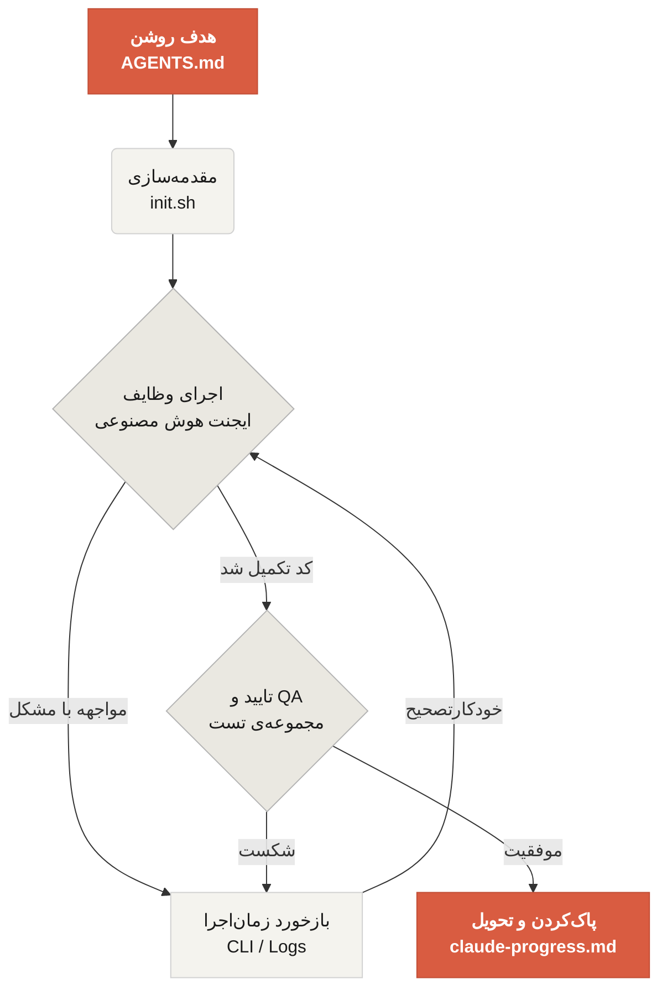

[نسخه‌ی انگلیسی ←](../../en/index.md)

# خوش‌آمدید به Learn Harness Engineering

Learn Harness Engineering دوره‌ای است که به مهندسی ایجنت‌های هوش مصنوعی کدنویسی اختصاص دارد. ما نظریات و شیوه‌های پیشتاز مهندسی هارنس در صنعت را بــه‌عمق مطالعه و ترکیب کرده‌ایم. منابع اصلی ما عبارت‌اند از:
- [OpenAI: Harness engineering: leveraging Codex in an agent-first world](https://openai.com/index/harness-engineering/)
- [Anthropic: Effective harnesses for long-running agents](https://www.anthropic.com/engineering/effective-harnesses-for-long-running-agents)
- [Anthropic: Harness design for long-running application development](https://www.anthropic.com/engineering/harness-design-long-running-apps)
- [Awesome Harness Engineering](https://github.com/walkinglabs/awesome-harness-engineering)

از طریق طراحی محیط منظم، مدیریت وضعیت، راستی‌آزمایی، و سیستم‌های کنترل، این دوره به شما نشان می‌دهد چگونه ابزارهای کدنویسی مبتنی‌بر ایجنت مانند Codex و Claude Code را واقعاً قابل‌اعتماد کنید. این کار شما را کمک می‌کند ویژگی‌ها ایجاد کنید، اشکال‌ها را برطرف کنید، و وظایف توسعه را با محدود کردن دستیار کدنویسی هوش مصنوعی با قوانین و مرزهای صریح خودکارسازی کنید.

## شروع کنید

مسیر یادگیری خود را انتخاب کنید. دوره به سخنرانی‌های نظری، پروژه‌های عملی، و کتاب‌خانه‌ی منابع آماده‌ی کپی تقسیم می‌شود.

  <a href="./lectures/lecture-01-why-capable-agents-still-fail/" class="card">
    <h3>سخنرانی‌ها</h3>
    
درک کنید چرا مدل‌های قوی هنوز شکست می‌خورند و نظریه‌ی پشت هارنس‌های موثر را بیاموزید.

  </a>
  <a href="./projects/" class="card">
    <h3>پروژه‌ها</h3>
    
تمرین عملی ساخت محیط قابل‌اعتماد مبتنی‌بر ایجنت از صفر.

  </a>
  <a href="./resources/" class="card">
    <h3>کتاب‌خانه‌ی منابع</h3>
    
الگوهای آماده‌ی کپی (AGENTS.md، feature_list.json) برای استفاده در ریپازیتوری‌های خود.

  </a>
  <a href="./harness-designs/" class="card">
    <h3>تحلیل طراحی‌های هارنس مرزی</h3>
    
نحوه‌ی طراحی هارنس‌های Pi، Claude Code، Codex، و DeepSeek—نقشه‌برداری شده به چارچوب دوره.

  </a>

## مکانیزم هسته‌ی یک هارنس

هارنس «مدل را باهوش‌تر نمی‌کند»؛ بلکه یک سیستم کاری حلقه‌ی بسته را برای مدل ایجاد می‌کند. می‌توانید جریان کار اصلی آن را از طریق این نمودار ساده درک کنید:

## آنچه خواهید یاد گرفت

در اینجا برخی از مفاهیم کلیدی است که تسلط خواهید یافت:

<ul class="index-list">
  <li><strong>محدود کردن رفتار ایجنت</strong> با قوانین و مرزهای صریح.</li>
  <li><strong>حفظ بافت</strong> در وظایف چندجلسه‌ای بلندمدت.</li>
  <li><strong>جلوگیری ایجنت‌ها</strong> از اعلان پیروزی زودهنگام.</li>
  <li><strong>تایید کار</strong> با استفاده از تست‌های خط‌لوله‌ی کامل و خودتأمل.</li>
  <li><strong>رصدپذیری زمان‌اجرا</strong> و قابل‌اشکال‌زدایی.</li>
</ul>

## مراحل بعدی

هنگامی که مفاهیم اصلی را درک کردید، این راهنماها کمک می‌کنند عمیق‌تر پیش‌روید:

<ul class="index-list">
  <li><a href="./lectures/lecture-01-why-capable-agents-still-fail/">سخنرانی ۰۱: چرا ایجنت‌های توانمند هنوز شکست می‌خورند</a>: با نظریه‌ی پشت مهندسی هارنس شروع کنید.</li>
  <li><a href="./projects/project-01-baseline-vs-minimal-harness/">پروژه ۰۱: هارنس پایه‌ای در مقابل هارنس کمینه</a>: راه خود را از اولین وظیفه‌ی واقعی عبور دهید.</li>
  <li><a href="./resources/templates/">الگوها</a>: بسته‌ی کمینه‌ی هارنس (AGENTS.md، feature_list.json، claude-progress.md) را برای پروژه‌های خود بگیرید.</li>
</ul>
