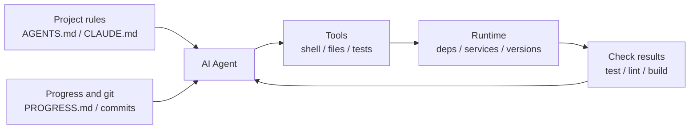

[نسخه‌ی انگلیسی ←](../../../en/lectures/lecture-02-what-a-harness-actually-is/)

> نمونه‌های کد: [code/](https://github.com/walkinglabs/learn-harness-engineering/blob/main/docs/en/lectures/lecture-02-what-a-harness-actually-is/code/)
> پروژه‌ی تمرین: [پروژه ۰۱. فقط پرامپت در مقابل قوانین‌محور](./../../projects/project-01-baseline-vs-minimal-harness/index.md)

# درس ۰۲. هارنس در واقعیت چیست

واژه‌ی «هارنس» خیلی بین اهل حرفه‌ی ایجنت‌های کدنویسی هوش مصنوعی در گردش است، اما بیشتر اوقات، وقتی مردم می‌گویند «هارنس»، فقط منظورشان یک فایل پرامپت است. فایل پرامپت یک هارنس نیست.

این سخنرانی تعریف دقیق و عملی برای هارنس ارائه می‌دهد — نه یک تجریدی دانشگاهی، بلکه چهارچوبی که امروز می‌توانید به کار ببرید. هارنس از پنج زیرسیستم تشکیل شده است: دستورالعمل‌ها، ابزارها، محیط، وضعیت، و بازخورد. هر زیرسیستم مسئولیت‌ها و معیار‌های ارزیابی روشنی دارد.

## شروع کنید با یک تشبیه

تصور کنید که شما مهندس تازه‌استخدام‌شده‌ای هستید که بدون هیچ مستندی به یک پروژه درآمده‌اید. نه README، نه کامنت در کد، کسی نمی‌گوید چگونه تست‌ها را اجرا کنید، پیکربندی CI جایی پنهان است. می‌توانید کد خوبی بنویسید؟ شاید — اگر به اندازه‌کافی باهوش و بردبار باشید. اما بیشتر وقت‌تان را صرف «فهمیدن اینکه این پروژه چیست» خواهید کرد به جای «حل کردن مسئله».

ایجنت هوش مصنوعی دقیقاً همین وضعیت را دارد، و حتی بدتر است. شما حداقل می‌توانید از یک همکار بپرسید. ایجنت فقط می‌تواند فایل‌هایی را ببیند که پیش روی‌اش قرار دادید و دستوراتی را اجرا کند.

OpenAI اصل اساسی مهندسی هارنس را «ریپازیتوری همان مشخصات است» فریم‌بندی می‌کند — تمام زمینه‌ی ضروری باید در ریپازیتوری زندگی کند، از طریق فایل‌های دستورالعمل ساختاری، دستورات تصدیق صریح، و سازماندهی واضح پوشه. اسناد ایجنت‌های طولانی‌مدت Anthropic تاکید بر ثبات وضعیت، مسیرهای بازیابی صریح، و ردیابی پیشرفت ساختاری دارد. دو شرکت بر جنبه‌های متفاوت تمرکز دارند، اما آنها همان چیز را می‌گویند: **هر چیزی در زیرساخت مهندسی خارج از وزن‌های مدل، تعیین می‌کند که چقدر از توانایی مدل واقعاً درک‌شده است.**

چند ابزار را که شما قبلاً می‌شناسید، نگاه کنید:

**Claude Code** تفکر هارنسی را جسد‌مندی می‌کند. `CLAUDE.md` را از ریپازیتوری‌ات می‌خواند، می‌تواند دستورات shell را اجرا کند، در محیط محلی‌ات اجرا می‌شود، تاریخچه‌ی جلسه را حفظ می‌کند، و می‌تواند تست‌ها را اجرا کند تا نتایج را ببیند. اما اگر به آن نگویید چگونه تست‌ها را اجرا کند، هیچ راهی ندارد که بفهمد آیا کارهایش درست انجام شده‌اند.

**Cursor** از منطق مشابهی پیروی می‌کند. فایل `.cursorrules` آن منبع دستورالعمل‌اش است، ترمینال ابزارش است، و می‌تواند ساختار پروژه‌تان و تنظیمات lint را بخواند. اما مدیریت وضعیت Cursor نسبتاً ضعیف است — اگر IDE را ببندید و دوباره بازش کنید، زمینه‌ی قبلی محو می‌شود.

**Codex** (ایجنت کدنویسی OpenAI) از git worktree‌ها برای جداسازی محیط زمان اجرای هر کار استفاده می‌کند، همراه با یک پشته‌ی رصدپذیری محلی (لاگ، متریک‌ها، ردس)، بنابراین هر تغییر در محیط مستقل تصدیق می‌شود. در ریپازیتوری‌هایی که `AGENTS.md` و دستورات تصدیق روشن دارند بسیار بهتر از ریپازیتوری‌های «خالی» عمل می‌کند.

**AutoGPT** داستان هشداردهنده است. فقدان مدیریت وضعیت ساختاری باعث می‌شود که زمینه در طول کارهای طولانی بی‌پایان انباشته شود، و فقدان مکانیزم‌های بازخورد دقیق باعث می‌شود ایجنت حلقه شود. بسیاری می‌گویند AutoGPT «کار نمی‌کند»، اما در واقع هارنس کار نمی‌کند.

## مفاهیم اساسی

- **هارنس چیست**: هر چیزی در زیرساخت مهندسی خارج از وزن‌های مدل. OpenAI کار اساسی مهندس را به سه چیز خلاصه می‌کند: طراحی محیط‌ها، بیان نیت، و ساختن حلقه‌های بازخورد. Anthropic مستقیماً Claude Agent SDK خود را «هارنس ایجنت کلی‌منظور» می‌نامد.
- **ریپازیتوری منبع واحد حقیقت است**: هر چیزی که ایجنت نمی‌تواند ببیند، عملاً وجود ندارد. OpenAI ریپازیتوری را «سیستم رکورد» می‌داند — تمام زمینه‌ی لازم باید آن‌جا زندگی کند، از طریق فایل‌ها و سازماندهی پوشه‌های ساختاری.
- **نقشه بدهید، نه راهنمای کامل**: تجربه‌ی OpenAI این است که `AGENTS.md` باید یک صفحه‌ی فهرست باشد، نه دایرةالمعارف. حدود ۱۰۰ خط کافی است. اگر جا نگیرد، آن را به دایرکتوری `docs/` تقسیم کنید و به ایجنت اجازه دهید در صورت نیاز بخواند.
- **محدود کنید، مدیریت نکنید**: هارنس خوب از قوانین قابل اجرا برای محدود کردن ایجنت استفاده می‌کند، نه برشمردن دستورالعمل‌ها یکی یکی. OpenAI می‌گوید «ثابت‌های برنامه را اعمال کنید، مدیریت نکنید»؛ Anthropic متوجه شد که ایجنت‌ها با اطمینان از کار‌های خود تعریف می‌کنند، و راه‌حل این است که «فردی که کار را انجام می‌دهد» را از «فردی که کار را بررسی می‌کند» جدا کنید.
- **یکی یکی برداشت کنید و رصد کنید**: برای کمی‌سازی مشارکت حاشیه‌ای هر جزء هارنس، آن‌ها را یکی یکی برداشته و ببینید برداشتن کدام باعث بزرگ‌ترین افت عملکرد می‌شود. این به شما می‌گوید کدام اجزا اکنون ارزشمندترند، و همچنین نشان می‌دهد کدام‌ها هنوز به طور معنادار کمک نمی‌کنند. Anthropic از این روش استفاده کرد و کشف کرد که با قوی‌تر شدن مدل‌ها، برخی اجزا دیگر بحرانی نیستند — اما اجزای بحرانی جدید همیشه ظاهر می‌شوند.

## مدل هارنس پنج زیرسیستمی

بازگشت به تشبیه. هارنس دارای پنج زیرسیستم است:



**زیرسیستم دستورالعمل**: `AGENTS.md` (یا `CLAUDE.md`) را شامل یک نمای کلی و هدف پروژه، پشته‌ی فناوری و نسخه‌ها، دستورات اجرای اول، محدودیت‌های سخت غیرقابل‌مذاکره، و پیوندهایی برای مستندات تفصیلی‌تر ایجاد کنید.

**زیرسیستم ابزار**: اطمینان حاصل کنید که ایجنت دسترسی ابزار کافی دارد. shell را به دلایل «امنیتی» غیرفعال نکنید — اگر ایجنت نمی‌تواند حتی `pip install` را اجرا کند، چگونه باید کاری انجام دهد؟ اما همچنین همه چیز را باز نکنید — اصل کمترین امتیاز را دنبال کنید.

**زیرسیستم محیط**: وضعیت محیط را خود‌توصیف‌کننده کنید. از `pyproject.toml` یا `package.json` برای قفل‌کردن وابستگی‌ها، `.nvmrc` یا `.python-version` برای تعیین نسخه‌های زمان اجرا، و Docker یا devcontainer برای ایجاد محیط قابل‌تکرار استفاده کنید.

**زیرسیستم وضعیت**: کارهای طولانی باید ردیابی پیشرفت داشته باشند. یک فایل ساده‌ی `PROGRESS.md` استفاده کنید که ثبت کند: چه کاری انجام شده، چه کاری در جریان است، چه کاری متوقف شده‌است. قبل از پایان هر جلسه به‌روز رسانی کنید؛ وقتی جلسه‌ی بعدی شروع شود بخوانید.

**زیرسیستم بازخورد**: این زیرسیستمی با بالاترین بازدهی سرمایه است. صریحاً دستورات تصدیق را در `AGENTS.md` فهرست کنید:
```
Verification commands:
- Tests: pytest tests/ -x
- Type check: mypy src/ --strict
- Lint: ruff check src/
- Full verification: make check (includes all above)
```

فقدان هر یک از پنج زیرسیستم به معنای هارنس ناقص است، و ایجنت همیشه احساس ناراحتی خواهد کرد.

**کمی‌سازی ارزش جزء هارنس**: از یک «تست حذف متغیر کنترل‌شده» استفاده کنید. مدل را ثابت نگاه دارید، پنج زیرسیستم را یکی یکی برداشته و ببینید حذف کدام باعث بزرگ‌ترین افت عملکرد می‌شود. جزئی که بزرگ‌ترین افت را داشته‌است بالاترین مشارکت حاشیه‌ای برای کار فعلی دارد و ارزش اولویت‌دهی دارد. آیا باید آن را تقویت کنید به نسبت‌دهی شکست بستگی دارد، نه فقط اندازه‌ی افت. اجزایی با اثر تقریباً صفر باید فوری رد نشوند: ممکن است اضافی، طراحی ضعیف، یا صرفاً به وسیله‌ی کار فعلی استفاده نشده باشند. این آزمایش پاسخ می‌دهد «کدام جزء اکنون ارزشمندترین است» — نمی‌تواند به تنهایی ثابت کند «جایی که تنگناست کجا است». برای واقعاً یافتن تنگنا، ابتدا باید سوابق شکست و نسبت‌دهی‌ها را بررسی کنید: آیا کار نامشخص بود، زمینه کافی نبود، محیط قابل‌تکرار نبود، بازخورد تصدیق کافی نبود، یا مدیریت وضعیت خراب بود؟ نتایج آزمایش حذف جزء تنها می‌تواند به عنوان شواهد پشتیبان عمل کنند.

## داستان واقعی یک تیم

یک تیم از GPT-4o برای توسعه یک برنامه‌ی TypeScript + React (~۲۰٬۰۰۰ خط کد) استفاده کرد. آن‌ها چهار مرحله را طی کردند، که اساساً اضافه کردن اجزای هارنس یکی یکی بود:

**مرحله ۱**: فقط توصیف پروژه‌ی پایه در README. ۱ از ۵ اجرا موفق بود (۲۰%). شکست‌های اصلی: انتخاب مدیر بسته‌ی اشتباه (npm در مقابل yarn)، عدم پیروی از کنوانسیون‌های نام‌گذاری جزء، نمی‌توانند تست‌ها را اجرا کنند.

**مرحله ۲**: `AGENTS.md` اضافه کنید که نسخه‌های پشته‌ی فناوری، کنوانسیون‌های نام‌گذاری، و تصمیمات معماری کلیدی را مشخص کند. نرخ موفقیت به ۶۰% افزایش یافت. شکست‌های باقی‌مانده عمدتاً از مسائل محیط و تصدیق گمشده بودند.

**مرحله ۳**: دستورات تصدیق را در `AGENTS.md` فهرست کنید: `yarn test && yarn lint && yarn build`. نرخ موفقیت به ۸۰% افزایش یافت.

**مرحله ۴**: الگوهای فایل پیشرفت را معرفی کنید جایی که ایجنت هر اجرا کار کامل‌شده و ناتمام را ثبت کند. نرخ موفقیت به ۸۰-۱۰۰% تثبیت شد.

چهار تکرار، مدل اصلاً تغییر نکرد، و نرخ موفقیت از ۲۰% به نزدیک ۱۰۰% رفت. شما به مدل بهتری تبدیل نشدید — آنچه تغییر کرد هارنس بود.

## نکات کلیدی

- هارنس = دستورالعمل‌ها + ابزارها + محیط + وضعیت + بازخورد. هر پنج زیرسیستم ضروری است.
- اگر وزن‌های مدل نیست، هارنس است. هارنس شما تعیین می‌کند که چقدر از توانایی مدل درک‌شده است.
- در میان پنج زیرسیستم، زیرسیستم بازخورد معمولاً کمترین سرمایه‌گذاری و بالاترین بازدهی را دارد. ابتدا دستورات تصدیق را درست کنید.
- از «تست‌های حذف متغیر کنترل‌شده» برای کمی‌سازی مشارکت حاشیه‌ای هر زیرسیستم استفاده کنید؛ برای یافتن تنگنای واقعی، به سوابق شکست و نسبت‌دهی تکیه کنید، نه تنهای حذف جزء.
- هارنس مانند کد فاسد می‌شود. به طور منظم بازرسی کنید، و بدهی هارنس را درست مثل بدهی فنی پرداخت کنید.

## مطالعه بیشتر

- [OpenAI: Harness Engineering](https://openai.com/index/harness-engineering/)
- [Anthropic: Effective Harnesses for Long-Running Agents](https://www.anthropic.com/engineering/effective-harnesses-for-long-running-agents)
- [HumanLayer: Harness Engineering for Coding Agents](https://www.humanlayer.dev/blog/skill-issue-harness-engineering-for-coding-agents)
- [SWE-agent: Agent-Computer Interfaces](https://github.com/princeton-nlp/SWE-agent)
- [Thoughtworks: Harness Engineering on Technology Radar](https://www.thoughtworks.com/radar)

## تمرین‌ها

۱. **بازرسی هارنس پنج‌تایی**: پروژه‌ای را انتخاب کنید که در حال حاضر یک ایجنت هوش مصنوعی را استفاده می‌کنید و از چهارچوب پنج‌تایی یک بازرسی کامل انجام دهید. هر زیرسیستم را بندی ۱-۵ کنید. کمترین امتیاز گیرنده را پیدا کنید، ۳۰ دقیقه صرف بهبود آن کنید، و سپس تغیير در عملکرد ایجنت را رصد کنید.

۲. **تست حذف متغیر کنترل‌شده**: یک مدل و یک کار چالش‌برانگیز را انتخاب کنید. به طور متوالی دستورالعمل‌ها را برداشته (AGENTS.md را حذف کنید)، بازخورد را برداشته (دستورات تصدیق ارائه ندهید)، وضعیت را برداشته (بدون فایل‌های پیشرفت) — تنها یکی یکی برداشته، و افت عملکرد را اندازه بگیرید. از نتایج برای رتبه‌بندی ارزش حاشیه‌ای هر زیرسیستم برای کار فعلی استفاده کنید. اگر می‌خواهید تنگنا را پیدا کنید، باید سوابق شکست را نیز ثبت کنید و نسبت‌دهی ریشه‌ای را در کنار حذف جزء انجام دهید.

۳. **تجزیه‌ی توانایی‌ها**: سناریویی در پروژه‌تان پیدا کنید جایی که ایجنت «می‌خواهد کاری انجام دهد اما نمی‌تواند» (به عنوان مثال، می‌داند باید از پرس‌وجوهای پارامتری استفاده کند اما الگوهای ORM پروژه‌تان را نمی‌داند). تحلیل کنید که آیا این خلیج اجرا است (نمی‌داند چگونه کار کند) یا خلیج ارزیابی (نمی‌داند آیا کارهایش درست انجام شده‌اند)، سپس بهبود هارنسی برای پل‌زدن فاصله طراحی کنید.
