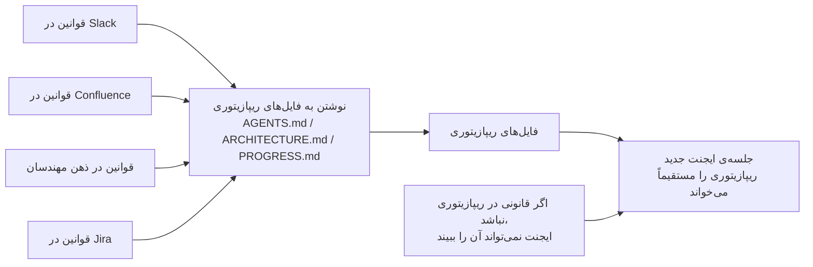
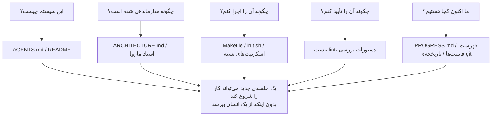

[نسخه‌ی انگلیسی ←](../../../en/lectures/lecture-03-why-the-repository-must-become-the-system-of-record/)

> نمونه کدها: [code/](https://github.com/walkinglabs/learn-harness-engineering/blob/main/docs/en/lectures/lecture-03-why-the-repository-must-become-the-system-of-record/code/)
> پروژه‌ی عملی: [پروژه 02. ایجنت را متوجه کنید تا پروژه را بخواند و جایی که ترک کرده بود ادامه دهد](./../../projects/project-02-agent-readable-workspace/index.md)

# درس ۰۳. تبدیل ریپازیتوری به تنها منبع حقیقت

تصمیم‌های معماری تیم شما در Confluence، Slack، Jira و ذهن چند مهندس ارشد پخش شده است. برای انسان‌ها این کار تا حدی کار می‌کند — شما می‌توانید از یک همکار بپرسید، گزارش‌های چت را جستجو کنید، اسناد را مرور کنید، و در بدترین حالت، می‌توانید کسی را در راهروی اداری گوشه‌ای کنید. اما برای یک ایجنت هوش مصنوعی، اطلاعاتی که در ریپازیتوری نیست به سادگی وجود ندارند.

این تبالغ نیست. یک ایجنت فقط سه منبع ورودی دارد: پرامپت‌های سیستمی و توصیف‌های تکلیف، محتویات فایل‌های ریپازیتوری، و خروجی اجرای ابزار. تاریخچه‌ی Slack شما، تیکت‌های Jira، صفحات Confluence، و آن تصمیم معماری که جمعه‌ی بعد‌ازظهر با یک همکار ریختید — ایجنت نمی‌تواند هیچ یک از اینها را ببیند. نمی‌تواند "برو و از کسی بپرس" یا "گزارش‌های چت را جستجو کن." کل دنیای کاری آن ریپازیتوری خود است. هر چیزی بیرون، چیزی نمی‌داند.

بنابراین سؤال واقعی این است: آیا شما می‌خواهید برای آن نقشه‌ای بخشید که خوب‌تر باشد؟

## چه چیزی روی نقشه باید باشد

OpenAI این را بسادگی در مقاله‌ی مهندسی هارنس خود بیان می‌کند: **اطلاعاتی که در ریپازیتوری وجود ندارند برای ایجنت وجود ندارند.** آنها این را اصل "ریپازیتوری به‌عنوان مشخصات" می‌نامند — ریپازیتوری خود بالاترین سند مشخصات دارای اختیار است.

مستندات ایجنت‌های طولانی‌مدت Anthropic نقطه‌ای مشابه را تکرار می‌کند: حالت دائمی یک شرط ضروری برای تداوم تکلیف‌های بلند‌مدت است، و بازیابی‌پذیری دانش متقاطع جلسات مستقیماً نرخ موفقیت تکلیف را تعیین می‌کند. و این حالت باید در ریپازیتوری وجود داشته باشد — زیرا آن تنها ذخیره‌سازی پایدار و قابل اعتماد است که ایجنت برای آن دارد.

شما ممکن است فکر کنید: "تیم ما کوچک است، دانش در ذهن همه است، و این خوب کار می‌کند." به اندازه‌ی کافی درست — برای انسان‌ها. اما اگر می‌خواهید یک ایجنت استفاده کنید، باید یک واقعیت را بپذیرید: ایجنت نمی‌تواند از مردم بپرسد. هر چیزی که باید بداند باید نوشته‌شده و در جایی قرار داده شود که بتواند آن را پیدا کند.

این یک مسئله‌ی "نوشتن اسناد بیشتر" نیست — یک مسئله‌ی "قرار دادن اطلاعات تصمیم در جای صحیح" است. یک `ARCHITECTURE.md` با 50 خط که در دایره‌کتاب `src/api/` نشسته است بسیار مفیدتر از یک سند طراحی 500 صفحه‌ای در Confluence است که هیچ کس آن را نگهداری نمی‌کند. نزدیکی اهمیت بیشتری دارد تا طول، زیرا اطلاعات تنها زمانی واقعاً مفید است که درست زمانی که به آن نیاز دارید در دست شما باشد.

## رصدپذیری دانش



چگونه می‌توانید آزمایش کنید که نقشه‌ی شما خوب‌تر است؟ یک "تست جلسه‌ی تازه" اجرا کنید: یک جلسه‌ی ایجنت کاملاً جدید باز کنید، فقط محتویات ریپازیتوری را به آن دهید، و ببینید که آیا می‌تواند پنج سؤال اساسی را پاسخ دهد.



اگر نتواند جواب دهد، نقشه دارای فضاهای خالی است. جایی که نقشه خالی است، ایجنت باید حدس بزند — حدس‌های غلط به باگ تبدیل می‌شوند، حدس زیاد متن را تلف می‌کند. و هر جلسه‌ی جدید باید دوباره همه چیز را حدس بزند. هزینه‌ی حدس زدن همیشه بسیار بیشتر از هزینه‌ی رسم نقشه درست در جای اول است.

## مفاهیم اساسی

- **شکاف رصدپذیری دانش**: بخشی از کل دانش پروژه که در ریپازیتوری نیست. هر چه شکاف بزرگتر باشد، نرخ شکست ایجنت بیشتر است. شما می‌توانید آن را به این‌گونه برآورد کنید: تمام دانش ضمنی در مورد این پروژه را که در ذهن مردم زندگی می‌کند بشمارید، سپس ببینید که چقدر از آن واقعاً به ریپازیتوری رفته است. تفاوت شکاف رصدپذیری شما است.
- **سیستم حقیقت**: کد ریپازیتوری به‌عنوان منبع معتبر برای تصمیم‌های پروژه، محدودیت‌های معماری، حالت اجرا، و معیارهای راستی‌آزمایی. ریپازیتوری آخرین نطق را دارد — جای دیگر اهمیت ندارد. اگر اطلاعات "این جاده بسته است" فقط در ذهن قدیمی Zhang زندگی می‌کند، پس هر بار باید از قدیمی Zhang بپرسید. آن را در ریپازیتوری بنویسید، و هیچ کس نباید بپرسد.
- **تست جلسه‌ی تازه**: پنج سؤال از بخش قبلی. چند سؤالی که ایجنت می‌تواند جواب دهد نشان می‌دهد که نقشه‌ی شما چقدر کامل است.
- **هزینه‌ی کشف**: چقدر بودجه متن ایجنت برای یافتن یک قطعه اطلاعات کلیدی در ریپازیتوری خرج می‌شود. هر چه اطلاعات پنهان‌تر باشد، هزینه‌ی کشف بیشتر است، و بودجه کمتری برای تکلیف واقعی باقی می‌ماند. اطلاعات حیاتی باید در جایی قرار گیرد که ایجنت آن را اول ببیند — نه در عمق ده سطح دایره‌کتاب.
- **نرخ تخریب دانش**: بخشی از ورودی‌های دانش در ریپازیتوری که در واحد زمان قدیمی می‌شوند. مستندات بدون‌هماهنگی با کد بزرگترین دشمن است — بدتر از هیچ مستندی مستندات فرسوده است.
- **تشبیه ACID**: استفاده از اصول معاملات پایگاه داده (Atomicity، Consistency، Isolation، Durability) برای مدیریت وضعیت ایجنت. ما در زیر این را گسترش خواهیم داد.

## چگونه نقشه‌ی خوبی رسم کنیم

**اصل 1: دانش کنار کد زندگی می‌کند.** یک قانون در مورد احراز هویت نقطه‌ی پایانی API باید کنار کد API باشد، نه در یک سند جهانی بزرگ دفن شده. یک مستند کوتاه در هر دایره‌کتاب ماژول قرار دهید که توضیح دهد مسئولیت‌های آن ماژول، رابط‌های آن، و محدودیت‌های خاص آن. خود دایره‌کتاب ماژول یک فهرست طبیعی است — زمانی که ایجنت به کد رسد، محدودیت‌های آن را هم می‌رسد، جستجویی لازم نیست.

**اصل 2: از فایل ورودی استاندارد استفاده کنید.** `AGENTS.md` (یا `CLAUDE.md`) "صفحه‌ی فرود" ایجنت است. نباید تمام اطلاعات را داشته باشد، اما باید به ایجنت اجازه دهد سریع سه سؤال را پاسخ دهد: "این پروژه چیست"، "چگونه آن را اجرا کنم"، و "چگونه آن را تأیید کنم." 50-100 خط کافی است.

**اصل 3: حداقل اما کامل.** هر قطعه دانش باید یک مورد استفاده واضح داشته باشد. اگر حذف یک قانون بر کیفیت تصمیم ایجنت تأثیر نگذارد، آن قانون نباید وجود داشته باشد. اما هر سؤالی از تست جلسه‌ی تازه باید یک جواب داشته باشد. این یک تعادل مستمری است که باید نگهداری شود — نه بیشتر، نه کمتر، فقط به اندازه‌ی کافی.

**اصل 4: به‌روزرسانی با کد.** ارتباط به‌روزرسانی‌های دانش به تغییرات کد. ساده‌ترین رویکرد: قرار دادن اسناد معماری در دایره‌کتاب ماژول مربوطه. زمانی که کد را تغییر دهید، به طور طبیعی مستند را متوجه می‌شوید. پس از تغییرات کد، CI می‌تواند یادآوری کند که آیا مستندات نیاز به به‌روزرسانی دارند یا خیر.

**ساختار ریپازیتوری مشخص**:

```
project/
├── AGENTS.md              # ورودی: نمای کلی پروژه، دستورات اجرا، محدودیت‌های سخت
├── src/
│   ├── api/
│   │   ├── ARCHITECTURE.md  # تصمیم‌های معماری لایه‌ی API
│   │   └── ...
│   ├── db/
│   │   ├── CONSTRAINTS.md   # محدودیت‌های سخت عملیات پایگاه داده
│   │   └── ...
│   └── ...
├── PROGRESS.md             # پیشرفت فعلی: انجام شده، در حال انجام، مسدود
└── Makefile                # دستورات استاندارد: setup، test، lint، check
```

## مدیریت وضعیت ایجنت با اصول ACID

این تشبیه از مدیریت معاملات پایگاه داده می‌آید. شما ممکن است احساس کنید که این کار را پیچیده‌تر می‌کند، اما در واقع یک چارچوب بسیار عملی فراهم می‌کند:

- **Atomicity**: هر "عملیات منطقی" (مثلاً، "اضافه کردن نقطه‌ی انتهایی جدید و به‌روزرسانی تست‌ها") یک git commit می‌گیرد. اگر در میانه‌ی مسیر ناموفق شود، `git stash` را استفاده کنید تا برگردید. همه یا هیچ — "نیمه انجام شده" ندارد.
- **Consistency**: تعریف کردن معادلات تأیید "وضعیت‌های سازگار" — تمام تست‌ها عبور می‌کنند، lint صفر خطا را گزارش می‌کند. ایجنت پس از هر عملیات تأیید را اجرا می‌کند؛ وضعیت‌های واسطه‌ی ناسازگار نباید commit شوند. پس از یک عملیات، سیستم باید در یک وضعیت راستی‌آزمایی‌شده‌ی صحیح باشد.
- **Isolation**: زمانی که چندین ایجنت به طور همزمان کار می‌کنند، فایل‌های وضعیت را طراحی کنید تا از شرایط مسابقه جلوگیری کنید. رویکرد ساده: هر ایجنت از فایل پیشرفت خود استفاده می‌کند، یا از شاخه‌های git برای جدایی استفاده کنید. نوشتن‌های همزمان به فایل‌های یکسان یک منبع معمول مشکل است.
- **Durability**: دانش پروژه‌ی حیاتی در فایل‌های ردیابی‌شده‌ی git زندگی می‌کند. وضعیت موقتی می‌تواند در حافظه‌ی جلسه باقی بماند، اما دانشی که باید بین جلسات باقی بماند باید در فایل‌ها نوشته شود. آنچه در سرتان است شمار نمی‌رود — تنها آنچه نوشته‌شده است شمار می‌رود.

## یک داستان تبدیل واقعی

یک تیم یک پلتفرم تجارت الکترونیکی را با تقریباً 30 خدمات میکروسرویس نگهداری می‌کرد. تصمیم‌های معماری — پروتکل‌های ارتباط بین خدمات، استراتژی‌های ثبات داده، قوانین نسخه‌بندی API — در میان آنها پخش شده بود: Confluence (تا حدی فرسوده)، Slack (جستجوی سخت)، ذهن چند مهندس ارشد (مقیاس‌پذیری نیست)، و نظرات کد پراکنده (نه سیستماتیک).

پس از معرفی ایجنت‌های هوش مصنوعی، 70% از تکالیف نیاز به مداخله‌ی انسان داشتند. تقریباً هر شکست شامل ایجنت نقض کردن محدودیتی ضمنی بود که "هر کس می‌داند اما هیچ کس هرگز نوشت." ایجنت هیچ راهی نداشت که بداند چه چیزی نمی‌داند — فقط می‌تواند بر اساس درک خود عمل کند و سپس مستقیماً به تله بیفتد.

تیم یک تبدیل اجرا کرد:
1. `AGENTS.md` را در ریشه‌ی ریپازیتوری با نمای کلی پروژه، نسخه‌های پشته‌ی فناوری، و محدودیت‌های سخت جهانی ایجاد کردند
2. `ARCHITECTURE.md` را در هر دایره‌کتاب خدمات میکروسرویس اضافه کردند که مسئولیت‌های، رابط‌های، و وابستگی‌های آن خدمات را توضیح دهند
3. یک `CONSTRAINTS.md` متمرکز‌شده را با استفاده از زبان صریح "MUST / MUST NOT" برای محدودیت‌های سخت ایجاد کردند
4. `PROGRESS.md` را در هر دایره‌کتاب خدمات اضافه کردند که وضعیت کار فعلی را ردیابی کند

پس از تبدیل: ایجنت یکسانی می‌تواند تمام سؤالات کلیدی پروژه را در یک جلسه‌ی تازه جواب دهد، و کیفیت تکمیل تکلیف به‌طور قابل‌توجهی بهبود یافت.

## نکات کلیدی

- دانش نه در ریپازیتوری برای ایجنت وجود ندارد. قرار دادن اطلاعات تصمیم حیاتی در ریپازیتوری بنیادی‌ترین سرمایه‌گذاری هارنس است — نقشه‌ی خوبی رسم کنید تا گم نشوید.
- از "تست جلسه‌ی تازه" استفاده کنید تا کیفیت ریپازیتوری را ارزیابی کنید: آیا یک جلسه‌ی کاملاً جدید می‌تواند پنج سؤال اساسی را با استفاده از فقط محتویات ریپازیتوری پاسخ دهد؟
- دانش باید کنار کد، حداقل اما کامل، و با کد به‌روزرسانی‌شده باشد. این درباره‌ی نوشتن اسناد بیشتر نیست — این درباره‌ی قرار دادن اطلاعات در جای صحیح است.
- از اصول ACID برای حالت ایجنت استفاده کنید: commit‌های اتمی، تأیید سازگاری، جدایی‌پذیری همزمانی، و دانش حیاتی دائمی.
- تخریب دانش بزرگترین دشمن است. مستندات فرسوده خطرناک‌تر از هیچ مستندی است — ایجنت را در جهتی غلط می‌فرستد و ایجنت فکر می‌کند که در جهت صحیح است.

## مطالعه‌ی بیشتر

- [OpenAI: Harness Engineering](https://openai.com/index/harness-engineering/)
- [Anthropic: Effective Harnesses for Long-Running Agents](https://www.anthropic.com/engineering/effective-harnesses-for-long-running-agents)
- [Infrastructure as Code — Martin Fowler](https://martinfowler.com/bliki/InfrastructureAsCode.html)
- [ADR: Architecture Decision Records](https://adr.github.io/)
- [The Twelve-Factor App](https://12factor.net/)

## تمرین‌ها

1. **تست جلسه‌ی تازه**: یک جلسه‌ی ایجنت کاملاً تازه را در پروژه خود باز کنید (هیچ متن شفاهی ارائه نکنید)، فقط محتویات ریپازیتوری را ببینید، سپس پنج سؤال بپرسید: این سیستم چیست؟ چگونه سازماندهی شده است؟ چگونه آن را اجرا کنم؟ چگونه آن را تأیید کنم؟ پیشرفت فعلی چیست؟ آنهایی را که نمی‌تواند جواب دهد ثبت کنید، سپس ریپازیتوری را بهبود دهید تا بتواند به همه‌ی آنها جواب دهد.

2. **تعیین‌کردن نمایش دانش خارجی**: تمام تصمیم‌ها و محدودیت‌های مهم برای کار توسعه در پروژه خود را فهرست کنید. هر یک را در داخل یا بیرون ریپازیتوری علامت‌گذاری کنید. شکاف رصدپذیری دانش خود را محاسبه کنید (نسبت اقلام خارج ریپازیتوری). برنامه‌ای بسازید تا شکاف را زیر 10% بیاورید.

3. **ارزیابی ACID**: مدیریت وضعیت پروژه خود را با استفاده از تشبیه ACID این سخنرانی ارزیابی کنید. Atomicity — آیا عملیات ایجنت می‌توانند به تمیزی برگردانده شوند؟ Consistency — آیا ریپازیتوری تأیید "وضعیت‌های سازگار" دارد؟ Isolation — آیا چندین ایجنت همزمان یکدیگر را لگد می‌زنند؟ Durability — آیا تمام دانش متقاطع جلسات به‌درستی نگهداری می‌شود؟
