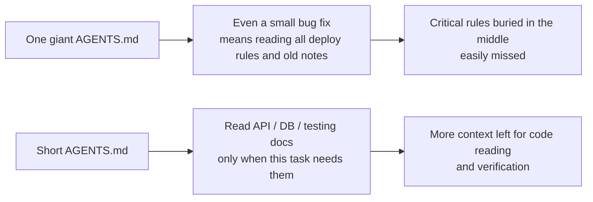
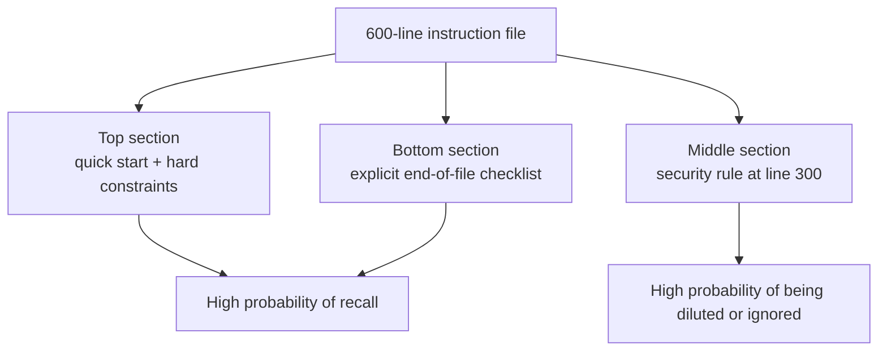

[نسخه‌ی انگلیسی ←](../../../en/lectures/lecture-04-why-one-giant-instruction-file-fails/)

> نمونه‌های کد: [code/](https://github.com/walkinglabs/learn-harness-engineering/blob/main/docs/en/lectures/lecture-04-why-one-giant-instruction-file-fails/code/)
> پروژه‌ی آموزش: [پروژه ۰۲. فضای کاری قابل درک برای ایجنت](./../../projects/project-02-agent-readable-workspace/index.md)

# درس ۰۴. تقسیم دستورالعمل‌ها در فایل‌های جداگانه

شروع کردید مهندسی هارنس را جدی بگیرید — عالی است. فایل `AGENTS.md` ایجاد کردید و هر قاعده، محدودیت و درسی که یاد گرفتید را در آن ریختید. یک ماه بعد فایل به ۳۰۰ خط رسید، دو ماه بعد به ۴۵۰، سه ماه بعد به ۶۰۰. سپس متوجه می‌شوید عملکرد ایجنت در واقع بدتر شده است: در یک رفع باگ ساده، ایجنت بخش‌های بزرگی از متن را صرف پردازش دستورالعمل‌های مستقرسازی نامربوط می‌کند؛ محدودیت امنیتی مهمی که در خط ۳۰۰ مدفون است کاملا نادیده انگاشته می‌شود؛ سه قانون سبک کد متناقض به این معنا است که ایجنت هر بار یکی را به‌طور تصادفی انتخاب می‌کند.

این تله «فایل دستورالعمل عظیم» است. همه چیز مفید به نظر می‌رسد، پس همه را در آن می‌ریزید، و یافتن یک قانون خاص به معنای جستجو در کل فایل است. ۶۰۰ خط نوشتید، اما فقط یک‌سوم آن برای کار موجود مربوط است.

## چرخه‌ی بدی در ریشه مسئله

رایج‌ترین چرخه‌ی بد به این‌گونه است: ایجنت اشتباه می‌کند، شما می‌گویید «یک قانون اضافه کن تا این را جلوگیری کند»، آن را به AGENTS.md اضافه می‌کنید و موقتا کار می‌کند. سپس ایجنت اشتباه دیگری می‌کند، پس قانون دیگری اضافه می‌کنید. این را تکرار کنید تا فایل کنترل خارج شود.

این کاملا واکنش طبیعی است. «افزودن قانون» هر بار که چیزی اشتباه می‌رود معقول به نظر می‌رسد. اما اثر تجمعی فاجعه‌بار است. بیایید دقیقا ببینیم چه اتفاقی می‌افتد.

**بودجه متن تمام می‌شود.** پنجره‌ی متن ایجنت محدود است. فرض کنید ایجنت پنجره‌ی ۲۰۰ هزار توکنی دارد (استاندارد کلود). یک فایل دستورالعمل متورم ممکن است ۱۰ تا ۲۰ هزار توکن مصرف کند. به نظر می‌رسد هنوز خیلی جای خالی وجود دارد؟ اما یک کار پیچیده ممکن است نیاز داشته باشد دهه‌ها فایل منبع را بخواند، اجرای ابزار نیز متن را مصرف می‌کند، و تاریخچه‌ی گفتگو همچنان تجمع می‌کند. زمانی که ایجنت واقعا نیاز دارد کد را بفهمد، بودجه قبلا تمام شده است.

**گم‌شدگی در میانه.** مقاله‌ی «گم‌شدگی در میانه» (Liu و همکاران، ۲۰۲۳) به وضوح نشان داد که مدل‌های زبانی اطلاعات در میانه‌ی متن‌های طولانی را به‌طور قابل‌توجهی کمتر از ابتدا یا انتهای متن استفاده می‌کنند. AGENTS.md شما ۶۰۰ خط طولانی است، و خط ۳۰۰ می‌گوید «تمام پرس‌وجوهای پایگاه‌داده باید از پرس‌وجوهای پارامتری‌شده استفاده کنند» — این یک محدودیت سخت امنیتی است. اما مدفون در میانه است، و ایجنت تقریبا قطعا آن را نادیده می‌گیرد.

**تعارض‌های اولویت.** فایل قواعد غیرقابل‌مذاکره محدودیت‌های سخت («هرگز از eval() استفاده نکن»)، راهنمایی‌های طراحی مهم («سبک تابعی را ترجیح بده»)، و درس تاریخی خاص («هفته‌ی گذشته یک نشت حافظه‌ی WebSocket را رفع کردیم، برای الگوهای مشابه مراقب باش») را ترکیب می‌کند. این سه قانون سطح‌های اهمیت کاملا متفاوتی دارند، اما در فایل همه یکسان به نظر می‌رسند. ایجنت سیگنال قابل‌اعتماد‌ی برای تشخیص کدام یک خط قرمز است و کدام فقط پیشنهاد ندارد.

**تخریب نگهداری.** فایل‌های بزرگ ذاتا دشوار نگهداری می‌شوند. دستورالعمل‌های قدیمی‌شده به ندرت حذف می‌شوند، زیرا عواقب حذف نامشخص است («شاید چیز دیگری به این قانون وابسته است؟»)، اما افزودن دستورالعمل‌های جدید بدون هزینه به نظر می‌رسد. نتیجه: فایل فقط بزرگ می‌شود، هرگز کوچک نمی‌شود، و نسبت سیگنال به نویز همچنان بدتر می‌شود. این همان مشکلی است که تجمع بدهی‌های فنی در نرم‌افزار دارند.

**تجمع تعارض‌ها.** دستورالعمل‌هایی که در زمان‌های مختلف اضافه شده‌اند شروع به تعارض با یکدیگر می‌کنند — یکی می‌گوید «از TypeScript strict mode استفاده کن»، دیگری می‌گوید «برخی فایل‌های ارثی مجاز هستند از any استفاده کنند». ایجنت هر بار یکی را به‌طور تصادفی انتخاب می‌کند.

## مفاهیم اساسی

- **ابر‌بار دستورالعمل**: زمانی که فایل دستورالعمل ۱۰ تا ۱۵ درصد پنجره‌ی متن را اشغال کند، شروع به تنگ کردن بودجه برای خواندن کد و استدلال کار می‌کند. یک `AGENTS.md` با ۶۰۰ خط ممکن است ۱۰٬۰۰۰ تا ۲۰٬۰۰۰ توکن مصرف کند — این ۸ تا ۱۵ درصد یک پنجره‌ی ۱۲۸ هزارتوکنی است.
- **گم‌شدگی در میانه**: اطلاعات در میانه‌ی متن‌های طولانی به آسانی نادیده انگاشته می‌شوند. تحقیقات ۲۰۲۳ Liu و همکاران نشان داد که مدل‌های زبانی اطلاعات در میانه‌ی متن‌های طولانی را به‌طور قابل‌توجهی کمتر از اطلاعات در ابتدا یا انتها استفاده می‌کنند. یک محدودیت مهم مدفون در خط ۳۰۰ از یک فایل ۶۰۰ خطی احتمال بسیار بالایی دارد که نادیده انگاشته شود.
- **نسبت سیگنال به نویز دستورالعمل (SNR)**: نسبت دستورالعمل‌هایی در یک فایل که مربوط به کار موجود هستند. مجبور شدن خواندن ۵۰ خط دستورالعمل مستقرسازی در حین رفع باگ — این SNR پایینی است.
- **فایل ورودی**: فایل کوتاهی که هدف آن راهنمایی ایجنت به سمت اسناد تفصیلی‌تر است، نه شامل همه چیز خود. ۵۰ تا ۲۰۰ خط کافی است.
- **افشا بر اساس تقاضا**: ابتدا اطلاعات کلی بدهید، اطلاعات تفصیلی هنگامی که لازم است. طراحی هارنس خوب مثل طراحی رابط کاربری خوب است — تمام گزینه‌ها را یکجا بر روی کاربر تحمیل نکنید.
- **نتوانستن تشخیص دهید چه مهم است**: زمانی که تمام دستورالعمل‌ها در قالب و مکان یکسانی ظاهر شوند، ایجنت نمی‌تواند محدودیت‌های سخت غیرقابل‌مذاکره را از راهنمایی‌های نرم پیشنهادی تشخیص دهد.

## Instruction Architecture





## نحوه‌ی تقسیم

اصل اساسی: اطلاعات مورد نیاز مکرر را در دسترس نگه‌دارید، اطلاعات نادر مورد نیاز را کنار بگذارید، و آن چیزی را حمل نکنید که هرگز استفاده نخواهید کرد.

فایل ورودی `AGENTS.md` بین ۵۰ تا ۲۰۰ خط باقی می‌ماند، شامل فقط مهم‌ترین موارد: یک خلاصه‌ی پروژه (یک یا دو جمله که روشن کند این چه چیز است)، دستورات اول اجرا (`make setup && make test`)، محدودیت‌های سخت جهانی (بیش از ۱۵ قانون غیرقابل‌مذاکره نه)، و پیوندهای سند موضوعی (یک خط توضیح و شرط کاربردی).

```markdown
# AGENTS.md

## خلاصه‌ی پروژه
برنامه Python 3.11 FastAPI، پایگاه‌داده‌ی PostgreSQL 15.

## شروع سریع
- نصب: `make setup`
- آزمایش: `make test`
- تأیید کامل: `make check`

## محدودیت‌های سخت
- تمام APIها باید از احراز OAuth 2.0 استفاده کنند
- تمام پرس‌وجوهای پایگاه‌داده باید از نحو SQLAlchemy 2.0 استفاده کنند
- تمام PRها باید pytest + mypy --strict + ruff check را گذراند

## اسناد موضوعی
- الگوهای طراحی API (`docs/api-patterns.md`) — مطالعه‌ی ضروری هنگام افزودن نقاط پایانی
- قوانین پایگاه‌داده (`docs/database-rules.md`) — ضروری هنگام تغییر عملیات پایگاه‌داده
- استانداردهای آزمایش (`docs/testing-standards.md`) — مرجع هنگام نوشتن آزمایش‌ها
```

هر سند موضوعی ۵۰ تا ۱۵۰ خط است، سازماندهی‌شده‌ی پروژه در دایرکتوری `docs/` یا کنار ماژول متناظر. ایجنت فقط زمانی آن را می‌خواند که لازم باشد. فکر کنید این مثل بسته‌بندی کوبه برای چمدان است — لباس‌زیر در یک کوبه، لوازم شخصی‌صحافی در دیگری، شارژرها در سومی. یافتن آن چه نیاز دارید نیاز به خالی کردن کل کیسه ندارد.

برخی اطلاعات بهتر است مستقیم در کد قرار داده شوند — تعریف‌های نوع، نظرات رابط، توضیحات در فایل‌های پیکربندی. ایجنت طبیعی‌ا این‌ها را هنگام خواندن کد می‌بیند، بنابراین نیازی نیست آن‌ها را در دستورالعمل‌ها تکرار کنید.

هر دستورالعمل باید منبع خود را مستند کند («چرا این قانون اضافه شد؟»)، شرط کاربردی («این قانون چه زمانی لازم است؟»)، و شرط انقضا («تحت چه شرایطی می‌توان این قانون را حذف کرد؟»). به‌طور منظم حسابرسی کنید و ورودی‌های قدیمی‌شده، زائد یا متناقض را حذف کنید. دستورالعمل‌هایتان را مثل وابستگی‌های کد مدیریت کنید — وابستگی‌های استفاده نشده باید حذف شوند، وگرنه فقط سیستم را کند می‌کنند.

اگر دستورالعملی باید مطلقا در فایل ورودی باشد، آن را در بالا یا پایین قرار دهید، هرگز در میانه. اثر «گم‌شدگی در میانه» ما را می‌گوید که مدل‌های زبانی اطلاعات در انتهای یک متن طولانی را به‌طور قابل‌توجهی بهتر از مرکز استفاده می‌کنند. اما بهتر است دستورالعمل‌ها را برای بارگیری بر اساس تقاضا به اسناد موضوعی منتقل کنید.

هم OpenAI و هم Anthropic به‌طور ضمنی این رویکرد تقسیم را تأیید می‌کنند. OpenAI می‌گوید فایل‌های ورودی باید «کوتاه و جهت‌دهندگی‌محور» باشند، در حالی که Anthropic می‌گوید اطلاعات کنترل برای ایجنت‌های طولانی‌مدت باید «مختصر و اولویت‌بالا» باشند. هر دو می‌گویند همان چیز: همه چیز را در یک فایل نریزید.

## مثال واقعی

یک تیم SaaS `AGENTS.md` از ۵۰ خط به ۶۰۰ خط بزرگ کرد. محتوا ورژن‌های تک‌پیام، استانداردهای کدنویسی، یادداشت‌های تاریخی رفع باگ، راهنمایی‌های استفاده از API، روش‌های مستقرسازی و ترجیحات شخصی اعضای تیم را با هم ترکیب می‌کرد — همه چیز در آنجا بود، اما یافتن قسمتی که مربوط به کار موجود است کار سختی بود.

عملکرد ایجنت شروع به کاهش قابل توجه کرد: در حین رفع باگ‌های ساده ایجنت متن زیادی را صرف پردازش دستورالعمل‌های مستقرسازی نامربوط می‌کرد؛ محدودیت امنیتی «تمام پرس‌وجوهای پایگاه‌داده باید از پرس‌وجوهای پارامتری‌شده استفاده کنند» در خط ۳۰۰ مدفون بود و اغلب نادیده انگاشته می‌شد؛ سه قانون سبک کد متناقض ایجنت را مجبور می‌کرد یکی را به‌طور تصادفی انتخاب کند.

تیم یک بازسازی تقسیم اجرا کرد:
۱. `AGENTS.md` کم‌شده به ۸۰ خط: فقط خلاصه‌ی پروژه، دستورات اجرا، و ۱۵ محدودیت سخت جهانی
۲. ایجاد اسناد موضوعی: `docs/api-patterns.md` (۱۲۰ خط)، `docs/database-rules.md` (۶۰ خط)، `docs/testing-standards.md` (۸۰ خط)
۳. افزودن پیوندهای سند موضوعی در فایل ورودی
۴. یادداشت‌های تاریخی یا به آزمایش‌های تبدیل شده یا کاملا حذف شده

بعد از بازسازی: نرخ موفقیت در همان مجموعه‌ی کار بهبود یافت از ۴۵ درصد به ۷۲ درصد. انطباق محدودیت امنیتی از ۶۰ درصد به ۹۵ درصد افزایش یافت، زیرا قانون از میانه‌ی فایل به بالای فایل ورودی منتقل شد — دیگر «گم نشده در میانه» نیست.

## نکات کلیدی

- «افزودن قانون» کمک درد کوتاه‌مدت و سم درازمدت است. قبل از افزودن هر قانون، در نظر بگیرید که آیا به جای آن به یک سند موضوعی تعلق دارد.
- فایل ورودی یک جهت‌دهنده است، نه دائرة‌المعارف. ۵۰ تا ۲۰۰ خط — خلاصه، محدودیت‌های سخت، و پیوندها فقط.
- از اثر «گم‌شدگی در میانه» استفاده کنید: اطلاعات مهم را در بالا یا پایین قرار دهید، و موارد کمتر مهم را به اسناد موضوعی منتقل کنید.
- ابر‌بار دستورالعمل‌ها را مثل بدهی فنی مدیریت کنید. حسابرسی منظم، و هر دستورالعمل باید منبع، شرط کاربردی، و شرط انقضا داشته باشد.
- بعد از تقسیم، SNR بهبود می‌یابد و ایجنت اکثر بودجه‌ی متن خود را به جای پردازش دستورالعمل‌های نامربوط به کار واقعی اختصاص می‌دهد.

## خواندن بیشتر

- [OpenAI: Harness Engineering](https://openai.com/index/harness-engineering/)
- [Anthropic: Effective Harnesses for Long-Running Agents](https://www.anthropic.com/engineering/effective-harnesses-for-long-running-agents)
- [Lost in the Middle: How Language Models Use Long Contexts](https://arxiv.org/abs/2307.03172)
- [HumanLayer: Harness Engineering for Coding Agents](https://www.humanlayer.dev/blog/skill-issue-harness-engineering-for-coding-agents)
- [Nielsen Norman Group: Progressive Disclosure](https://www.nngroup.com/articles/progressive-disclosure/)

## تمرین‌ها

۱. **حسابرسی SNR**: فایل دستورالعمل ورودی فعلی خود را بگیرید و تمام ورودی‌های دستورالعمل را فهرست کنید. ۵ نوع کار متفاوت معمول را انتخاب کنید و علامت بزنید که آیا هر دستورالعمل مربوط به آن کار است. SNR را برای هر نوع کار محاسبه کنید. دستورالعمل‌هایی که نویز برای بیشتر کارها هستند باید به اسناد موضوعی منتقل شوند.

۲. **بازسازی افشا بر اساس تقاضا**: اگر فایل دستورالعمل‌های شما بیش از ۳۰۰ خط است، آن را به موارد زیر تقسیم کنید: (الف) فایل ورودی زیر ۱۰۰ خط، (ب) ۳ تا ۵ سند موضوعی. مجموعه‌ای یکسان از کارها را (حداقل ۵) قبل و بعد از بازسازی اجرا کنید و نرخ موفقیت را مقایسه کنید.

۳. **تأیید گم‌شدگی در میانه**: در یک فایل دستورالعمل طولانی، یک محدودیت مهم را به‌ترتیب در بالا، میانه و پایین قرار دهید، هر بار کار‌های یکسانی را اجرا کنید (حداقل ۵ بار برای هر موقعیت). ببینید آیا تفاوتی در نرخ انطباق وجود دارد. ممکن است غافل‌گیر شوید که اثر موقعیت چقدر قوی است.
