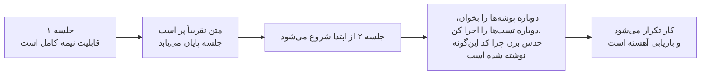
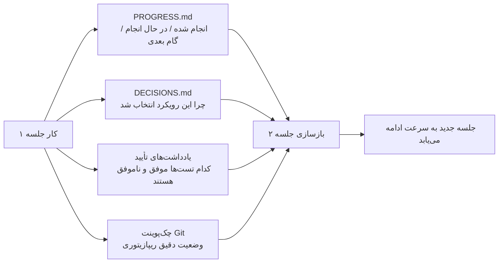

[نسخه‌ی انگلیسی ←](../../../en/lectures/lecture-05-why-long-running-tasks-lose-continuity/)

> نمونه‌های کد: [code/](https://github.com/walkinglabs/learn-harness-engineering/blob/main/docs/en/lectures/lecture-05-why-long-running-tasks-lose-continuity/code/)
> پروژه‌ی تمرینی: [پروژه ۰۳. تداوم در میان جلسات متعدد](./../../projects/project-03-multi-session-continuity/index.md)

# درس ۰۵. نگاه‌داشتن متن در طول جلسات

شما از Claude Code می‌خواهید تا یک قابلیت کامل را پیاده‌سازی کند. برنامه ۳۰ دقیقه اجرا می‌شود، بیشتر کار را انجام می‌دهد، اما متن در حال تمام شدن است. شما یک جلسه جدید شروع می‌کنید تا ادامه دهید — و متوجه می‌شوید که نمی‌خاطرد چه تصمیماتی در دفعه گذشته گرفته شد، چرا گزینه‌ی الف بر گزینه‌ی ب انتخاب شد، کدام فایل‌ها قبلاً ویرایش شدند، یا وضعیت تست‌ها چگونه است. ۱۵ دقیقه را برای تحقیق مجدد در پروژه می‌گذراند و ممکن است از دفعه‌ی گذشته رویکردی نامتناسب داشته باشد.

این معضل واقعی است که ایجنت‌های هوش مصنوعی در کارهای میان‌جلسه ای با آن مواجه می‌شوند. این سخنرانی توضیح می‌دهد چرا ایجنت‌ها در طول کارهای طولانی "رشته را رها می‌کنند"، و چگونه پایداری وضعیت ساختاری اجازه می‌دهد تا یک جلسه جدید به سرعت از جایی که جلسه‌ی قبل تمام شده بود، ادامه دهد.

## پنجره‌های متن: محدود نیستند

پنجره‌های متن محدود هستند. این یک مشکلی نیست که ارتقای مدل می‌تواند آن را حل کند — حتی اگر اندازه‌های پنجره به ۱ میلیون توکن رشد کنند، کارهای پیچیده ایجنت‌ها را به تنهایی خالی می‌کنند. ایجنت‌ها فقط کد تولید نمی‌کنند؛ آن‌ها متن‌های کد را درک می‌کنند، تاریخچه‌ی تصمیمات خودشان را ردیابی می‌کنند، خروجی ابزار را پردازش می‌کنند، و بافت مکالمه را حفظ می‌کنند. تمام این اطلاعات سریع‌تر از بسط پنجره رشد می‌کنند.

مشکل عمیق‌تری وجود دارد: اطلاعاتی که ایجنت‌ها تولید می‌کنند یکنواخت اهمیت ندارند. مراحل تفکر واسطی دارای "چرا" تصمیمات هستند — چرا گزینه‌ی الف بر ب انتخاب شد، چرا این کتاب‌خانه برای آن، چرا یک بهینه‌سازی خاص رها شد. خروجی نهایی فقط شامل "چه" است — خود کد. استراتژی‌های فشرده‌سازی معمولاً دومی را حفظ می‌کنند اما اول را از دست می‌دهند. جلسه‌ی بعد کد را می‌بیند اما نمی‌داند چرا این‌گونه نوشته شده است، و ممکن است یک تصمیم طراحی عمدی را "بهینه‌سازی" کند.

Anthropic چیز جالبی در تحقیقات ایجنت‌های طولانی‌مدت خود مشاهده کرد: زمانی که ایجنت‌ها احساس می‌کنند متن در حال تمام شدن است، رفتار "اتمام شتاب‌گرفته" را نشان می‌دهند — شتاب برای اتمام کار جاری، رها کردن مراحل تأیید، یا انتخاب راه‌حل ساده‌تر بر جای بهینه. Anthropic این را "اضطراب متن" می‌خواند.

## جریان تداوم جلسه

بدون فایل‌های پایداری وضعیت، هر جلسه جدید باید از ابتدا شروع کند:



با فایل‌های پایداری وضعیت، جلسات جدید می‌توانند به سرعت ادامه دهند:



## مفاهیم اساسی

- **پنجره‌های متن محدود هستند**: صرف‌نظر از آنچه اندازه‌ی پنجره ادعا می‌کند (۱۲۸ هزار، ۲۰۰ هزار، ۱ میلیون توکن)، کارهای طولانی در نهایت آن را خالی می‌کنند. بعد از خالی شدن، یا فشرده‌سازی (از دست دادن اطلاعات) یا بازنشانی (شروع جلسه جدید) لازم است — هر دو چیزی را از دست می‌دهند.
- **فایل‌های پایداری وضعیت**: فایل‌های وضعیت پایدار که اجازه می‌دهند جلسه جدید به‌وضوح از جایی ادامه دهد که جلسه آخری تمام شده است. ساده‌ترین شکل شامل گزارش‌های پیشرفت، رکورد‌های تأیید، و اقدامات بعدی است.
- **هزینه‌ی بازسازی**: زمانی که جلسه جدید برای رسیدن به وضعیت قابل اجرا نیاز دارد. یک هارنس خوب می‌تواند هزینه‌ی بازسازی را از ۱۵ دقیقه به ۳ دقیقه کاهش دهد.
- **انحراف**: شکاف بین درک ایجنت و وضعیت واقعی ریپازیتوری کد. هر مرز جلسه انحراف را معرفی می‌کند؛ بدون کنترل، این انحراف جلسه پس از جلسه تجمع می‌یابد.
- **اضطراب متن**: یک پدیده‌ی مشاهده‌شده توسط Anthropic — ایجنت‌ها رفتار اتمام شتاب‌گرفته را نشان می‌دهند زمانی که به حدود متن نزدیک می‌شوند، کارها را زودتر به پایان می‌رسانند تا از از دست دادن اطلاعات جلوگیری کنند. در اساس، یک اضطراب منطقی منابع است.
- **فشرده‌سازی در مقابل بازنشانی**: فشرده‌سازی متن را در همان جلسه خلاصه می‌کند (حفظ می‌کند "چه"، ممکن است "چرا" را از دست دهد)؛ بازنشانی جلسه جدید را باز می‌کند و بازسازی از وضعیت پایدار می‌کند (تمیز اما به تمامیت آثار دستگاه تحویل بستگی دارد).

## آنچه زمانی تداوم شکست می‌خورد اتفاق می‌افتد

جلسه‌ی قبل بودجه‌ی متن قابل توجهی را برای تجزیه‌وتحلیل سه رویکرد و انتخاب گزینه‌ی ب صرف کرد. ایجنت جلسه‌ی این بار نمی‌دانست که این تحلیل را داشته اند و ممکن است بر اساس اطلاعات ناقص دوباره تصمیم بگیرد — احتمالاً گزینه‌ی الف را انتخاب کند. همان اطلاعات، نتیجه‌ی متفاوت، زیرا متن تصمیم‌گیری رفته است.

حتی بدتر کار تکراری است. ایجنت مطمئن نیست که آیا کار معینی قبلاً تکمیل شده است و دوباره آن را انجام می‌دهد. یا بدتر — نیمه‌ی آن را انجام می‌دهد، درگیری را با اجرای موجود کشف می‌کند، و باید دوباره کار کند. بدون رکورد پیشرفت، جلسه‌ی جدید هیچ ایده‌ای از کاری که قبلاً انجام شده است ندارد.

در طول چند جلسه، جهت اجرا ممکن است به‌خاموشی از نیازهای اصلی منحرف شده باشد. هر جلسه‌ی جدید درک متفاوتی از اهداف پروژه دارد. هر انحراف بر اخیری تجمع می‌یابد، و نتیجه‌ی نهایی ممکن است بسیار دور از قصد اصلی باشد.

هم‌چنین شکاف تأیید وجود دارد. نتایج تأیید جلسه‌ی قبل (کدام تست‌ها موفق‌اند، کدام‌ها ناموفق، چرا ناموفق‌اند) ثبت نشدند. جلسه‌ی جدید باید تمام تأیید را دوباره اجرا کند تا وضعیت فعلی را درک کند. هر جلسه از ابتدا دوباره تشخیص می‌دهد، هر بار متن مقدس را هدر می‌دهد.

هم OpenAI و هم Anthropic بر پایداری وضعیت ساختاری در اسناد خود تاکید می‌کنند. مقاله‌ی مهندسی هارنس OpenAI، ریپازیتوری را "رکورد عملیاتی" در نظر می‌گیرد — نتایج هر عملیات باید شاهدی ردپا‌پذیر در ریپازیتوری بگذارد. اسناد ایجنت‌های طولانی‌مدت Anthropic به‌طور خاص "فایل‌های تحویل" را توصیه می‌کند — اسناد ساختاری شامل وضعیت فعلی، مسائل شناخته‌شده، و اقدامات بعدی.

## رویکردهای عملی برای پایداری وضعیت

رویکرد اساسی: **ایجنت را مثل مهندسی در نظر بگیرید که حافظه‌ی کوتاه‌مدت او در هر جلسه پاک می‌شود.** قبل از اینکه "کار روز را تمام کند"، باید اطلاعات بحرانی را یادداشت کند تا ایجنت "کارایی" بعدی به سرعت ادامه دهد.

**ابزار ۱: فایل پیشرفت (PROGRESS.md).** ساده‌ترین فایل پایداری وضعیت:

```markdown
# Project Progress

## Current State
- Latest commit: abc1234 (feat: add user preferences endpoint)
- Test status: 42/43 passing (test_pagination_edge_case failing)
- Lint: passing

## Completed
- [x] User model and database migration
- [x] Basic CRUD endpoints
- [x] Auth middleware integration

## In Progress
- [ ] Pagination feature (90% - edge case test failing)

## Known Issues
- test_pagination_edge_case returns 500 on empty result sets
- Need to confirm whether deleted users should appear in listings

## Next Steps
1. Fix pagination edge case bug
2. Add "include deleted users" query parameter
3. Update API documentation
```

**ابزار ۲: گزارش تصمیم (DECISIONS.md).** تصمیمات طراحی مهم و دلایل را ثبت کنید. نیاز به اسناد طراحی مفصلی نیست — فقط "چه تصمیم، چرا، کی":

```markdown
# Design Decisions

## 2024-01-15: Use Redis for user preferences caching
- Reason: High read frequency (every API call), small data size
- Rejected alternative: PostgreSQL materialized view (high change frequency makes maintenance cost not worthwhile)
- Constraint: Cache TTL of 5 minutes, active invalidation on write
```

**ابزار ۳: کامیت‌های Git به‌عنوان چک‌پوینت.** بعد از تکمیل هر واحد کار اتمی، کامیت کنید. پیام‌های کامیت باید توضیح دهند چه انجام شد و چرا. این‌ها رایگان هستند، خودکار نسخه‌بندی‌شده‌ی عکس‌العمل وضعیت.

**ابزار ۴: init.sh یا جریان مقدار‌دهی هارنس.** در `AGENTS.md` روتین‌های "ورود" و "خروج" را مشخص کنید:

```markdown
## At session start (clock in)
1. Read PROGRESS.md for current state
2. Read DECISIONS.md for important decisions
3. Run make check to confirm repo is in consistent state
4. Continue from PROGRESS.md "Next Steps" section

## Before session end (clock out)
1. Update PROGRESS.md
2. Run make check to confirm consistent state
3. Commit all completed work
```

**استراتژی مختلط**: نه هر کاری نیاز به بازنشانی متن دارد. کارهای کوتاه (کمتر از ۳۰ دقیقه) می‌توانند در یک جلسه تکمیل شوند. کارهای طولانی (دوره‌ای جلسات) باید از فایل‌های پیشرفت و گزارش‌های تصمیم برای تداوم استفاده کنند. معیار تصمیم: اگر کاری بیش از ۶۰ درصد پنجره نیاز دارد، شروع به آماده‌سازی دستگاه تحویل کنید.

### نگاه عمیق‌تر به اضطراب متن

تحقیقات مارس ۲۰۲۶ Anthropic مظاهر خاص اضطراب متن را فاش کرد: بر روی Sonnet 4.5، زمانی که متن به حد پنجره نزدیک می‌شود، ایجنت رفتار "اتمام شتاب‌گرفته" قوی را نشان می‌دهد.

دو استراتژی این را حل می‌کند:

**فشرده‌سازی**: خلاصه‌سازی مکالمه‌ی اولیه در همان جلسه. مزیت: تداوم را حفظ می‌کند، ایجنت می‌تواند "چه" را ببیند. نقص: "چرا" اغلب در خلاصه‌ها گم می‌شود — چرا گزینه‌ی ب بر الف انتخاب شد، چرا یک بهینه‌سازی خاص رها شد. حتی اهم‌تر، فشرده‌سازی اضطراب متن را حذف نمی‌کند — ایجنت می‌داند متن یک‌بار بزرگ بود، و روان‌شناختی هنوز تمایل دارد برای اتمام شتاب بگیرد.

**بازنشانی متن**: کاملاً متن را پاک کنید، جلسه‌ی جدید را باز کنید، بازسازی از آثار پایدار کنید. مزیت: وضعیت ذهنی تمیز — جلسه‌ی جدید هیچ "از وقت رفته‌ام" اضطراب ندارد. نقص: به تمامیت آثار دستگاه تحویل بستگی دارد. اگر فایل پیشرفت اطلاعات بحرانی را از دست دهد، جلسه‌ی جدید ممکن است زمان را برای رفتن در جهت غلط صرف کند.

داده‌های واقعی Anthropic: برای Sonnet 4.5، اضطراب متن آنقدر شدید است که فشرده‌سازی تنهایی کافی نیست — بازنشانی متن به یک جزء بحرانی طراحی هارنس تبدیل می‌شود. اما برای Opus 4.5، این رفتار بسیار کاهش می‌یابد، و فشرده‌سازی می‌تواند متن را بدون تکیه بر بازنشانی مدیریت کند. این به معنای: **طراحی هارنس به درک خاص مدل هدف نیاز دارد، نه یک الگوی یک‌سان برای همه.**

> Source: [Anthropic: Harness design for long-running application development](https://www.anthropic.com/engineering/harness-design-long-running-apps)

## نمونه‌ی دنیای واقعی

یک ایجنت با کار پیاده‌سازی سیستم وبلاگ با احراز‌هویت کاربر — ۱۲ نقطه قابلیت، تخمین۵ جلسه لازم است.

**بدون فایل‌های پایداری وضعیت**: جلسه‌ی ۱ مدل کاربر و مسیرهای اساسی را اجرا کرد. جلسه‌ی ۲ بدون اینکه ایجنت از قرارداد واسط middleware احراز‌هویت یاد داشته باشد شروع شد، حدود ۱۵ دقیقه را برای استنباط قصد طراحی قبل صرف کرد. تا جلسه‌ی ۳، انحراف تجمع‌شده باعث شد ایجنت قابلیت‌های قبلاً تکمیل‌شده را دوباره اجرا کند. تا جلسه‌ی ۵، ریپازیتوری حاوی بسیاری کد تکراری است اما قابلیت احراز‌هویت اصلی هنوز تست‌های انتهای‌به‌انتها را تصویب نکرده است. فقط ۷ از ۱۲ نقطه قابلیت تکمیل‌شده، ۳ مورد مسائل صحت‌شناختی پنهانی دارند.

**با فایل‌های پایداری وضعیت**: استفاده از فایل‌های پیشرفت، گزارش‌های تصمیم، رکورد‌های تأیید، و چک‌پوینت‌های git. گزارش وضعیت به‌طور خودکار در پایان هر جلسه به‌روزرسانی می‌شود. هزینه‌ی بازسازی جلسه‌ی ۲ به حدود ۳ دقیقه کاهش یافت. تا جلسه‌ی ۵، تمام ۱۲ نقطه قابلیت تکمیل و تأیید‌شده است.

مقایسه‌ی کمی: زمان بازسازی حدود ۷۸ درصد کاهش یافت، نرخ تکمیل قابلیت از ۵۸ درصد به ۱۰۰ درصد، نرخ عیب‌های پنهان از ۴۳ درصد به ۸ درصد کاهش یافت.

## خلاصه‌های اساسی

- پنجره‌های متن یک منبع محدود هستند. کارهای طولانی چند جلسه‌ای خواهند بود، و جلسات اطلاعات را از دست خواهند داد — این واقعیت عینی است.
- راه‌حل پنجره‌های بزرگ‌تر نیست — بهتر است پایداری وضعیت. فایل‌های پیشرفت، گزارش‌های تصمیم، و چک‌پوینت‌های git با هم کار می‌کنند تا جلسات جدید از جایی که جلسات قبلی تمام شدند ادامه دهند.
- ایجنت را مثل مهندسی در نظر بگیرید که حافظه‌ی کوتاه‌مدت او هر جلسه پاک می‌شود: قبل از "کار روز را تمام کند"، چه انجام شد، چرا، و چه‌ی بعد را بنویسید.
- هزینه‌ی بازسازی معیار کلیدی است. یک هارنس خوب باید جلسات جدید را به وضعیت قابل اجرا در طی ۳ دقیقه برساند.
- استراتژی مختلط: کارهای کوتاه در جلسات، کارهای طولانی با آثار ساختاری برای تداوم.

## بیشتر بخوانید

- [Anthropic: Effective Harnesses for Long-Running Agents](https://www.anthropic.com/engineering/effective-harnesses-for-long-running-agents)
- [OpenAI: Harness Engineering](https://openai.com/index/harness-engineering/)
- [Lost in the Middle: How Language Models Use Long Contexts](https://arxiv.org/abs/2307.03172)
- [Claude Code Documentation](https://docs.anthropic.com/en/docs/claude-code)
- [HumanLayer: Harness Engineering for Coding Agents](https://www.humanlayer.dev/blog/skill-issue-harness-engineering-for-coding-agents)

## تمرین‌ها

۱. **اندازه‌گیری پایداری وضعیت**: یک کار توسعه را انتخاب کنید که حداقل ۳ جلسه نیاز داشته باشد. بدون ارائه‌ی هیچ فایل پایداری وضعیت، در هر شروع جلسه ثبت کنید متن ایجنت برای "درک اینکه چه اتفاقی افتاده" صرف کند. بعد از هر جلسه، یک فایل پیشرفت بسازید و اجازه دهید جلسه‌ی بعد از آن شروع شود. هزینه‌ی بازسازی را با و بدون فایل‌های پیشرفت مقایسه کنید.

۲. **طراحی الگوی دستگاه تحویل**: الگوی دستگاه تحویلی حداقل با چهار فیلد طراحی کنید: وضعیت ریپازیتوری (هش کامیت)، وضعیت زمان‌اجرا (نرخ تصویب تست)، موانع، اقدامات بعدی. اجازه دهید یک جلسه ایجنت کاملاً تازه وضعیت پروژه را فقط با استفاده از این الگو بازیابی کند. ابهامات مواجه‌شده در طول بازیابی را ثبت کنید، برای بهبود الگو تکرار کنید.

۳. **آزمایش استراتژی مختلط**: در کار توسعه ۵ جلسه‌ای، سه استراتژی را مقایسه کنید: (الف) همیشه جلسات تازه شروع کنید + فایل‌های پیشرفت، (ب) تا آنجا که ممکن است در یک جلسه انجام دهید (فشرده‌سازی متن)، (ج) استراتژی مختلط (کارهای کوتاه در جلسه، کارهای طولانی در جلسات + فایل‌های پیشرفت). زمان بازسازی، نرخ تکمیل قابلیت، و سازگاری تصمیم را مقایسه کنید.
