[نسخه‌ی انگلیسی ←](../../../en/lectures/lecture-06-why-initialization-needs-its-own-phase/)

> نمونه کدها: [code/](https://github.com/walkinglabs/learn-harness-engineering/blob/main/docs/en/lectures/lecture-06-why-initialization-needs-its-own-phase/code/)
> پروژه‌ی تمرین: [Project 03. تداوم چند جلسه‌ای](./../../projects/project-03-multi-session-continuity/index.md)

# درس ۰۶. ایجنت را قبل از هر جلسه‌ی کاری مقدمه‌سازی کنید

یک جلسه‌ی جدید ایجنت شروع می‌کنید و به آن می‌گویید «یک ویژگی جستجو اضافه کن.» فوری‌اً به کدنویسی می‌پردازد — سرمایه‌گذاری قابل ستایش. بعد از ۲۰ دقیقه متوجه می‌شود فریم‌ورک آزمایشی به‌درستی پیکربندی نشده، ۱۰ دقیقه‌ی دیگر برای رفع آن صرف می‌کند، سپس فرمت script مهاجرت پایگاه‌داده غلط است، تلاش‌های بیشتری انجام می‌دهد. ویژگی جستجو در نهایت اضافه می‌شود، اما تمام جلسه ناکارآمد بود. اکثر زمان برای «فهمیدن نحوه‌ی عملکرد این پروژه» صرف شد، نه نوشتن خود ویژگی جستجو.

روش بهتر: پیش از دادن اجازه‌ی شروع کار به ایجنت، از یک فاز جداگانه استفاده‌کنید تا محیط پایه‌ای آماده شود، دستورات راستی‌آزمایی اجرا شوند، و ساختار پروژه درک شود. کار مقدمه‌سازی نباید با پیاده‌سازی ویژگی یکی شود — آنها دو نوع کاری کاملاً متفاوت هستند.

این سخنرانی بحث می‌کند که چرا مقدمه‌سازی باید یک فاز جداگانه باشد، نه اختلاط‌شده با پیاده‌سازی.

## دو نوع کار بنیادی‌متفاوت

مقدمه‌سازی و پیاده‌سازی اهداف بهینه‌سازی کاملاً متفاوتی دارند. فاز پیاده‌سازی به‌دنبال حداکثرسازی کمّ و کیفّ ویژگی‌های تأیید‌شده است. فاز مقدمه‌سازی به‌دنبال حداکثرسازی قابلیت‌اعتماد و کارآیی تمام پیاده‌سازی‌های بعدی است.

هنگام‌که مقدمه‌سازی و پیاده‌سازی را یکی می‌کنید، ایجنت با یک مسئله‌ی بهینه‌سازی چندهدفه مواجه می‌شود: باید به‌طور همزمان زیرساخت را بسازد و کد ویژگی بنویسد. بدون تعیین اولویت صریح، ایجنت طبیعی‌اً به سوی نوشتن کد گرایش پیدا می‌کند (زیرا این‌ها مستقیماً output قابل‌دیدی هستند) در حالی‌که زیرساخت را قربانی می‌کند (زیرا ارزش آن فقط در جلسات بعدی ظاهر می‌شود). نتیجه: زیرساخت مستحکم ساخته نمی‌شود، و قابلیت‌اعتماد کد ویژگی نیز آسیب می‌بیند.

## چرخه‌ی حیات مقدمه‌سازی

```mermaid
flowchart TB
    subgraph Wrong["Mixed into one session (wrong)"]
        W1["Start feature work immediately"] --> W2["Discover env and test gaps mid-task"]
        W2 --> W3["Accumulate unverified code"]
        W3 --> W4["Next session must rediscover project state"]
    end

    subgraph Right["Dedicated initialization phase (right)"]
        R1["Session 1: environment runnable"] --> R2["Example test passing"]
        R2 --> R3["Startup readiness checklist + task list written"]
        R3 --> R4["Clean checkpoint committed"]
        R4 --> R5["Later sessions start directly on verified tasks"]
    end
```



## اتفاق‌های زمانی که آن‌ها را یکی می‌کنید

مسئله‌ی مستقیم: زیرساخت به‌درستی ساخته نمی‌شود. ایجنت ۸۰ درصد تلاش خود را به کد ویژگی و بقیه‌ی ۲۰ درصد را به تنظیم سریع بعض زیرساخت‌ها صرف می‌کند. فریم‌ورک آزمایشی پیکربندی می‌شود اما هرگز تأیید نمی‌شود، قوانین lint تعیین می‌شوند اما خیلی سست هستند، هیچ فایل progress ساخته نمی‌شود. این عیوب در جلسه‌ی اول واضح نیستند (زیرا ایجنت هنوز آنچه انجام داده را یادآور است)، اما در جلسه‌ی دوم ظاهر می‌شوند: ایجنت جدید نمی‌داند چگونه پروژه را اجرا کند، چگونه آزمایش کند، یا وضعیت کجا است.

هزینه‌ی پنهان‌تری «انباشت‌ی بدون‌تأیید» است. کد ویژگی‌ای که پیش از پیکربندی صحیح فریم‌ورک آزمایشی نوشته می‌شود — هنگامی‌که بالاخره برای اضافه‌کردن آزمایشات برمی‌گردید، ممکن است متوجه شوید خود طراحی عیبدار بود. اگر زودتر می‌دانستید، آن را متفاوت پیاده‌سازی می‌کردید. هر چه کد بیشتری در ابتدا نوشته شود، بیشتری باید خراب‌شده و دوباره انجام شود.

بودجه‌ی متن (context) هم هدر می‌رود. کار مقدمه‌سازی (پیکربندی محیط‌ها، تنظیم آزمایشات، درک ساختار پروژه) بخش بزرگی از بودجه را مصرف می‌کند، برای پیاده‌سازی ویژگی‌های واقعی کمتر بودجه می‌ماند. نتیجه: جلسه‌ی اول فقط نیمی از ویژگی‌ها را انجام می‌دهد، و جلسه‌ی دوم هنوز هم باید از خود درک ساختار پروژه شروع کند. بودجه برای مقدمه‌سازی صرف شد، اما مقدمه‌سازی خوب انجام نشد — بدترین حالت‌های ممکن.

مسئله‌ای که آسان‌تر نادیده گرفته می‌شود «معادله‌های فرض ضمنی» است. تصمیماتی که ایجنت در حین مقدمه‌سازی می‌گیرد (کدام فریم‌ورک آزمایشی، چگونه دایرکتوری‌ها را سازماندهی کنید، مدیریت وابستگی) — اگر صریحاً ثبت نشوند، جلسات بعدی ممکن است انتخاب‌های متناقض کنند. جلسه‌ی اول Vitest را به‌عنوان فریم‌ورک آزمایشی انتخاب کرد، اما ایجنت جلسه‌ی دوم نمی‌داند و Jest را وارد می‌کند. دو فریم‌ورک آزمایشی کنار هم وجود دارند، و هزینه‌های نگهداری دو برابر می‌شود.

پژوهش توسعه‌ی برنامه‌های کار دراز‌مدت Anthropic صریحاً توصیه می‌کند مقدمه‌سازی را از پیاده‌سازی جدا کنید. داده‌های تجربی آنان: پروژه‌هایی که از یک فاز مقدمه‌سازی اختصاصی استفاده می‌کردند ۳۱ درصد نرخ تکمیل ویژگی بیشتری را در سناریوهای چند جلسه‌ای نسبت به روش‌های ترکیبی نشان دادند. و زمانی که در فاز مقدمه‌سازی سرمایه‌گذاری شد در ۳-۴ جلسه‌ی بعدی کاملاً بازیافت می‌شود.

راهنمای مهندسی هارنس Codex OpenAI نیز اصل «ریپازیتوری به‌عنوان سابقه‌ی عملیاتی» را تأکید می‌کند: از اولین اجرا ساختار عملیاتی واضح برقرار کنید، یا هر جلسه‌ی جدید باید کنوانسیون‌های پروژه را دوباره استنتاج کند.

## مفاهیم اساسی

- **فاز مقدمه‌سازی**: اولین فاز در چرخه‌ی حیات ایجنت — فقط پیش‌نیازهای پیاده‌سازی بعدی را برقرار می‌کند، بدون توسعه‌ی ویژگی تجاری. output آن زیرساخت است، نه کد تجاری.
- **فهرست راستی‌آزمایی آمادگی شروع**: شرایطی که تحت آن یک پروژه می‌تواند بدون ابهام توسط یک جلسه‌ی ایجنت جدید عملیاتی شود: می‌تواند شروع شود، می‌تواند آزمایش کرد، می‌تواند پیشرفت را دید، می‌تواند مراحل بعدی را انتخاب کند. چهار شرط، همه‌ی آنها الزامی.
- **از صفر در مقابل از Template**: شروع از صفر به معنی ایجنت باید ساختار پروژه را خود از یک دایرکتوری خالی استنتاج کند؛ شروع از template به معنی زیرساخت قبلاً جا‌ گذاشته‌شده است. شروع از template بسیار بهتر عمل می‌کند تا شروع از صفر.
- **همیشه برای تحویل آماده**: پروژه در هر لحظه‌ای در وضعیتی است که جلسه‌ی ایجنت جدید می‌تواند تحویل بگیرد. هیچ توضیح شفاهی لازم نیست — فقط نگاه کردن به محتویات repo کافی است برای ادامه‌ی کار.
- **زمان از شروع تا اولین آزمایش موفق**: زمان از شروع پروژه تا نقطه‌ای که اولین نقطه‌ی ویژگی راستی‌آزمایی را برابر کند. این معیار اصلی برای سنجش کارآیی مقدمه‌سازی است.
- **نرخ موفقیت جلسات بعدی**: نسبتی از جلسات بعدی که می‌توانند کارها را بدون تکیه‌ی بر دانش ضمنی اجرا کنند. این بهترین اندازه‌گیری برای کیفیت مقدمه‌سازی است.

## چگونه مقدمه‌سازی را به‌درستی انجام دهید

**مقدمه‌سازی را به‌عنوان یک فاز اختصاصی درمان کنید.** جلسه‌ی اول فقط مقدمه‌سازی انجام می‌دهد — اصلاً کد ویژگی تجاری نیست. مقدمه‌سازی تولید می‌کند:

**۱. محیط اجرایی.** پروژه شروع می‌شود، وابستگی‌ها نصب می‌شوند، هیچ مسئله‌ی محیطی نیست.

**۲. فریم‌ورک آزمایشی قابل راستی‌آزمایی.** حداقل یک آزمایش نمونه موفق است، ثابت می‌کند فریم‌ورک آزمایشی خود به‌درستی پیکربندی شده است.

**۳. سند فهرست راستی‌آزمایی آمادگی شروع.** یک سند واضح برای جلسات بعدی:
```markdown
# Startup Readiness Checklist

## Start Commands
- Install dependencies: `make setup`
- Start dev server: `make dev`
- Run tests: `make test`
- Full verification: `make check`

## Current State
- All dependencies installed and locked
- Test framework configured (Vitest + React Testing Library)
- Example test passing (1/1)
- Lint rules configured (ESLint + Prettier)

## Project Structure
- src/ — Source code
- src/components/ — React components
- src/api/ — API client
- tests/ — Test files
```

**۴. تقسیم کار.** کل پروژه را به یک فهرست کار مرتب‌شده تقسیم کنید، هر کار با معیارهای پذیرش واضح:
```markdown
# Task Breakdown

## Task 1: User Authentication Basics
- Implement JWT auth middleware
- Add login/register endpoints
- Acceptance: pytest tests/test_auth.py all passing

## Task 2: User Profile Page
- Implement user profile CRUD
- Add profile edit form
- Acceptance: pytest tests/test_profile.py all passing

## Task 3: Search Feature
- ...
```

**۵. Git commit به‌عنوان چک‌پوینت.** بعد از اتمام مقدمه‌سازی، یک چک‌پوینت پاک commit کنید. تمام کار بعدی از این چک‌پوینت شروع می‌شود.

**شروع از template**: از یک دایرکتوری خالی شروع نکنید. از یک template پروژه (create-react-app، fastapi-template، و غیره) استفاده‌کنید تا ساختار دایرکتوری استاندارد، پیکربندی وابستگی، و فریم‌ورک آزمایشی را از پیش تعیین کنید. مراحل مقدمه‌سازی رایج را در template بسازید، فقط کار مقدمه‌سازی مخصوص پروژه باقی می‌ماند.

**معیارهای تکمیل مقدمه‌سازی**: نه «چه حدی کد نوشته‌شد»، بلکه آیا چهار شرط فهرست راستی‌آزمایی آمادگی شروع همه‌ی آنها تأمین شده‌اند: می‌تواند شروع شود، می‌تواند آزمایش کرد، می‌تواند پیشرفت دید، می‌تواند مراحل بعدی را انتخاب کند. از این فهرست استفاده‌کنید تا مقدمه‌سازی را تأیید کنید:

```markdown
## Initialization Acceptance Checklist
- [ ] `make setup` succeeds from scratch
- [ ] `make test` has at least one passing test
- [ ] A new agent session can answer "how to run" and "how to test" from repo contents alone
- [ ] Task breakdown file exists with at least 3 tasks
- [ ] Everything committed to git
```

## نمونه‌ی واقعی

دو روش مقدمه‌سازی برای پروژه‌ی frontend React، مقایسه‌شده:

**روش ترکیبی**: ایجنت به‌طور همزمان در جلسه‌ی اول scaffolding پروژه را ایجاد کرد و اولین ویژگی را پیاده‌سازی کرد. در انتهای جلسه، repo کد قابل اجرا داشت اما هیچ مستندات دستور شروع/آزمایش صریح، هیچ فایل پیگیری پیشرفت، هیچ تقسیم کار نبود. جلسه‌ی ۲ حدود ۲۰ دقیقه صرف استنتاج ساختار پروژه، فریم‌ورک آزمایشی، و روند ساخت کرد.

**مقدمه‌سازی اختصاصی**: جلسه‌ی اول فقط مقدمه‌سازی کرد — ساختار دایرکتوری را از template ایجاد کرد، فریم‌ورک آزمایشی (Vitest + React Testing Library) را پیکربندی کرد، یک آزمایش نمونه نوشت و راستی‌آزمایی کرد، فهرست راستی‌آزمایی آمادگی شروع و فایل تقسیم کار را ایجاد کرد، چک‌پوینت اولیه را commit کرد. زمان بازسازی جلسه‌ی ۲ کمتر از ۳ دقیقه بود، و مستقیماً از فهرست کار شروع کرد.

مقایسه‌ی چرخه‌ی پروژه‌ی کامل: کل زمان بازسازی روش ترکیبی (در تمام جلسات) حدود ۶۰ درصد بیشتر از روش مقدمه‌سازی اختصاصی بود. ۲۰ دقیقه‌ی اضافی صرف‌شده‌ی مقدمه‌سازی بارها در جلسات بعدی بازیافت شد. مقدار زمانی را در ابتدا برای مقدمه‌سازی به‌درستی سرمایه‌گذاری کنید، و کارآیی بعدی واقعاً بیشتر است.

## نکات کلیدی

- مقدمه‌سازی و پیاده‌سازی اهداف بهینه‌سازی متفاوتی دارند — اختلاط‌کردن آنها فقط هر دو را پایین می‌کشد.
- output مقدمه‌سازی کد تجاری نیست، زیرساخت است: محیط اجرایی، آزمایشات قابل راستی‌آزمایی، فهرست راستی‌آزمایی آمادگی شروع، تقسیم کار.
- مقدمه‌سازی را با چهار شرط فهرست راستی‌آزمایی آمادگی شروع تأیید کنید: می‌تواند شروع شود، می‌تواند آزمایش کرد، می‌تواند پیشرفت دید، می‌تواند مراحل بعدی را انتخاب کند.
- شروع از template بهتر از شروع از صفر است. template‌های پروژه استفاده‌کنید تا زیرساخت استاندارد را از پیش تعیین کنید.
- زمان سرمایه‌گذاری‌شده‌ی مقدمه‌سازی در ۳-۴ جلسه‌ی بعدی کاملاً بازیافت می‌شود. این هزینه‌ی اضافی نیست — سرمایه‌گذاری اولیه است.

## مطالعه‌ی بیشتر

- [Anthropic: Effective Harnesses for Long-Running Agents](https://www.anthropic.com/engineering/effective-harnesses-for-long-running-agents)
- [OpenAI: Harness Engineering](https://openai.com/index/harness-engineering/)
- [HumanLayer: Harness Engineering for Coding Agents](https://www.humanlayer.dev/blog/skill-issue-harness-engineering-for-coding-agents)
- [Infrastructure as Code — Martin Fowler](https://martinfowler.com/bliki/InfrastructureAsCode.html)
- [SWE-agent: Agent-Computer Interfaces](https://github.com/princeton-nlp/SWE-agent)

## تمرین‌ها

۱. **طراحی فهرست راستی‌آزمایی آمادگی شروع**: یک فهرست راستی‌آزمایی آمادگی شروع کامل برای پروژه‌ای که در حال توسعه‌ی آن هستید بنویسید. سپس یک جلسه‌ی ایجنت کاملاً جدید باز کنید، فقط محتویات repo را نمایش دهید (بدون هیچ بافت شفاهی)، و سعی کنید پروژه را شروع کند، آزمایشات را اجرا کند، و پیشرفت فعلی را درک کند. هر مسئله‌ای که با آن مواجه می‌شود را ثبت کنید — هر کدام متناظر با یک بند گمشده در فهرست راستی‌آزمایی آمادگی شروع شماست.

۲. **آزمایش مقایسه‌ای**: یک پروژه‌ی جدید متوسط پیچیدگی انتخاب کنید. روش الف: ایجنت را مقدمه‌سازی و اولین پیاده‌سازی را به‌طور همزمان انجام دهند. روش ب: یک جلسه‌ی مخصوص برای مقدمه‌سازی صرف کنید، پیاده‌سازی را در جلسه‌ی دوم شروع کنید. بعد از ۴ جلسه، زمان از شروع تا اولین آزمایش موفق، هزینه‌ی بازسازی، و نرخ تکمیل ویژگی را مقایسه‌کنید.

۳. **فهرست راستی‌آزمایی پذیرش مقدمه‌سازی**: یک فهرست راستی‌آزمایی پذیرش مقدمه‌سازی برای پروژه‌ی خود طراحی کنید. یک جلسه‌ی ایجنت جدید هر مورد فهرست را اجرا کند و ثبت کند کدام‌ها موفق هستند و کدام‌ها شکست می‌خورند. موارد شکست‌خورده جایی است که هارنس شما نیاز به تقویت دارد.
