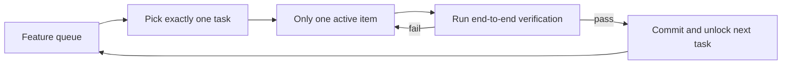
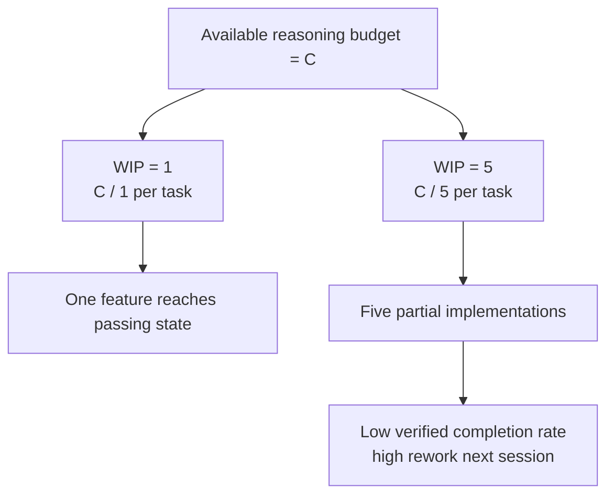

[نسخه‌ی انگلیسی ←](../../../en/lectures/lecture-07-why-agents-overreach-and-under-finish/)

> نمونه کدها: [code/](https://github.com/walkinglabs/learn-harness-engineering/blob/main/docs/en/lectures/lecture-07-why-agents-overreach-and-under-finish/code/)
> پروژه‌ی تمرین: [Project 04. استفاده از بازخورد زمان‌اجرا برای تصحیح رفتار ایجنت](./../../projects/project-04-incremental-indexing/index.md)

# درس ۰۷. مرزهای وضوح‌دار کار برای ایجنت‌ها رسم کنید

به Claude Code می‌گویید «احراز هویت کاربر را به این پروژه اضافه کن»، و شروع به اصلاح scheme پایگاه‌داده، نوشتن routes، تغییر مؤلفه‌های frontend، و — در حین انجام — بازسازی middleware مدیریت‌خطا می‌کند. دو ساعت بعد بررسی می‌کنید: ۱۲ فایل اصلاح‌شده، ۸۰۰ خط کد جدید، و هیچ ویژگی end-to-end کار نمی‌کند.

ایجنت‌ها با تمایل به «کمی کار اضافی انجام دادن» متولد می‌شوند — چیزهای مرتبط را می‌بینند و فقط آن‌ها را در طول راه مدیریت می‌کنند. مسئله این است که انجام خیلی زیاد کار در یک‌زمان تقریباً تضمین می‌کند هیچ یک از آنها خوب انجام نشود.

وبلاگ مهندسی «Effective harnesses for long-running agents» Anthropic صریح‌اً اظهار می‌کند: هنگام‌که prompt‌ها بیش‌از‌حد گسترده‌اند، ایجنت‌ها تمایل دارند به «شروع کردن چندین چیز به‌یک‌زمان» نسبت به «پایان‌دادن به یک چیز ابتدا». تمرین‌های مهندسی Codex OpenAI یکسان را پیدا کردند — کارهایی بدون کنترل دامنه‌ی کار صریح نرخ تکمیل را فرو می‌بندند. این مسئله‌ی مدل نیست — مسئله‌ی هارنس است. شما مرز را رسم نکردید.

## توجه یک منبع محدود است

این یک استعاره نیست — ریاضی است. فرض کنید ظرفیت متن ایجنت C است و آن k کار را به‌طور همزمان فعال می‌کند. هر کار میانگین C/k منبع استدلال می‌گیرد. هنگام‌که C/k زیر حداقل آستانه‌ی مورد نیاز برای تکمیل یک کار تنهایی قرار می‌گیرد، هیچ یک از آنها انجام نمی‌شود.

رفتار واقعی Claude Code آموزنده است. از آن درخواست کنید «ثبت‌نام کاربر را اضافه کن» و ممکن است:

۱. مدل کاربر ایجاد کنید
۲. route ثبت‌نام بنویسید
۳. متوجه شوید نیاز به تأیید email دارد، پس mail service اضافه کنید
۴. ببینید کلمه‌ی عبور نیاز به hashing دارد، پس bcrypt بیاورید
۵. ببینید مدیریت‌خطا ناسازگار است، پس middleware خطای جهانی را بازسازی کنید
۶. ببینید ساختار فایل آزمایش‌ی آشفته است، پس دایرکتوری را سازماندهی‌کنید

شش مرحله‌ی بعدی، هر یک نیمه‌تمام است. بدون تأیید end-to-end، coupling پیچیده‌ی بین کدهای نیمه‌تمام، و جلسه‌ی بعدی برای انتخاب بخش‌های باقی‌مانده کاملاً گمراه خواهد بود.

داده‌های تجربی Anthropic مستقیماً این را تأیید می‌کند: ایجنت‌هایی که از استراتژی‌ی «مرحله‌ی بعدی کوچک» استفاده می‌کنند (معادل WIP=1) ۳۷ درصد نرخ تکمیل کار بیشتری نسبت به ایجنت‌هایی که از prompt‌های گسترده استفاده می‌کنند نشان می‌دهند. جالب‌تر اینکه، تعداد خط‌های کد تولید‌شده‌ی ایجنت‌ها ضعیف‌اً با تکمیل ویژگی‌های واقعی همبستگی منفی دارند — بیشتر کد نوشته‌شده، ویژگی‌های کمتر تکمیل‌شده. چنان‌که بیشتر از آن‌چه می‌توانید بجویید، ثابت‌شده‌ی داده است.

## جریان WIP=1





## مفاهیم اساسی

- **تجاوز**: ایجنت بیشتر کارها را در یک جلسه‌ی واحد فعال می‌کند تا بهینه. این ذهنی نیست — کمّی است: انجام ۵ ویژگی با ۰ گذر end-to-end تجاوز است.
- **عدم‌تکمیل**: نسبت کارهایی که راستی‌آزمایی end-to-end را برابر کنند، از کل کارهای فعال‌شده، زیر آستانه می‌افتد. کد نوشته‌شده اما آزمایشات گذر نمی‌کنند عدم‌تکمیل است.
- **محدودیت WIP (کار در حال انجام)**: از روش‌شناسی Kanban. ایده‌ی اصلی: محدود کنید چند کار به‌یک‌زمان جریان دارند. برای ایجنت‌ها، WIP=1 تنظیم پیشفرض محفوظ است — یکی را تکمیل کنید پیش از شروع بعدی.
- **شواهد تکمیل**: شرط قابل تأیید که کار باید آن را برآورده کند تا از «درحال انجام» به «انجام‌شده» حرکت کند. بدون این، ایجنت‌ها «کد خوب به‌نظر می‌رسد» را برای «رفتار آزمایشات را برابر می‌کند» جایگزین می‌کنند.
- **سطح دامنه‌ی کار**: ساختار DAG که هر گره یک واحد کار و لبه‌ها وابستگی‌ها هستند. وضعیت‌ها به چهار محدود: not_started، active، blocked، passing.
- **فشار تکمیل**: نیروی مقید‌کننده‌ی که هارنس از طریق محدودیت‌های WIP و نیازمندی‌های شواهد تکمیل اعمال می‌کند، ایجنت را برای تکمیل کار جاری پیش از شروع کار جدید مجبور می‌کند.

## تجاوز و عدم‌تکمیل دو سوی یک سکه‌اند

این دو مسئله مستقل نیستند — یکدیگر را تقویت می‌کنند. تجاوز توجه را کاهش می‌دهد، توجه کاهش‌یافته عدم‌تکمیل را ایجاد می‌کند، و کد نیمه‌تمام باقی‌مانده پیچیدگی سیستم را افزایش می‌دهد، که بیشتر تجاوز را در کار بعدی هم‌انگیختان می‌کند. یک چرخه‌ی شوم.

در لحاظ Kanban: قانون Little به ما می‌گوید L = lambda * W. اگر کار در حال انجام L بیش‌از‌حد باشد (بیش‌از‌حد کارها را به‌یک‌زمان انجام دهید)، زمان اجرا W برای هر کار حتماً افزایش می‌یابد. برای ایجنت‌ها، این به معنی هر ویژگی بیشتر زمانی برای رفتن از شروع تا تکمیل راستی‌آزمایی‌شده می‌گیرد، و احتمال شکست رشد می‌یابد.

این یک مسئله‌ی قدیمی در دنیای انسانی هم است. Steve McConnell در *Rapid Development* مستندسازی کرد scope creep دلیل اصلی شکست پروژه است. اما انسان‌ها حداقل شهود دارند «من اندازه‌ی کافی کار کردم.» ایجنت‌ها هیچی ندارند. ایجاد ایده‌ی بعدی تقریباً برای مدل هزینه‌ای ندارد — نوشتن «بگذارید این را هم در طول راه درست کنم» تقریباً لازمه‌ای اضافی هزینه نمی‌کند، اما هر اصلاح اضافی توجه ایجنت را کاهش می‌دهد.

## چگونه آن را به‌درستی انجام دهید

### ۱. WIP=1 را تحت‌الشعاع کنید

این مستقیم‌ترین و مؤثرترین روش است. در هارنس خود، به ایجنت صریح‌اً بگویید: **تنها یک کار مجاز است وضعیت «فعال» داشته باشد به‌یک‌زمان.** در CLAUDE.md Claude Code یا AGENTS.md Codex، بنویسید:

```
## Work Rules
- Work on one feature at a time
- Only start the next feature after the current one passes end-to-end verification
- Don't "also refactor" feature B while implementing feature A
```

### ۲. شواهد تکمیل صریح برای هر کار تعریف کنید

انجام نیست «کد نوشته‌شد» — «راستی‌آزمایی رفتار برابر است.» در فهرست ویژگی شما، هر ورودی نیاز دستور راستی‌آزمایی دارد:

```
F01: User Registration
  Verification: curl -X POST /api/register -d '{"email":"test@example.com","password":"123456"}' | jq .status == 201
  State: passing
```

### ۳. سطح دامنه‌ی کار را خارج‌سازی کنید

از فایل قابل‌تفسیر‌ماشین (JSON یا Markdown) برای ثبت تمام وضعیت‌های کار استفاده‌کنید. هر جلسه‌ی جدید می‌تواند این فایل را بخواند و فوری‌اً بداند: کدام کار فعال است؟ چه رفتاری به‌عنوان انجام‌شده شمار می‌رود؟ کدام راستی‌آزمایی‌ها برابر شده‌اند؟

### ۴. نرخ تکمیل تأیید‌شده را نظارت کنید

هارنس باید به‌طور مستمر VCR (نرخ تکمیل تأیید‌شده) = کارهای تأیید‌شده / کارهای فعال‌شده را ردیابی کند. فعال‌سازی کار جدید را وقتی VCR < 1.0 است مسدود کنید.

## مورد واقعی

پروژه‌ی REST API با ۸ ویژگی، دو استراتژی مقایسه‌شده:

**حالت بدون‌محدودیت**: ایجنت ۵ ویژگی را به‌طور همزمان در جلسه‌ی اول فعال می‌کند. تقریباً ۸۰۰ خط در ۱۲ فایل تولید می‌کند. نرخ گذر آزمایش end-to-end: ۲۰ درصد — فقط ثبت‌نام کاربر کار می‌کند. ۴ ویژگی دیگر: scheme پایگاه‌داده ایجاد‌شده اما منطق راستی‌آزمایی ندارد، routes تعریف‌شده اما فرمت پاسخ غلط برمی‌گردانند. به انتهای جلسه‌ی سوم، فقط ۳ از ۸ ویژگی تکمیل.

**حالت WIP=1**: ایجنت فقط بر ثبت‌نام کاربر کار می‌کند در جلسه‌ی اول. تقریباً ۲۰۰ خط در ۴ فایل تولید می‌کند. آزمایشات end-to-end: ۱۰۰ درصد برابر. یک پیاده‌سازی تمیز، تأیید‌شده را commit کنید. به انتهای جلسه‌ی چهارم، ۷ از ۸ ویژگی تکمیل (هشتمی توسط وابستگی بیرونی مسدود).

نتیجه: کل کد کمتر (۸۰۰ در مقابل ۱۲۰۰ خط) اما کد مؤثرتر. نرخ تکمیل: ۸۷.۵ درصد در مقابل ۳۷.۵ درصد.

## نکات کلیدی

- **WIP=1 تنظیم پیشفرض محفوظ برای هارنس‌های ایجنت است** — یکی را تکمیل کنید، سپس بعدی را شروع کنید؛ سعی‌نکنید موازی‌کاری کنید.
- **شواهد تکمیل باید اجرایی باشند** — «کد خوب به‌نظر می‌رسد» شمار نمی‌رود؛ «curl ۲۰۱ برمی‌گرداند» شمار می‌رود.
- **سطح دامنه‌ی کار باید فایل خارج‌سازی‌شده باشد** — نه فقط در مکالمه‌ی ذکر‌شده، اما ثبت‌شده‌ی فرمت قابل‌تفسیر‌ماشین در repo.
- **تجاوز و عدم‌تکمیل همزیستی هستند** — حل یکی حل دیگری است.
- **«کمتر کنید اما تکمیل کنید» همیشه بهتر از «بیشتر کنید اما نیمه‌تمام بگذارید»** است — خط‌های کد ایجنت و نرخ تکمیل ویژگی رابطه‌ی منفی دارند. کیفیت همیشه بر مقدار برمی‌خورد.

## مطالعه‌ی بیشتر

- [Effective harnesses for long-running agents - Anthropic](https://www.anthropic.com/engineering/effective-harnesses-for-long-running-agents) — وبلاگ مهندسی Anthropic، بحث دقیق استراتژی‌ی «مرحله‌ی بعدی کوچک»
- [Harness Engineering - OpenAI](https://openai.com/index/harness-engineering/) — درمان کامل مهندسی هارنس OpenAI
- [Kanban: Successful Evolutionary Change - David Anderson](https://www.goodreads.com/book/show/1070822.Kanban) — منبع کلاسیک در محدودیت‌های WIP
- [Rapid Development - Steve McConnell](https://www.goodreads.com/book/show/125171.Rapid_Development) — داده‌های تجربی scope creep به‌عنوان دلیل اصلی شکست پروژه

## تمرین‌ها

۱. **اتمی‌کردن کار**: یک نیاز گسترده (مثلاً «سیستم مدیریت کاربر را پیاده‌سازی کنید») انتخاب کنید و آن را به حداقل ۵ واحد کار اتمی تقسیم کنید. برای هر واحد، مشخص کنید: (الف) توصیف یک رفتار تنهایی، (ب) دستور راستی‌آزمایی اجرایی، (ج) وابستگی‌ها. بررسی کنید آیا تقسیم محدودیت WIP=1 را برآورده می‌کند.

۲. **آزمایش مقایسه‌ای**: همان پروژه را دو بار اجرا کنید — یک‌بار بدون محدودیت، یک‌بار با WIP=1 اجباری. نرخ تکمیل تأیید‌شده، کل خط‌های کد، و نسبت کد مؤثر را مقایسه‌کنید.

۳. **حسابرسی شواهد تکمیل**: خروجی اجرای ایجنت اخیر را بررسی کنید، هر تغییر کد را به‌عنوان «رفتار تکمیل‌شده»، «رفتار ناتکمیل»، یا «scaffolding» طبقه‌بندی کنید. دستورات راستی‌آزمایی گمشده برای هر رفتار ناتکمیل اضافه کنید.
