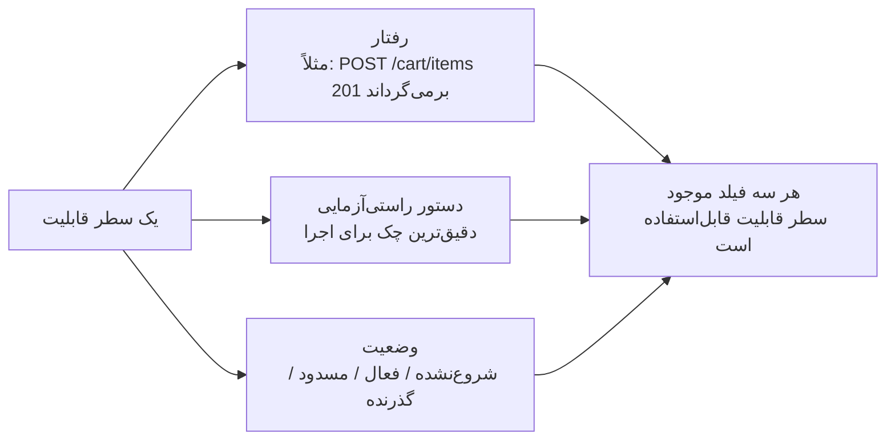
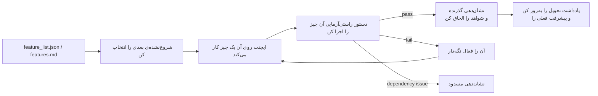

[نسخه‌ی انگلیسی ←](../../../en/lectures/lecture-08-why-feature-lists-are-harness-primitives/)

> مثال‌های کد: [code/](https://github.com/walkinglabs/learn-harness-engineering/blob/main/docs/en/lectures/lecture-08-why-feature-lists-are-harness-primitives/code/)
> پروژه‌ی عملی: [پروژه 04. بازخورد زمان‌اجرا و کنترل دامنه‌ی کار](./../../projects/project-04-incremental-indexing/index.md)

# درس ۰۸. استفاده از فهرست قابلیت‌ها برای محدود کردن کار ایجنت

از ایجنتی می‌خواهی یک سایت تجارت‌الکترونیکی بسازد. بعد از اینکه تمام می‌شود، به تو می‌گوید «آماده است.» کد را نگاه می‌کنی — احراز هویت کاربر کار می‌کند، اما دکمه‌ی پرداخت در سبد خریداری کاری نمی‌کند، و جریان پرداخت اصلاً متصل نیست. چه چیز اشتباه شد؟ هرگز به ایجنت نگفتی «آماده» یعنی چه، پس از استاندارد خودش استفاده کرد: «من کد زیادی نوشتم و نسبتاً کامل به نظر می‌رسد.»

فهرست قابلیت‌ها، در دید بسیاری، صرفاً یادداشتی است — چیزها را یادداشت کن تا فراموش نکنی، سپس آن را کنار بگذار. اما در دنیای هارنس، فهرست قابلیت‌ها یادداشتی برای انسان‌ها نیست. این ساختار بنیادی‌ای است که کل هارنس روی آن ساخته شده. جاد‌بندی بر آن برای انتخاب وظایف تکیه می‌کند، تأیید‌کننده بر آن برای قضاوت تکمیل تکیه می‌کند، و گزارش‌دهنده‌ی تحویل جلسه برای ایجاد خلاصه‌ها بر آن تکیه می‌کند. بدون آن، این اجزا هیچ توافق مشترکی برای تکیه کردن ندارند.

هم Anthropic و هم OpenAI تأکید می‌کنند: **معیارها باید خارج‌شده باشند.** وضعیت قابلیت باید در یک فایل قابل‌خواندن توسط ماشین در ریپازیتوری زندگی کند، نه در متن گفتگوی بدون ساختار.

## ایجنت‌ها نمی‌دانند «آماده» یعنی چه

نه Claude Code و نه Codex به‌طور خودکار نمی‌دانند منظورت از «آماده» چیست. می‌گویی «ویژگی سبد خرید را اضافه کن»، و تفسیر مدل ممکن است «یک جزء Cart و یک متد addToCart بنویس» باشد. اما منظورت این بود «کاربر می‌تواند محصول مرور کند، به سبد اضافه کند، و پرداخت را از ابتدا تا انتها تکمیل کند.»

این فاصله‌ی درک بدون فهرست قابلیت‌ها باقی می‌ماند. ایجنت از استاندارد ضمنی خودش استفاده می‌کند — معمولاً «کد هیچ خطای نحوی واضحی ندارد.» آنچه تو نیاز داری تأیید رفتاری از ابتدا تا انتها است. بدون فهرست، دو طرف هرگز درباره‌ی معنی «آماده» توافق نخواهند کرد.

این یادداشت پیشرفت معمول را نگاه کن:

```
احراز هویت کاربر انجام شد، سبد خرید تقریباً آماده است، هنوز نیاز به پرداخت است
```

آیا یک جلسه‌ی ایجنت جدید می‌تواند این سؤالات را از این یادداشت پاسخ دهد؟ «تقریباً آماده» یعنی چه؟ سبد خرید از کدام تست‌ها عبور کرد؟ چه چیز پرداخت را مسدود می‌کند؟ پاسخ همه «هیچ‌کس نمی‌داند» است.

نتیجه: جلسه‌ی جدید 20 دقیقه صرف استنتاج وضعیت پروژه می‌کند، و ممکن است در نهایت قابلیت‌های تکمیل‌شده را دوباره پیاده‌سازی کند. داده‌های مهندسی Anthropic نشان می‌دهد که سوابق پیشرفت خوب زمان تشخیصی شروع جلسه را 60-80 درصد کاهش می‌دهند.

## ماشین حالت قابلیت





## مفاهیم اصلی

- **فهرست قابلیت‌ها اولیه‌های هارنس هستند**: نه «ابزار برنامه‌ریزی اختیاری»، بلکه ساختارهای داده‌ی بنیادی که سایر اجزای هارنس به آن‌ها وابسته‌اند. جاد‌بندی، تأیید‌کننده، و گزارش‌دهنده‌ی تحویل همه نیاز به خواندن فهرست قابلیت‌ها دارند.
- **ساختار سه‌گانه**: هر مورد قابلیت سه عنصر دارد: `(توضیح رفتار، دستور راستی‌آزمایی، وضعیت فعلی)`. توضیح رفتار به ایجنت می‌گوید چه کار کند، راستی‌آزمایی به او می‌گوید چه چیز معادل آماده‌بودن است، و وضعیت به او می‌گوید چیزها کجا ایستاده‌اند. گم کردن هر عنصر موردی را ناقص می‌کند.
- **مدل ماشین حالت**: هر مورد قابلیت چهار حالت دارد — `شروع‌نشده، فعال، مسدود، گذرنده`. انتقال‌های وضعیت توسط هارنس کنترل می‌شوند، نه آزادانه توسط ایجنت تغییر داده می‌شوند.
- **دربند‌دهی حالت گذرنده**: تنها راهی که یک قابلیت از `فعال` به `گذرنده` حرکت می‌کند این است که دستور راستی‌آزمایی با موفقیت اجرا شود. این انتقال برگشت‌ناپذیر است — بعد از `گذرنده`، نمی‌تواند برگردد.
- **منبع واحد حقیقت**: تمام اطلاعات درباره‌ی «چه کارهایی باید انجام شود» باید از یک فهرست قابلیت‌ها ناشی شود. بدون تناقضات بین فهرست قابلیت‌ها و تاریخچه‌ی گفتگو.
- **فشار پسین**: تعداد قابلیت‌هایی که هنوز عبور نکرده‌اند فشاری است که هارنس بر ایجنت وارد می‌کند. صفر فشار = پروژه تکمیل.

## چرا فهرست قابلیت‌ها باید «اولیه‌ها» باشند

اسناد برای خواندن توسط انسان‌ها هستند؛ اولیه‌ها برای اجرای سیستم‌ها. اسناد می‌توانند نادیده گرفته شوند؛ اولیه‌ها نمی‌توانند دور زده شوند.

فکر کن مثل محدودیت‌های تریگر دیتابیس در مقابل بررسی‌های سطح برنامه: اول توسط موتور دیتابیس اجرا می‌شود — هیچ SQL نمی‌تواند آن را دور بزند. دومی بر صحت کد برنامه بستگی دارد و می‌تواند به‌طور تصادفی دور زده شود. فهرست قابلیت‌ها به‌عنوان اولیه‌های هارنس نقش مشابهی با محدودیت‌های سطح دیتابیس دارند — ایجنت نمی‌تواند آن‌ها را دور بزند.

به‌طور خاص، فهرست قابلیت‌ها چهار جزء هارنس را تأمین می‌کند:

1. **جاد‌بندی**: وضعیت‌ها را می‌خواند، قابلیت `شروع‌نشده‌ی` بعدی را انتخاب می‌کند.
2. **تأیید‌کننده**: دستورات راستی‌آزمایی را اجرا می‌کند، تصمیم می‌گیرد انتقال‌های وضعیت را اجازه دهد.
3. **گزارش‌دهنده‌ی تحویل جلسه**: خلاصه‌های تحویل جلسه را به‌طور خودکار از فهرست قابلیت‌ها تولید می‌کند.
4. **ردیاب پیشرفت**: توزیع وضعیت را شمارش می‌کند، معیارهای سلامت پروژه را فراهم می‌کند.

## نحوه‌ی انجام این کار

### 1. تعریف یک قالب فهرست قابلیت‌های حداقلی

تو نیاز به یک سیستم پیچیده ندارید — یک فایل Markdown یا JSON ساختار‌یافته کار می‌کند. کلید این است که هر ورودی باید سه‌گانه را داشته باشد:

```json
{
  "id": "F03",
  "behavior": "POST /cart/items با {product_id, quantity} برمی‌گرداند 201",
  "verification": "curl -X POST http://localhost:3000/api/cart/items -H 'Content-Type: application/json' -d '{\"product_id\":1,\"quantity\":2}' | jq .status == 201",
  "state": "passing",
  "evidence": "commit abc123, test output log"
}
```

### 2. هارنس کنترل انتقال‌های وضعیت را کند

ایجنت نمی‌تواند مستقیماً وضعیت یک قابلیت را `گذرنده` تغییر دهد. تنها می‌تواند درخواست راستی‌آزمایی ارائه دهد. هارنس دستور راستی‌آزمایی را اجرا می‌کند و تصمیم می‌گیرد انتقال را اجازه دهد. این «دربند‌دهی حالت گذرنده» است.

### 3. قوانین را در CLAUDE.md بنویس

```
## قوانین فهرست قابلیت‌ها
- فایل فهرست قابلیت‌ها: /docs/features.md
- تنها یک قابلیت فعال در یک زمان
- دستور راستی‌آزمایی باید عبور کند قبل از نشان‌دهی گذرنده
- وضعیت‌های فهرست قابلیت‌ها را خود تغییر ندهید — اسکریپت راستی‌آزمایی آن‌ها را به‌طور خودکار به‌روز می‌کند
```

### 4. دانه‌بندی را کالیبره کن

هر مورد قابلیت باید در دامنه‌ی «قابل‌تکمیل در یک جلسه» باشد. بیش از حد گسترده و تمام نخواهد شد؛ بیش از حد باریک و سربار مدیریت رشد می‌کند. «کاربر می‌تواند چیزها را به سبد اضافه کند» دانه‌بندی خوبی است. «سبد خرید را پیاده‌سازی کن» بیش از حد گسترده است. «فیلد نام را در مدل Cart ایجاد کن» بیش از حد باریک است.

## مورد واقعی

یک پلتفرم تجارت‌الکترونیکی با 10 قابلیت. دو رویکرد ردیابی مقایسه‌شده‌اند:

**حالت یادداشت**: ایجنت از یادداشت‌های بدون ساختار برای ردیابی پیشرفت استفاده می‌کند. بعد از 3 جلسه، یادداشت‌ها «احراز هویت کاربر و فهرست محصول انجام شد، سبد خرید تقریباً آماده اما دارای باگ است، پرداخت شروع نشده» می‌شوند. یک جلسه‌ی جدید 20 دقیقه برای استنتاج وضعیت نیاز دارد، و در نهایت قابلیت‌های تکمیل‌شده را دوباره پیاده‌سازی می‌کند.

**حالت ساختار‌یافته**: هر قابلیت وضعیت واضح و دستور راستی‌آزمایی دارد. یک جلسه‌ی جدید فهرست قابلیت‌ها را می‌خواند و در 3 دقیقه می‌فهمد: F01-F05 `گذرنده` هستند، F06 `فعال` است (در حال پیشرفت)، F07-F10 `شروع‌نشده` هستند. مستقیماً از F06 ادامه می‌دهد، بدون هیچ بازکار.

نتیجه کمی‌شده: پروژه‌هایی که از فهرست قابلیت‌های ساختار‌یافته استفاده می‌کنند 45 درصد نرخ تکمیل قابلیت بالاتر نسبت به ردیابی آزاد نشان می‌دهند، بدون هیچ پیاده‌سازی تکراری.

## نکات کلیدی

- **فهرست قابلیت‌ها ساختار بنیادی هارنس است**، نه یادداشت برای انسان‌ها. جاد‌بندی، تأیید‌کننده، و گزارش‌دهنده‌ی تحویل همه به آن‌ها وابسته‌اند.
- **هر مورد قابلیت باید سه‌گانه را داشته باشد**: توضیح رفتار + دستور راستی‌آزمایی + وضعیت فعلی. گم کردن یک عنصر آن را ناقص می‌کند.
- **انتقال‌های وضعیت توسط هارنس کنترل می‌شوند** — ایجنت نمی‌تواند وضعیت‌ها را خود تغییر دهد. عبور از راستی‌آزمایی تنها مسیر ارتقاء است.
- **فهرست قابلیت‌ها منبع واحد حقیقت پروژه است** — تمام اطلاعات «چه کار باید کرد» از آن ناشی می‌شود.
- **دانه‌بندی را برای «قابل‌تکمیل در یک جلسه» کالیبره کن.» بیش از حد گسترده و تمام نخواهد شد؛ بیش از حد باریک و نمی‌توانی آن را مدیریت کن.

## خواندن بیشتر

- [Building Effective Agents - Anthropic](https://www.anthropic.com/research/building-effective-agents) — به‌طور صریح فهرست قابلیت‌ها را به‌عنوان «ساختار داده‌ی اصلی» برای کنترل دامنه‌ی ایجنت شناسایی می‌کند
- [Harness Engineering - OpenAI](https://openai.com/index/harness-engineering/) — اصل «خارج‌کردن معیارها» را تأکید می‌کند
- [Design by Contract - Bertrand Meyer](https://www.goodreads.com/book/show/130439.Object_Oriented_Software_Construction) — اصول طراحی توسط قرارداد، بنیاد نظری فهرست قابلیت‌ها
- [How Google Tests Software](https://books.google.dk/books/about/How_Google_Tests_Software.html?id=VrAx1ATf-RoC&redir_esc=y) — هرم تست و عملیات مهندسی مشخصات رفتاری

## تمرین‌ها

1. **طراحی فهرست قابلیت‌ها**: یک طرح JSON فهرست قابلیت‌های حداقلی را تعریف کن. شامل: id، توضیح رفتار، دستور راستی‌آزمایی، وضعیت فعلی، مرجع شواهد. از آن برای توضیح یک پروژه‌ی واقعی با 5 قابلیت استفاده کن.

2. **مقایسه‌ی سختی راستی‌آزمایی**: 3 قابلیت را انتخاب کن و هم یک راستی‌آزمایی «شل» (مثلاً «کد هیچ خطای نحوی ندارد») و هم یک راستی‌آزمایی «سخت» (مثلاً «تست از ابتدا تا انتها عبور می‌کند») طراحی کن. نرخ مثبت‌های نادرست را در هر رویکرد مقایسه کن.

3. **اطلاعات منبع واحد حقیقت**: یک پروژه‌ی ایجنت موجود را بررسی کن و اطلاعات دامنه‌ی کار را که با فهرست قابلیت‌ها متناقض است چک کن (نیازمندی‌های ضمنی در گفتگو‌ها، نظرات TODO در کد، و غیره). یک طرح برای یکپارچه کردن تمام اطلاعات در فهرست قابلیت‌ها طراحی کن.
