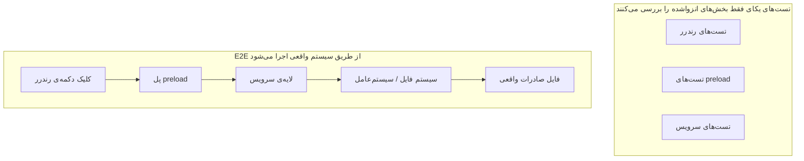
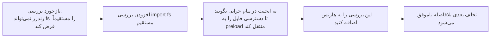

[نسخه‌ی انگلیسی ←](../../../en/lectures/lecture-10-why-end-to-end-testing-changes-results/)

> نمونه کدهای این سخنرانی: [code/](https://github.com/walkinglabs/learn-harness-engineering/blob/main/docs/en/lectures/lecture-10-why-end-to-end-testing-changes-results/code/)
> تمرین عملی: [پروژه ۵. بگذارید ایجنت کار خود را تأیید کند](./../../projects/project-05-grounded-qa-verification/index.md)

# درس ۱۰. فقط یک اجرای کامل خط لوله به عنوان راستی‌آزمایی واقعی شناخته می‌شود

شما از ایجنت می‌خواهید ویژگی صادرات فایل را به یک برنامه‌ی Electron اضافه کند. این برنامه جزء رندر، اسکریپت preload و منطق لایه‌ی سرویس را می‌نویسد. تست‌های یکای برای هر جزء موفق‌اند. ایجنت می‌گوید «انجام شد». شما واقعاً روی دکمه‌ی صادرات کلیک می‌کنید — فرمت مسیر فایل اشتباه است، نوار پیشرفت پاسخ نمی‌دهد، و صادرات فایل‌های بزرگ حافظه را نشت می‌دهد. پنج خرابی در مرزهای اجزاء، و تست‌های یکای هیچ‌کدام را نگرفته‌اند.

هر بخش به خودی خود «درست» به نظر می‌رسد، اما مشکلات زمانی ظاهر می‌شوند که آنها با هم متصل شوند. تست‌کردن هرمی گوگل به ما می‌گوید که یک پایه‌ی بزرگ از تست‌های یکای ضروری است، اما توقف در آنجا به معنای از دست دادن سیستماتیک مسائل تعامل اجزاء است. برای ایجنت‌های کدنویسی هوش مصنوعی این مشکل حتی بدتر است، زیرا ایجنت‌ها تمایل دارند فقط سریع‌ترین تست‌ها را اجرا کنند و سپس تکمیل را اعلام کنند. **فقط تست‌های اجرای کامل می‌توانند عدم وجود خرابی‌های سطح سیستم را اثبات کنند.**

## نقاط کور تست‌های یکای

فلسفه‌ی طراحی تست‌کردن یکای انزوایی است: وابستگی‌های مجازی، تمرکز بر یکایی که تحت تست است. این فلسفه تست‌های یکای را سریع و دقیق می‌کند، اما نقاط کور سیستماتیکی ایجاد می‌کند. هر ماژول در انزوای کامل کامل است، اما دسته‌های مشکلات زیر فقط زمانی ظاهر می‌شوند که همه‌چیز واقعاً با هم اجرا شود:

**عدم تطابق رابط**: رندرر مسیر فایل نسبی را به اسکریپت preload می‌فرستد، اما اسکریپت preload مسیر مطلق را انتظار می‌رود. تست‌های یکای هریک از آنها از مجازی استفاده می‌کنند و هر دو موفق‌اند. مشکل فقط زمانی کشف می‌شود که جریان اجرای کامل استفاده شود.

**خرابی‌های انتشار وضعیت**: یک مهاجرت پایگاه داده طرح جدول را تغییر می‌دهد، اما لایه‌ی کش‌سازی ORM هنوز ورودی‌های کش را با طرح قدیمی نگاه می‌دارد. تست‌های یکای هر بار یک محیط مجازی تازه راه‌اندازی می‌کنند، بنابراین هیچ‌گاه این نوع عدم‌تطابق وضعیت میان‌لایه را در معرض قرار نمی‌دهند.

**مشکلات چرخه‌ی زندگی منبع**: اکتساب و آزادسازی دستچه‌های فایل، اتصالات پایگاه داده و سوکت‌های شبکه چندین جزء را در بر می‌گیرند. تست‌های یکای منابع مستقل را برای هر مورد آزمایشی ایجاد و تخریب می‌کنند، بنابراین هیچ‌گاه مسابقه‌ی منابع یا نشت را در معرض قرار نمی‌دهند.

**وابستگی محیط**: کد در محیط آزمایشی (جایی که همه‌چیز مجازی است) به درستی رفتار می‌کند اما در محیط واقعی به دلیل تفاوت‌های پیکربندی، تأخیر شبکه یا عدم دسترسی سرویس ناموفق می‌شود.

## تست اجرای کامل نه تنها نتایج را تغییر می‌دهد — رفتار را تغییر می‌دهد

این چیزی است که بسیاری از مردم نادیده می‌گیرند: زمانی که ایجنت می‌داند کار آن توسط تست‌های اجرای کامل تأیید خواهد شد، رفتار کدنویسی آن تغییر می‌کند.

۱. **در نظر گرفتن تعامل اجزاء**: در حین نوشتن کد، شروع به پرسیدن می‌کند «این رابط چگونه با آپ‌استریم متصل می‌شود؟» به جای تمرکز بر یک تابع در انزوا.
۲. **احترام به مرزهای معماری**: در سیستم‌هایی با محدودیت‌های معماری، تست‌های اجرای کامل ایجنت را مجبور می‌کند قوانین مرز را پیروی کند.
۳. **مدیریت مسیرهای خرابی**: تست‌های اجرای کامل معمولاً شامل سناریوهای شکست‌اند، که ایجنت را تشویق می‌کند به مدیریت استثناء فکر کند.

## هرم تست‌کردن و ارتقاء بازخورد بررسی





OpenAI در روش‌های مهندسی Codex خود تأکید می‌کند: **پیام‌های خرابی نوشته‌شده برای ایجنت‌ها باید شامل دستورالعمل تصحیح باشند.** به جای نوشتن `"Direct filesystem access in renderer"`، نویسید `"Direct filesystem access in renderer. All file operations must go through the preload bridge. Move this call to preload/file-ops.ts and invoke it via window.api."` این قوانین معماری را به یک حلقه‌ی خودتصحیح تبدیل می‌کند. پیام‌های خرابی فقط «چه اشتباهی رخ داد» را نمی‌گویند — آنها «چگونه آن را تصحیح کنید» را می‌گویند، ایجنت را قادر می‌سازند که خود را به طور خودمختار تصحیح کند.

## مفاهیم اصلی

- **خرابی‌های مرز اجزاء**: جزء A و B هر کدام تست‌های یکای خود را گذار می‌دهند، اما تعامل آنها رفتار نادرست ایجاد می‌کند. این دسته‌ی مشکلی است که تست‌کردن اجرای کامل در آن برتری دارد.
- **گرادیان کفایت تست‌کردن**: خرابی‌های قابل تشخیص توسط تست‌های یکای ≤ خرابی‌های قابل تشخیص توسط تست‌های ادغام ≤ خرابی‌های قابل تشخیص توسط تست‌های اجرای کامل. قابلیت تشخیص با هر لایه افزایش می‌یابد.
- **قوانین اجرای مرز معماری**: تبدیل قوانین از اسناد معماری (مثلاً «فرایند رندرر نباید مستقیماً سیستم‌فایل را دسترسی کند») به بررسی‌های قابل اجرا و خودکار — تبدیل از «نوشته‌شده بر روی کاغذ» به «اجرا در CI».
- **ارتقاء بازخورد بررسی**: تبدیل نظرات کد بررسی تکراری به تست‌های خودکار. هر بار که یک دسته‌ی جدید از مشکل مکرر کشف شود، یک قانون اضافه کنید، و هارنس به طور خودکار قوی‌تر می‌شود.
- **پیام‌های خرابی با جهت‌گیری ایجنت**: پیام‌های شکست نباید تنها «چه اشتباهی رخ داد» را بیان کنند، بلکه باید به ایجنت بگویند دقیقاً چگونه آن را تصحیح کند، تبدیل شکست تست‌ها را به حلقه‌های بازخورد خودتصحیح کنید.

## نحوه انجام آن

### ۰. قبل از نوشتن تست‌های اجرای کامل، مرزهای معماری را تعریف کنید

شرط اولیه برای تست‌کردن اجرای کامل این است که سیستم دارای مرزهای واضح باشد. اگر معماری یک هم‌افزایی درهم‌ریخته باشد، تست‌کردن اجرای کامل فقط اثبات می‌کند «کل هم‌افزایی اجرا می‌شود» بدون اینکه به شما بگوید نیت طراحی در کجا نقض شده است.

تجربه‌ی OpenAI: **برای پایگاه کد تولیدشده توسط ایجنت، محدودیت‌های معماری باید در روز اول به عنوان شرط‌های اولیه برای ضروری بوجود آیند — نه چیزی که پس از رشد تیم باید فکر کنید.** دلیل ساده است: ایجنت‌ها الگوهای موجود در ریپازیتوری را کپی می‌کنند، حتی زمانی که آن الگوها نامتناسب یا کم‌بهینه هستند. بدون محدودیت‌های معماری، ایجنت‌ها با هر جلسه بیشتر انحراف معرفی می‌کنند.

OpenAI یک «معماری دامنه‌ی لایه‌ای» را پذیرفت، جایی که هر دامنه‌ی تجاری به لایه‌های ثابت تقسیم می‌شود: Types -> Config -> Repo -> Service -> Runtime -> UI. وابستگی‌ها به طور سخت به جلو جریان دارند، و نگرانی‌های میان‌دامنه از طریق رابط Providers صریح وارد می‌شوند. هر وابستگی دیگری ممنوع است و به طور مکانیکی از طریق linting سفارشی اجرا می‌شود.

اصل کلیدی: **عدم تغییرهای اجرا کنید؛ پیاده‌سازی را ریزمدیریت نکنید.** برای مثال، بخواهید که «داده‌ها در مرز تجزیه شوند»، اما نگویید کدام کتابخانه‌ی را استفاده کنید. پیام‌های خرابی باید شامل دستورالعمل تصحیح باشند — نه فقط گفتن «نقض»، بلکه به ایجنت بگویید بتواند چگونه آن را تغییر دهد.

> منبع: [OpenAI: Harness engineering: leveraging Codex in an agent-first world](https://openai.com/index/harness-engineering/)

### ۱. هارنس باید شامل یک لایه‌ی اجرای کامل باشد

آن را صریح کنید در جریان راستی‌آزمایی خود: برای وظایفی که شامل تغییرات میان‌اجزاء هستند، گذار تست‌های اجرای کامل شرط پیش‌نیاز برای تکمیل است:

```
## سلسله‌مراتب راستی‌آزمایی
- سطح ۱: تست‌های یکای (باید گذار شود)
- سطح ۲: تست‌های ادغام (باید گذار شود)
- سطح ۳: تست‌های اجرای کامل (باید گذار شود وقتی تغییرات میان‌اجزاء درگیر هستند)
- پرش هر سطح لازم = ناتکمیل
```

### ۲. قوانین معماری را به بررسی‌های قابل اجرا تبدیل کنید

هر محدودیت‌ی معماری باید دارای قانون تست یا linting متناسب باشد:

```bash
# بررسی کنید که آیا فرایند رندرر مستقیماً API های Node.js را فراخوانی می‌کند
grep -r "require('fs')" src/renderer/ && exit 1 || echo "OK: no direct fs access in renderer"
```

### ۳. پیام‌های خرابی با جهت‌گیری ایجنت را طراحی کنید

پیام‌های شکست باید شامل سه عنصر باشند: چه اشتباهی رخ داد، چرا، و نحوه تصحیح آن:

```
ERROR: Found direct import of 'fs' in src/renderer/App.tsx:12
WHY: Renderer process has no access to Node.js APIs for security
FIX: Move file operations to src/preload/file-ops.ts and call via window.api.readFile()
```

### ۴. فرایند ارتقاء بازخورد بررسی را تثبیت کنید

هر بار که یک دسته‌ی جدید از خرابی‌ی ایجنت را در بررسی کد کشف کنید، آن را به یک بررسی خودکار تبدیل کنید. یک ماه بعد هارنس شما بسیار قوی‌تر از آنچه در آغاز ماه بود خواهد بود.

## مورد واقعی

**وظیفه**: پیاده‌سازی ویژگی صادرات فایل در یک برنامه‌ی Electron. شامل رابط کاربری فرایند رندرر، پروکسی سیستم‌فایل اسکریپت preload، و تبدیل داده‌های لایه‌ی سرویس است.

**مرحله‌ی تست یکای**: تست‌های جزء رندرر (گذار شد، عملیات فایل مجازی)، تست‌های اسکریپت preload (گذار شد، سیستم‌فایل مجازی)، تست‌های لایه‌ی سرویس (گذار شد، منبع داده مجازی). ایجنت تکمیل را اعلام می‌کند.

**خرابی‌های نشان‌داده‌شده توسط تست‌های اجرای کامل**:

| خرابی | توضیح | تست یکای | E2E |
|--------|-------------|-----------|-----|
| عدم تطابق رابط | فرمت مسیر فایل نامتناسب | نگرفته | گرفته |
| انتشار وضعیت | پیشرفت صادرات از طریق IPC به رابط کاربری ارسال نشد | نگرفته | گرفته |
| نشت منبع | دستچه‌های صادرات فایل بزرگ آزاد نشدند | نگرفته | گرفته |
| مشکل اجازه | اجازه‌های متفاوت در محیط بسته‌شده | نگرفته | گرفته |
| انتشار خرابی | استثناء‌های لایه‌ی سرویس به لایه‌ی رابط کاربری نرسیدند | نگرفته | گرفته |

هر ۵ خرابی توسط تست‌های اجرای کامل گرفته شدند؛ تست‌های یکای هیچ کدام را نگرفتند. مبادله‌ی معادل‌ای زمان تست از ۲ ثانیه به ۱۵ ثانیه بود — کاملاً قابل پذیرش در جریان کار ایجنت.

## نکات اصلی

- **تست‌های یکای به طور سیستماتیک نسبت به خرابی‌های مرز اجزاء کور هستند**: طراحی انزوای آنها دقیقاً چیزی است که از آنها جلوگیری می‌کند که مشکلات تعامل را تشخیص دهند.
- **تست‌کردن اجرای کامل نه تنها خرابی‌ها را تشخیص می‌دهد، بلکه نحوه‌ی کدنویسی ایجنت‌ها را تغییر می‌دهد**: کانون را به سمت ادغام و مرزها تغییر می‌دهد.
- **قوانین معماری باید قابل اجرا باشند**: نه نوشته‌شده در یک سند منتظر اینکه کسی آن را بخواند، بلکه به طور خودکار در هر commit بررسی شود.
- **پیام‌های خرابی باید برای ایجنت‌ها طراحی شوند**: شامل مراحل بتواند «نحوه تصحیح» را شامل کند تا حلقه‌ی خود تصحیح را تشکیل دهند.
- **ارتقاء بازخورد بررسی هارنس را به طور خودکار قوی‌تر می‌کند**: هر دسته‌ی خرابی‌ای گرفته‌شده یک خط دفاع دائمی می‌شود.

## مطالعه‌ی بیشتر

- [How Google Tests Software - Whittaker et al.](https://books.google.dk/books/about/How_Google_Tests_Software.html?id=VrAx1ATf-RoC&redir_esc=y) — منبع کلاسیک مدل هرم تست‌کردن
- [Harness Engineering - OpenAI](https://openai.com/index/harness-engineering/) — روش‌های مهندسی برای اجرای خودکار محدودیت‌های معماری
- [Chaos Engineering - Netflix (Basiri et al.)](https://ieeexplore.ieee.org/document/7466237) — تزریق فعالانه‌ی خرابی‌ها برای راستی‌آزمایی مقاومت سیستم
- [QuickCheck - Claessen & Hughes](https://www.cs.tufts.edu/~nr/cs257/archive/john-hughes/quick.pdf) — روش‌شناسی تست‌کردن ویژگی، بین تست‌کردن مثال محور و راستی‌آزمایی رسمی

## تمرین‌ها

۱. **تشخیص خرابی میان‌اجزاء**: یک وظیفه‌ی تغییر را انتخاب کنید که شامل حداقل سه جزء است. ابتدا فقط تست‌های یکای را اجرا کنید و نتایج را ثبت کنید، سپس تست‌های اجرای کامل را اجرا کنید. هر خرابی اضافی تشخیص‌داده‌شده را تحلیل کنید و آن را طبقه‌بندی کنید.

۲. **اتوماسیون قانون معماری**: یک محدودیت معماری از پروژه خود را انتخاب کنید و آن را به یک بررسی قابل اجرا تبدیل کنید (همراه با پیام خرابی با جهت‌گیری ایجنت). آن را در هارنس ادغام کنید و اثرمندی آن را با استفاده از یک وظیفه‌ی پایه‌ی تاییدی راستی‌آزمایی کنید.

۳. **ارتقاء بازخورد بررسی**: یک نوع نظر مکرر از تاریخ بررسی کد را پیدا کنید و آن را به یک بررسی خودکار تبدیل کنید. فراوانی این دسته‌ی مشکل قبل و بعد از ارتقاء را مقایسه کنید.
