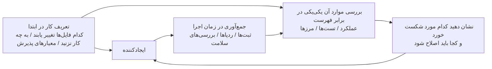

[نسخه‌ی انگلیسی ←](../../../en/lectures/lecture-11-why-observability-belongs-inside-the-harness/)

> نمونه‌های کد: [code/](https://github.com/walkinglabs/learn-harness-engineering/blob/main/docs/en/lectures/lecture-11-why-observability-belongs-inside-the-harness/code/)
> پروژه‌ی عملی: [پروژه 06. ساخت یک هارنس کامل برای ایجنت](./../../projects/project-06-runtime-observability-and-debugging/index.md)

# درس ۱۱. ایجاد رصدپذیری در زمان اجرای ایجنت

شما از یک ایجنت می‌خواهید که یک قابلیت را پیاده‌سازی کند. برای 20 دقیقه اجرا می‌شود، بسیاری از فایل‌ها را تغییر می‌دهد، و سپس می‌گوید "تمام شد، اما دو تست شکست خورد." شما می‌پرسید چرا — "مطمئن نیستم، شاید مسئله‌ی زمان‌بندی باشد." شما می‌پرسید چه مسیرهای حیاتی را تغییر داد — "بگذار کد را نگاه کنم..."

این سناریو بسیار رایج است، و ریشه‌ی علت این نیست که ایجنت قابلیت کافی ندارد — بلکه هارنس فاقد رصدپذیری است. هنگامی‌که یک ایجنت یک کار را بدون دید در وضعیت زمان‌اجرای واقعی انجام می‌دهد، هر تصمیمی که می‌گیرد اساساً یک حدس است.

**بدون رصدپذیری، ایجنت‌ها تصمیماتشان را تحت عدم اطمینان می‌گیرند، ارزیابی‌ها به قضاوت‌های ذهنی تبدیل می‌شوند، و تلاش‌های مجدد به گردش‌های کور می‌شوند.** هم OpenAI و هم Anthropic قابلیت‌اعتماد را به‌عنوان مسئله‌ای مبتنی‌بر شواهد ارائه می‌دهند: هارنس باید رفتار زمان‌اجرا و سیگنال‌های ارزیابی را به شکلی نمایش دهد که واقعاً می‌تواند تصمیم بعدی را راهنمایی کند.

## هزینه‌ی واقعی رصدپذیری گمشده

هنگامی‌که یک هارنس فاقد رصدپذیری است، چهار دسته‌ی مسائل به‌طور سیستماتیک ظاهر می‌شوند.

**نمی‌توان تفاوت "صحیح" را از "به‌نظر صحیح" تشخیص داد.** یک تابع در بررسی کد کاملاً درست به‌نظر می‌رسد — نحو صحیح، منطق سالم. اما در زمان اجرا، خطای مدیریت شرط‌مرزی نتایج نادرست تحت ورودی‌های خاص را تولید می‌کند. تنها ردپای زمان‌اجرا می‌تواند نشان دهد که مسیر اجرای واقعی از انتظارات منحرف شده است. بررسی کد "آنچه را نوشته شده است" نشان می‌دهد؛ ردپای زمان‌اجرا "آنچه واقعاً اجرا شده است" را نشان می‌دهد. شما به هر دو نیاز دارید.

**ارزیابی به عرفانیت تبدیل می‌شود.** بدون رمز‌های گذار‌نمایی و معیارهای پذیرش، ارزیابان (انسانی یا ایجنت) باید به فرض‌های ضمنی تکیه کنند. خروجی یکسان می‌تواند ارزیابی‌های بسیار متفاوتی را از ارزیابان مختلف دریافت کند. ارزیابی کیفیت غیر قابل‌تکرار می‌شود.

**تلاش‌های مجدد به حدس‌های کور تبدیل می‌شوند.** هنگامی‌که ایجنت نمی‌داند چه چیزی شکست خورد، جهت تلاش مجدد آن تصادفی است. ممکن است در جهت غلط کوبش کند — رفع مسیرهای کد بی‌ربط در حالی‌که ریشه‌ی علت واقعی را نادیده می‌گیرد. هر تلاش مجدد کور توکن و زمان را می‌سوزاند.

**درهم‌ریختگی اطلاعات تحویل جلسه.** هنگامی‌که کار ناقص به جلسه‌ی بعدی تحویل داده می‌شود، رصدپذیری گمشده به‌این معنی است که جلسه‌ی جدید باید وضعیت سیستم را از ابتدا تشخیص دهد. مشاهدات Anthropic از ایجنت‌های طولانی‌مدت نشان می‌دهد که این تشخیص‌های تکراری می‌تواند 30-50 درصد از کل زمان جلسه را مصرف کند.

## یک سناریو واقعی Claude Code

یک هارنس را در نظر بگیرید که از جریان کاری سه‌نقش "برنامه‌ریز-ایجادکننده-ارزیاب" استفاده می‌کند، با اجرای کار "افزودن حالت تاریک به برنامه."

**بدون رصدپذیری:** برنامه‌ریز توضیح مبهمی خروج می‌دهد. ایجادکننده حالت تاریک را بر اساس آن ابهام پیاده‌سازی می‌کند، اما نتیجه با انتظارات ضمنی برنامه‌ریز مطابقت ندارد. ارزیاب بر اساس استانداردهای ضمنی خود آن را رد می‌کند اما نمی‌تواند بگوید دقیقاً چه چیز اشتباه است — تنها "احساس اشتباهی دارد." ایجادکننده به‌طور کور تلاش مجدد می‌کند بر اساس دلایل رد کردن مبهم. چرخه تکرار می‌شود 3-4 بار، حدود 45 دقیقه طول می‌کشد، و به‌سختی خروجی قابل‌قبولی تولید می‌کند.

**با رصدپذیری کامل:** برنامه‌ریز قرارداد اسپرینت را خروج می‌دهد که تمام اجزایی را فهرست می‌کند که باید تغییر یابند، معیارهای راستی‌آزمایی برای هر کدام، و استثناهایی (مثلاً هیچ سبک چاپی). ایجادکننده طبق قرارداد پیاده‌سازی می‌کند، و رصدپذیری زمان‌اجرا فرایند بارگیری و کاربرد سبک‌های هر جزء را ثبت می‌کند. ارزیاب از رمز‌گذار امتیاز‌دهی استفاده می‌کند تا بعد از بعد ارزیابی کند، شواهد خاصی را نقل می‌کند: "تضاد رنگ دکمه ناکافی است (استاندارد WCAG AA 4.5:1، اندازه‌گیری شده 2.1:1)." یک تکرار نتیجه‌ی با کیفیت بالا را تولید می‌کند، در حدود 15 دقیقه.

تفاوت کارایی 3 برابر. تنها متغیر رصدپذیری است.

## رصدپذیری لایه‌ای

رصدپذیری تنها "ثبت بیشتر" نیست. بر دو لایه‌ کار می‌کند، و هر دو ضروری هستند.



**رصدپذیری زمان‌اجرا:** سیگنال‌های سطح سیستم — ثبت‌ها، ردپاها، رویدادهای فرایند، بررسی‌های سلامت. پاسخ می‌دهد "سیستم چه کار کرد."

**رصدپذیری فرایند:** دید در آثار تصمیم‌گیری هارنس — طرح‌ها، رمز‌های گذار‌نمایی، معیارهای پذیرش. پاسخ می‌دهد "چرا باید این تغییر پذیرفته شود."

## مفاهیم اساسی

- **رصدپذیری زمان‌اجرا**: سیگنال‌های سطح سیستم شامل ثبت‌ها، ردپاها، رویدادهای فرایند، و بررسی‌های سلامت. پاسخ می‌دهد "سیستم چه کار کرد."
- **رصدپذیری فرایند**: دید در آثار تصمیم‌گیری هارنس شامل طرح‌ها، رمز‌های گذار‌نمایی، و معیارهای پذیرش. پاسخ می‌دهد "چرا باید این تغییر پذیرفته شود."
- **ردپای کار**: ریکورد مسیر تصمیم‌گیری کامل از شروع کار تا تکمیل، مشابه ردپای درخواست در سیستم‌های توزیع‌شده. هر گام ایجنت، همراه با متن بافت آن، ثبت‌شده است — بنابراین هنگامی‌که چیزی غلط می‌شود، می‌توانید کل فرایند را دوباره پخش کنید.
- **قرارداد اسپرینت**: توافق کوتاه‌مدت که قبل از شروع کدنویسی مذاکره می‌شود، دامنه‌ی کار، معیارهای راستی‌آزمایی، و استثناهایی را مشخص می‌کند. ابزار اساسی برای رصدپذیری فرایند.
- **رمز‌گذار ارزیاب**: ارزیابی کیفیت را از قضاوت ذهنی به امتیاز‌دهی ساختار‌شده‌ی مبتنی‌بر شواهد تبدیل می‌کند، امکان‌پذیر می‌سازد تا ارزیابان مختلف نتایج مشابهی برای خروجی یکسان به‌دست آورند.
- **رصدپذیری لایه‌ای**: رصدپذیری سطح سیستم و سطح فرایند که به‌طور همزمان طراحی شده و یکدیگر را تقویت می‌کنند. سیگنال‌های زمان‌اجرا رفتار را توضیح می‌دهند؛ آثار فرایند هدف را توضیح می‌دهند.

## چرا ایجنت‌ها نمی‌توانند این را خودشان حل کنند

شاید فکر می‌کنید: "آیا ایجنت نمی‌تواند فقط ثبت‌های خود را چاپ کند؟" مسئله این است:

1. **ایجنت‌ها نمی‌دانند آن‌ها چه نمی‌دانند.** آن‌ها به‌طور فعال سیگنال‌هایی را ثبت نمی‌کنند که نمی‌دانند نیاز دارند. بدون محدودیت‌های سطح هارنس، ایجنت‌ها فقط آنچه را ثبت می‌کنند که فکر می‌کنند مهم است — و آنچه فکر می‌کنند مهم است معمولاً کافی نیست.
2. **قالب‌های ثبت ناسازگار هستند.** جلسات مختلف از قالب‌های ثبت متفاوت استفاده می‌کنند، تجزیه‌و‌تحلیل سیستماتیک را غیرممکن می‌سازند.
3. **رصدپذیری فرایند نمی‌تواند با ثبت‌کردن حل شود.** قرارداد‌های اسپرینت و رمز‌های گذار‌نمایی آثار ساختار‌شده‌ای هستند که نیاز به پشتیبانی سطح هارنس دارند — افزودن چند دستور چاپ کافی نیست.

## نحوه‌ی ساخت رصدپذیری

### 1. جمع‌آوری سیگنال زمان‌اجرا را در هارنس بسازید

به ایجنت برای چاپ ثبت‌های خود تکیه نکنید. هارنس باید به‌طور خودکار سیگنال‌های زیر را جمع‌آوری کند:

- **چرخه‌ی حیات برنامه**: حالات فاز شروع، آماده، اجرا، خاموشی
- **اجرای مسیر قابلیت**: ریکوردهای اجرا برای مسیرهای حیاتی، شامل نقاط ورود، چک‌پوینت‌ها، و خروج‌ها
- **جریان داده**: ریکوردهای داده جریانی بین اجزاء
- **استفاده‌ی منابع**: الگوهای استفاده‌ی غیرعادی منابع (مثلاً حافظه‌ی افزایش‌یافته‌ی مداوم)
- **خطاها و استثناها**: متن بافت خطای کامل، نه تنها پیام‌های خطا

### 2. قرارداد‌های اسپرینت را پیاده‌سازی کنید

قبل از اینکه هر کار شروع شود، ایجادکننده و ارزیاب (که ممکن است فراخوان‌های متفاوتی از ایجنت یکسان باشند) قرارداد را مذاکره می‌کنند که تعریف می‌کند چه را بسازید و "تمام" چه معنی دارد:

```markdown
# قرارداد اسپرینت: پشتیبانی حالت تاریک

## دامنه
- تغییر جزء تاثیر تم
- به‌روزرسانی متغیرهای CSS جهانی
- افزودن تست‌های حالت تاریک

## معیارهای راستی‌آزمایی
- تست‌های عقب‌افتادگی بصری برای هر جزء پاس می‌شوند
- تست‌های پایانی به‌انتهای جریان اصلی پاس می‌شوند
- هیچ فلش محتوای بدون سبک نیست (FOUC)

## استثناها
- عدم مدیریت سبک‌های چاپی
- عدم مدیریت حالت تاریک جزء شخص ثالث
```

### 3. رمز‌گذار ارزیاب را تعیین کنید

"آیا خوب است یا نه" را به امتیاز‌دهی قابل‌اندازه‌گیری تبدیل کنید:

```markdown
# رمز‌گذار امتیاز‌دهی

| بعد | الف | ب | ج | د |
|---|---|---|---|---|
| صحت کد | تمام تست‌ها پاس می‌شوند | جریان اصلی پاس می‌شود | پاس جزئی | ساخت شکست می‌خورد |
| انطباق معماری | کاملاً منطبق | انحرافات جزئی | انحرافات واضح | تخطی‌های جدی |
| پوشش تست | جریان اصلی + موارد لبه‌ای | تنها جریان اصلی | فقط اسکلت | بدون تست‌ها |
```

### 4. با OpenTelemetry استاندارد کنید

برای هر جلسه‌ی هارنس یک ردپا بسازید، یک بخش برای هر کار، و زیرشاخه‌ها برای هر گام راستی‌آزمایی. از صفات استاندارد برای حاشیه‌نویسی اطلاعات کلیدی استفاده کنید. به این طریق داده‌های رصدپذیری با جعبه‌های ابزار استاندارد (Jaeger، Zipkin) ادغام می‌شوند.

## آزمایش معماری سه‌ایجنتی Anthropic

در مارس 2026، Anthropic یک آزمایش هارنس منظم را منتشر کرد. آن‌ها همان کار را اجرا کردند ("ساخت یک DAW مبتنی‌بر مرورگر با استفاده از Web Audio API") با سه معماری مختلف و داده‌های دقیق فاز‌به‌فاز را ثبت کردند:

| ایجنت و فاز | مدت | هزینه |
|---|---|---|
| برنامه‌ریز | 4.7 دقیقه | $0.46 |
| دور ساخت 1 | 2 ساعت 7 دقیقه | $71.08 |
| دور QA 1 | 8.8 دقیقه | $3.24 |
| دور ساخت 2 | 1 ساعت 2 دقیقه | $36.89 |
| دور QA 2 | 6.8 دقیقه | $3.09 |
| دور ساخت 3 | 10.9 دقیقه | $5.88 |
| دور QA 3 | 9.6 دقیقه | $4.06 |
| **کل** | **3 ساعت 50 دقیقه** | **$124.70** |

هر سه ایجنت نقش‌های متمایز داشتند، و هر یک بخش روشنی در رصدپذیری بازی کرد:

**برنامه‌ریز:** یک الزام کاربر 1-4 جمله‌ای را دریافت می‌کند و آن را به مشخصات محصول کامل گسترش می‌دهد. دستور‌ داده شد که "در دامنه کار جسور باشید" و "بر متن محصول و طراحی فنی سطح بالا تمرکز کنید نه اجرای فنی دقیق." دلیل: اگر برنامه‌ریز به‌طور زودهنگام جزئیات فنی دانه‌ای را مشخص کند و اشتباه بگیرد، این خطاها پائین‌دست تحت تأثیر قرار می‌گیرند. رویکرد بهتر این است که محصولات قابل‌تحویل را محدود کنید و ایجنت را در طی اجرا راه خود را پیدا کند.

**ایجادکننده:** قابلیت به قابلیت، اسپرینت به اسپرینت پیاده‌سازی می‌کند. قبل از هر اسپرینت، با ارزیاب قرارداد اسپرینت را مذاکره می‌کند که تعریف می‌کند "تمام" برای آن بلوک قابلیت چه معنی دارد. سپس طبق قرارداد پیاده‌سازی می‌کند، خود را ارزیابی می‌کند، و به QA تحویل می‌دهد.

**ارزیاب:** از Playwright MCP استفاده می‌کند تا با برنامه‌ی اجرا‌شده مانند کاربر واقعی تعامل کند — تست عملکرد UI، نقاط پایانی API، و وضعیت پایگاه‌داده. هر اسپرینت را در چهار بعد امتیاز می‌دهد: عمق محصول، عملکرد، طراحی بصری، و کیفیت کد. هر بعد آستانه‌ی سخت دارد — اگر هر کدام کم کند، اسپرینت شکست می‌خورد و ایجادکننده بازخورد دقیق برای اصلاح‌ها دریافت می‌کند.

نمونه‌ی بازخورد از دور QA 1: "این یک برنامه‌ی امراً بصری‌ات بدیع با اتصال AI خوب است، اما چندین قابلیت DAW اساسی فقط نمایشی هستند، فاقد عمق تعامل: کلیپ‌ها را نمی‌توان کشید/منتقل کردند، هیچ پنجره‌ی UI ساز‌واره (دنده‌های سنتز، تپک‌های درام) وجود ندارد، و هیچ ویرایشگر لوازم بصری (منحنی‌های EQ، متر‌های فشردهٰ) نیست." اینها موارد لبه‌ای نیستند — آن‌ها تعاملات اساسی‌ای هستند که یک DAW را قابل‌استفاده می‌سازند. بازخورد خاص، مبتنی‌بر شواهد — نه "احساس اشتباهی دارد."

ارزیاب همیشه این تیز نبود. نسخه‌های اولیه مسائل معقول را شناسایی می‌کردند، سپس خود را قانع می‌کردند که آن مسائل را به‌عنوان غیرشدید رد کنند، در نهایت کار را تصویب می‌کردند. رفع: ثبت‌های ارزیاب را بخوانید، نقاطی را پیدا کنید جایی‌که قضاوت آن از قضاوت انسانی منحرف شده است، و پرامپت QA را به‌روزرسانی کنید تا آن مسائل خاص را برطرف کند. بعد از چندین دور این حلقه‌ی توسعه، امتیاز‌دهی ارزیاب قابل اعتماد شد.

> منبع: [Anthropic: Harness design for long-running application development](https://www.anthropic.com/engineering/harness-design-long-running-apps)

## نکات کلیدی

- **رصدپذیری یک خاصیت معماری هارنس است.** این قابلیتی نیست که بعد‌ها افزودنی کنید — این یک قابلیت اساسی است که باید از ابتدا طراحی شود.
- **هر دو لایه‌ی رصدپذیری ضروری هستند.** سیگنال‌های زمان‌اجرا "آنچه اتفاق افتاد" را توضیح می‌دهند، آثار فرایند "چرا به این روش انجام شد" را توضیح می‌دهند.
- **قرارداد‌های اسپرینت هم‌افزایی را پیش‌فرض می‌کنند.** آن‌ها مانع ایجادکننده را از ساختن چیزی می‌کنند که ارزیاب فوری‌اً برای دلایل قابل‌پیش‌بینی رد می‌کند.
- **رمز‌های گذار‌نمایی ارزیابی را قابل‌تکرار می‌سازند.** ارزیابان مختلف نتایج مشابهی برای خروجی یکسان تولید می‌کنند.
- **رصدپذیری گمشده 30-50 درصد زمان جلسه را به تشخیص‌های تکراری تلف می‌کند.**

## مطالعه‌ی بیشتر

- [Observability Engineering - Charity Majors](https://www.honeycomb.io/blog/observability-engineering-book) — چارچوب نظری و عملی برای مهندسی رصدپذیری جدید
- [Dapper - Google (Sigelman et al.)](https://research.google/pubs/pub36356/) — عملی برگشت‌گذیر در ردپای توزیع‌شده‌ی بزرگ‌مقیاس
- [Harness Design - Anthropic](https://www.anthropic.com/engineering/harness-design-long-running-apps) — معرفی قرارداد‌های اسپرینت و رمز‌های گذار‌نمایی
- [Site Reliability Engineering - Google](https://sre.google/sre-book/table-of-contents/) — کاربرد سیستماتیک رصدپذیری در سیستم‌های تولید

## تمرین‌ها

1. **تجزیه‌و‌تحلیل شکاف رصدپذیری**: هارنس فعلی‌تان را برای رصدپذیری سطح سیستم و سطح فرایند بازرسی کنید. وضعیت‌های سیستمی را پیدا کنید که نمی‌توان از سیگنال‌های موجود تشخیص داد، و اضافاتی را پیشنهاد کنید.

2. **تمرین قرارداد اسپرینت**: قرارداد اسپرینت برای کار واقعی بنویسید. ایجنت را طبق قرارداد اجرا کنید، و کارایی و کیفیت را با و بدون قرارداد مقایسه کنید.

3. **ساخت ردپای کار**: هر گام ایجنت را طی کار کدنویسی کامل ثبت کنید. با استفاده از کنوانسیون‌های معنایی OpenTelemetry حاشیه‌نویسی کنید. ردپا را برای گلوگاه‌های اطلاعات تجزیه کنید — کدام گام‌ها از پشتیبانی سیگنال کافی برای تصمیم‌گیری آن‌ها محروم هستند.
