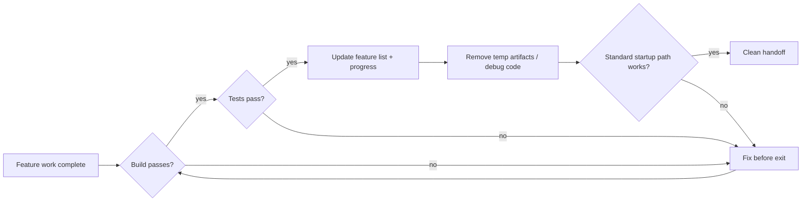
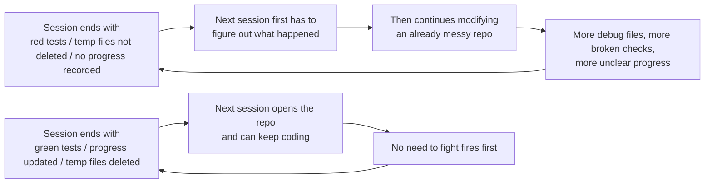

[نسخه‌ی انگلیسی ←](../../../en/lectures/lecture-12-why-every-session-must-leave-a-clean-state/)

> نمونه‌های کد: [code/](https://github.com/walkinglabs/learn-harness-engineering/blob/main/docs/en/lectures/lecture-12-why-every-session-must-leave-a-clean-state/code/)
> پروژه‌ی عملی: [پروژه 06. ساخت یک فضای کار ایجنت کامل](./../../projects/project-06-runtime-observability-and-debugging/index.md)

# درس ۱۲. ترک یک تحویل پاک در انتهای هر جلسه

ایجنت شما تمام بعدازظهر کار می‌کند، 20 فایل را تغییر می‌دهد، کد را commit می‌کند، و جلسه پایان می‌یابد. جلسه‌ی بعدی ایجنت شروع می‌شود و فوراً متوجه می‌شود: build شکسته است، آزمون‌ها قرمز هستند، فایل‌های موقتی برای دیبوگ در همه‌ی جا پراکنده هستند، فهرست قابلیت‌ها به‌روز نشده است، و پیشرفت کاملاً نامشخص است. 30 دقیقه‌ی اول جلسه‌ی جدید کاملاً صرف «فهمیدن اینکه جلسه‌ی قبلی واقعاً چه کار کرد» می‌شود.

هم OpenAI و هم Anthropic به‌وضوح بیان می‌کنند: **اعتماد‌پذیری بلندمدت به انضباط عملیاتی بستگی دارد، نه تنها موفقیت یک‌بار اجرا.** کیفیت وضعیت در انتهای هر جلسه مستقیماً بر کارایی جلسه‌ی بعدی تاثیر می‌گذارد.

## رشد آنتروپی حالت پیش‌فرض است

قوانین Lehman در مورد تکامل نرم‌افزار به ما می‌گویند: سیستم‌هایی که تغییرات مستمری را تجربه می‌کنند حتماً پیچیده‌تر می‌شوند مگر اینکه فعالانه مدیریت شوند. این به‌خصوص برای ایجنت‌های ایجاد کد مصنوعی درست است. هر جلسه تغییراتی را معرفی می‌کند، و بدون پاک‌سازی در خروج، بدهی فنی به‌صورت نمایی جمع می‌شود.

در طول پنج ماه آزمایش‌های Codex، OpenAI چیزی چشمگیری مشاهده کرد: **ایجنت‌ها الگوهایی را که قبلاً در ریپازیتوری وجود دارند کپی می‌کنند، حتی اگر آن الگوها ناسازگار یا بهینه نباشند.** در طول زمان، این کپی‌کردن حتماً به انحراف منجر می‌شود. اولین شخص فنجان قهوه را در ناحیه‌ی مشترک رها می‌کند؛ فنجان دوم می‌گوید «این‌جا از قبل خراب است» و یک فنجان دیگر رها می‌کند؛ یک هفته‌ی بعد میز در زیر فنجان‌ها مدفون است. یک کد پایگاه به‌همین روش کار می‌کند.

تیم OpenAI در ابتدا 20 درصد هر جمعه را صرف پاک‌سازی دستی «بقایای هوش مصنوعی» می‌کردند، اما این رویکرد واضح است که مقیاس‌پذیر نیست. آن‌ها در نهایت به یک راه‌حل سیستماتیک رسیدند:

1. **رمز‌گذاری «قوانین طلایی» در ریپازیتوری**: قوانینی مانند «بجای تولید دستی راه‌حل‌های ad-hoc، بسته‌ی ابزار مشترک را ترجیح دهید» (نگاه‌دارندگان متمرکز) و «تخمین‌های بدون اطلاع در ساختار داده‌ها نزنید» (مرزها را تصدیق کنید یا از SDK‌های تایپ شده استفاده کنید). این قوانین ملموس، مکانیکی، و خودکار قابل‌بررسی هستند.
2. **ایجاد جریان‌های پاک‌سازی دوره‌ای**: یک ناوگان از کارهای Codex در پس‌زمینه که به‌طور منظم برای انحرافات اسکن می‌کنند، نمرات کیفیت را به‌روز می‌کنند، و PR‌های بازسازی هدفمند باز می‌کنند. بسیاری در عرض یک دقیقه قابل‌بررسی و خودکار ادغام هستند.
3. **اسطوره‌ی انسانی را یک‌بار ثبت کنید، مستمراً آن را اجرا کنید**: نظرات بررسی، PR‌های بازسازی، و اشکالات رو‌به‌روی کاربر همگی به‌روزرسانی‌های مستندات یا رمز‌کردن مستقیم در ابزار شود. هنگامی که مستندات کافی نیست، قانون را به کد ارتقا دهید.

بدهی فنی یک وام با بهره‌ی بالا است. پرداخت مستمر آن در افزایش کوچک تقریباً همیشه بهتر از اجازه دادن به انباشت آن در یک رویداد بزرگ بازپرداخت است.

> منبع: [OpenAI: مهندسی هارنس: استفاده از Codex در جهانی متمرکز بر ایجنت](https://openai.com/index/harness-engineering/)

## وضعیت پاک: بیشتر از «کد compile شود»

وضعیت پاک صرف «کد compile می‌شود» نیست. ساخت بدون خطا ساده‌ترین الزام است — جلسه‌ی بعدی نباید ابتدا خطاهای ساخت را رفع کند. تمام آزمون‌ها باید بگذرند، حتی آزمون‌هایی که قبل از جلسه وجود داشتند؛ جلسه مسئول عدم شکستن عملکرد موجود است. و این باید در CI تصدیق شود، نه فقط «روی دستگاه من کار می‌کند».



اما این هنوز کافی نیست. پیشرفت فعلی باید در قطعات ماشین‌خوان ثبت شود: تکام‌های تکمیل‌شده‌ی فرعی با معیار گذر آن‌ها، تکام‌های ناتمام اما ناتمام با وضعیت فعلی، و تکام‌های هنوز‌آغاز نشده‌ی فرعی. سوابق پیشرفت خوب می‌توانند زمان تشخیصی راه‌اندازی جلسه‌ی جدید را 60-80 درصد کاهش دهند. قطعات موقتی — فایل‌های log دیبوگ، فایل‌های موقتی، کد نظری، علامات TODO — نیز باید پاک شوند، زیرا بار شناختی را برای جلسه‌ی بعدی افزایش می‌دهند. مسیر راه‌اندازی استاندارد نیز باید عملکردی باقی بماند. آیا جلسه‌ی بعدی می‌تواند بدون مداخله‌ی دستی کار را شروع کند؟ مقدار اولیه‌ی محیط، بارگذاری کد پایگاه، اکتساب متن، انتخاب کار — هیچ‌یک از این مسیرها نمی‌تواند شکسته باشد.



## مفاهیم اساسی

- **وضعیت پاک**: سیستم باید پنج شرط را در انتهای جلسه برآورده کند — ساخت می‌گذرد، آزمون‌ها می‌گذرند، پیشرفت ثبت می‌شود، قطعات کهنه وجود ندارد، مسیر راه‌اندازی دستیاب است. عدم وجود هر یک به معنی عدم «تکمیل» جلسه است.
- **تمامیت جلسه**: مشابه معاملات پایگاه داده — یا کاملاً commit و ترک وضعیت پاک، یا بازگشت به آخرین وضعیت سازگار. بین این دو گزینه چیزی نیست.
- **سند کیفیت**: یک قطعه‌ی فعال که مستمراً نمرات کیفیت برای هر ماژول ثبت می‌کند. نه ارزیابی یک‌بار، بلکه یک ردیاب که نشان می‌دهد آیا کد پایگاه تقویت یا ضعیف می‌شود.
- **حلقه‌ی پاک‌سازی**: یک جلسه‌ی نگهداری منظم که هدف آن کاهش سیستماتیک آنتروپی در کد پایگاه است. نه ترمیم اضطراری، بلکه عملیات معمول.
- **سادگی‌بخشی هارنس**: با بهبود قابلیت‌های مدل، اجزای هارنس را که دیگر لازم نیستند حذف کنید. محدودیتی که امروز ضروری است ممکن است در سه ماه سربار غیر ضروری باشد.
- **پاک‌سازی idempotent**: عملیات پاک‌سازی نتیجه‌ی یکسانی ایجاد می‌کنند بدون توجه به اینکه چند بار اجرا شوند، تضمین می‌کند که پاک‌سازی حتی در سناریوهای شکست-تکرار امن می‌ماند.

## «پاک‌سازی بعداً» یعنی هرگز پاک نکردن

رایج‌ترین دام ذهنی این است: «این جلسه زمان پاک‌سازی ندارد، بعداً انجام خواهم داد.» اما جلسه‌ی بعدی ایجنت نمی‌داند چه چیزی را پس گذاشتید — یک آشفتگی از کد و وضعیت نامعلوم می‌بیند. زمان قابل‌توجهی را صرف استنتاج می‌کند «کدام بخش‌های این کد عمدی هستند و کدام موقتی هستند».

بدتر، هر جلسه اهداف کار خود را دارد. جلسه‌ی جدید برای انجام کار جدید آمده است، نه برای پاک‌سازی آشفتگی جلسه‌ی قبلی. این آشفتگی را نادیده می‌گیرد و کار جدید را روی آن شروع می‌کند، آشفتگی بیشتری را معرفی می‌کند. این حلقه‌ی بازخورد مثبت آنتروپی است.

اعداد داستان را می‌گویند. یک پروژه‌ی توسعه‌یافته با ایجنت‌ها برای 12 هفته، بدون استراتژی پاک‌سازی:

- هفته‌ی 1: نرخ عبور ساخت 100٪، نرخ آزمون 100٪، راه‌اندازی جلسه‌ی جدید 5 دقیقه
- هفته‌ی 4: ساخت 95٪، آزمون 92٪، راه‌اندازی 15 دقیقه
- هفته‌ی 8: ساخت 82٪، آزمون 78٪، راه‌اندازی 35 دقیقه
- هفته‌ی 12: ساخت 68٪، آزمون 61٪، راه‌اندازی 60+ دقیقه

همان پروژه با استراتژی پاک‌سازی:

- هفته‌ی 1: 100٪، 100٪، 5 دقیقه
- هفته‌ی 12: 97٪، 95٪، 9 دقیقه

بعد از 12 هفته: نرخ عبور ساخت 29 نقطه درصدی تفاوت دارد، زمان راه‌اندازی جلسه‌ی جدید 85 درصد تفاوت دارد. این نظری نیست — یک تفاوت مشاهده‌شده است.

## نحوه‌ی انجام آن

### 1. وضعیت پاک شرط لازم برای تکمیل است

به‌صراحت در هارنس تعریف کنید: **تکمیل جلسه = کار راستی‌آزمایی را می‌گذراند و بررسی وضعیت پاک می‌گذراند.** عدم وجود هر یک به معنی عدم تکمیل جلسه است. در CLAUDE.md بنویسید:

```
## چک لیست خروج جلسه
- [ ] ساخت می‌گذرد (npm run build)
- [ ] تمام آزمون‌ها می‌گذرند (npm test)
- [ ] فهرست قابلیت‌ها به‌روز شده
- [ ] بدون کد دیبوگ باقی‌مانده (console.log, debugger, TODO)
- [ ] مسیر راه‌اندازی استاندارد دستیاب است (npm run dev)
```

### 2. استراتژی پاک‌سازی دوحالتی

دو حالت پاک‌سازی را ترکیب کنید:

**پاک‌سازی فوری (در انتهای هر جلسه)**: قطعات موقتی ایجادشده‌ی حین جلسه را پاک کنید، وضعیت فهرست قابلیت‌ها را به‌روز کنید، ساخت و آزمون‌ها می‌گذرند اطمینان دهید. این پاک‌سازی «شمارش‌گری مراجع» است — به‌محض اینکه استفاده‌ی از چیزی تمام شد پاک کنید.

**پاک‌سازی دوره‌ای (هفتگی)**: اسکن سیستم‌پهن — مسائل ساختاری جمع‌شده را مقابله کنید، مستندات کیفیت را به‌روز کنید، آزمون‌های معیار را اجرا کنید تا انحراف را کشف کنید. این پاک‌سازی «ردیابی» است — یک عبور نگهداری جامع بر روی یک دوره‌ی منظم انجام می‌شود.

### 3. یک سند کیفیت نگاه‌دارید

یک سند کیفیت یک قطعه‌ی فعال است که مستمراً هر ماژول را نمره می‌دهد:

```markdown
# سند کیفیت

## ماژول احراز هویت کاربر (کیفیت: A)
- راستی‌آزمایی می‌گذراند: بله
- ایجنت درک می‌کند: بله
- ثبات آزمون: پایدار
- مرزهای معماری: منطبق
- معیارهای کد: تعقیب شده

## ماژول پرداخت (کیفیت: C)
- راستی‌آزمایی می‌گذراند: تا حدی (callback پرداخت آزمایش‌نشده)
- ایجنت درک می‌کند: دشوار (منطق در 3 فایل پراکنده است)
- ثبات آزمون: ناپایدار (2 آزمون ناپایدار)
- مرزهای معماری: نقض وجود دارد
- معیارهای کد: تا حدی تعقیب شده
```

جلسات جدید این سند را می‌خوانند و فوراً می‌دانند کجا اولویت دهند. ابتدا کم‌ترین-نمره‌ی ماژول را رفع کنید.

### 4. به‌صورت دوره‌ای هارنس را ساده کنید

هر جزء هارنس وجود دارد زیرا مدل نتوانست به‌طور قابل‌اطمینان چیزی را تنهایی انجام دهد. اما با بهبود مدل‌ها، این فرض‌ها قدیمی می‌شوند.

آزمایش‌های Anthropic این را به‌صراحت نشان داد. هارنس اولیه‌ی آن‌ها شامل مکانیسم شکستن sprint بود — کار را به تکام‌های کوچک تقسیم کنند تا Sonnet 4.5 یک‌ by‌یک آن‌ها را تکمیل کند. وقتی Opus 4.6 عرضه شد، قابلیت‌های بومی مدل می‌تواند تجزیه‌ی کار را به‌طور خودمختار مقابله کند، ساخت sprint را سربار غیرضروری کند. بعد از حذف آن، ایجنت‌سازنده می‌توانست بیش از دو ساعت بدون انحراف کار کند — و از نظر صافی‌تر بود.

اما ارزیاب داستان متفاوتی را گفت. حتی با قابلیت‌های بیشتر قوی‌تر Opus 4.6، وقتی کارها به مرز قابلیت مدل نزدیک شدند، ارزیاب هنوز ارزش واقعی ارائه داد — عملکرد گمشده‌ی سازنده و اجرای stub را می‌گیرید. این به معنی ارزیاب یک تصمیم بله/خیر ثابت نیست؛ به جایی که سختی کار نسبت به قابلیت مدل نشسته است بستگی دارد.

**عمل توصیه‌شده**: هر ماه، یک جزء هارنس را انتخاب کنید، به‌طور موقتی آن را غیرفعال کنید، و کارهای معیار را اجرا کنید. اگر نتایج بدتر نشود، آن را برای همیشه حذف کنید. اگر شدند، آن را بازگردانید یا آن را با جایگزین سبک‌تر جایگزین کنید.

اصل عمیق‌تر: **با بهبود مدل‌ها، ترکیب‌های جالب در هارنس کاهش نمی‌یابد — آن‌ها تغییر می‌کنند.** مسائلی که قبلاً راه‌حل‌های صریح الزام می‌کردند توسط قابلیت‌های مدل جذب می‌شوند، اما مرزهای قابلیت جدیدی فضاهای طراحی هارنس را باز می‌کنند که قبلاً غیرممکن بودند. کار مهندس هوش مصنوعی تداوماً یافتن ترکیب‌های ارزشمند بعدی است.

### 5. عملیات پاک‌سازی باید Idempotent باشند

اسکریپت‌های پاک‌سازی باید برای اجرای مجدد ایمن باشند — اجرای یک‌بار دیگر نباید اثرات جانبی ایجاد کند:

```bash
# عملیات پاک‌سازی idempotent
rm -f /tmp/debug-*.log  # -f تضمین می‌کند عدم خطا هنگام عدم وجود فایل‌ها
git checkout -- .env.local  # بازگردان به وضعیت معروف
npm run test  # راستی‌آزمایی پاک‌سازی چیزی را نشکست
```

### 6. نفوذ بالا فلسفه‌ی ادغام را تغییر می‌دهد

وقتی خروجی ایجنت از ظرفیت بررسی انسان بیشتر باشد، فلسفه‌ی سنتی ادغام نیاز به تعدیل دارد. تجربه‌ی تیم OpenAI: در محیطی که ایجنت 3.5 PR هر روز باز می‌کند (و بعداً حتی بیشتر)، کاهش gates ادغام بلاکه‌کننده صحیح است. PR‌ها باید کوتاه‌عمر باشند؛ ناپایداری آزمون معمولاً با اجرای بعدی حل می‌شود تا غیرتعیین بلوکه کردن پیشرفت. در سیستمی که هزینه‌ی ترمیم کم و هزینه‌ی انتظار بالا است، سریع‌تر حرکت با ترمیم‌های سریع استراتژی بهتر از تأیید آهسته است.

**اخطار**: این در محیط کم‌نفوذ غیرمسئولانه است. اما وقتی خروجی ایجنت از توجه انسانی بسیار بیشتر باشد، اغلب صحیح است. معیار کلیدی: **میانگین هزینه‌ی ترمیم اشکال در مقابل میانگین هزینه‌ی انتظار برای بررسی انسان PR.** وقتی اول کمتر از دوم است، ادغام سریع صحیح است.

## مورد واقعی

یک برنامه‌ی Electron توسعه‌یافته با ایجنت‌ها برای 12 هفته، مقایسه‌ی دو رویکرد:

**بدون استراتژی پاک‌سازی** (گروه کنترل): هفته‌ی 12، نرخ عبور ساخت 68٪، نرخ عبور آزمون 61٪، راه‌اندازی جلسه‌ی جدید 60+ دقیقه، 103 قطعه‌ی کهنه.

**با استراتژی پاک‌سازی** (گروه آزمایش): بررسی وضعیت پاک‌سازی کامل در هر انتهای جلسه، بعلاوه حلقه‌ی پاک‌سازی هفتگی. هفته‌ی 12، نرخ عبور ساخت 97٪، نرخ عبور آزمون 95٪، راه‌اندازی جلسه‌ی جدید 9 دقیقه، 11 قطعه‌ی کهنه.

تا هفته‌ی 12، نرخ عبور ساخت گروه آزمایش 29 نقطه درصدی بیشتر است، نرخ عبور آزمون 34 نقطه بیشتر، و زمان راه‌اندازی جلسه‌ی جدید 85 درصد کمتر. هر جلسه 5 دقیقه اضافی برای پاک‌سازی صرف کرد، اما در 12 هفته ده‌ها ساعت آشفتگی را صرفه‌جویی کرد.

## نکات کلیدی

- **وضعیت پاک شرط لازم برای تکمیل جلسه است** — نه کارهای اختیاری داخلی، بلکه بخشی از «تعریف انجام».
- **تمام پنج بعد غیرقابل‌مذاکره هستند** — ساخت، آزمون‌ها، پیشرفت، قطعات، راه‌اندازی — هر یک باید به‌صراحت بررسی شود.
- **سند‌های کیفیت سلامت کد پایگاه را قابل ردیابی می‌کنند** — فقط می‌توانید به‌صورت فعال چیزی را رفع کنید که می‌دانید تنزل می‌یابد.
- **به‌صورت دوره‌ای هارنس را ساده کنید** — با بهبود قابلیت‌های مدل، محدودیت‌های دیگری را که لازم نیستند حذف کنید.
- **«پاک‌سازی بعداً» برابر هرگز پاک نکردن است.** رشد آنتروپی حالت پیش‌فرض است؛ فقط پاک‌سازی فعال آن را مقابله می‌کند.

## مطالعات بیشتر

- [Clean Code - Robert C. Martin](https://www.goodreads.com/book/show/3735293-clean-code) — اصول سیستماتیک صاف‌بودن کد
- [Harness Engineering - OpenAI](https://openai.com/index/harness-engineering/) — تکرارپذیری به‌عنوان الزام طراحی هارنس کوری
- [Effective Harnesses - Anthropic](https://www.anthropic.com/engineering/effective-harnesses-for-long-running-agents) — نقش بحرانی خروج جلسه‌ی پاک برای اعتماد‌پذیری بلندمدت
- [Programs, Life Cycles, and Laws of Software Evolution - Lehman](https://ieeexplore.ieee.org/document/1702314) — قوانین تکامل نرم‌افزار اثبات می‌کنند پیچیدگی سیستم حتماً بدون نگهداری فعال رشد می‌کند

## تمرین‌ها

1. **چک لیست وضعیت پاک**: برای کد پایگاه خود یک چک‌لیست خروج جلسه طراحی کنید که تمام پنج بعد را پوشش دهد. آن را در 5 جلسه‌ی متوالی اعمال کنید و تعداد نقض‌های هر بعد را ثبت کنید.

2. **مقایسه‌ی معیار**: از یک مجموعه‌ی کار ثابت با دو نسخه‌ی هارنس (با/بدون الزامات وضعیت پاک) استفاده کنید. نرخ تکمیل، شمارش تکرار، و نرخ فرار عیب را مقایسه کنید.

3. **تمرین سادگی‌بخشی هارنس**: یک جزء هارنس را انتخاب کنید، به‌طور موقتی آن را غیرفعال کنید، و کارهای معیار را اجرا کنید. نتایج را با و بدون آن مقایسه کنید. تصمیم بگیرید که آن را نگاه‌دارید، حذف کنید، یا جایگزین کنید.
