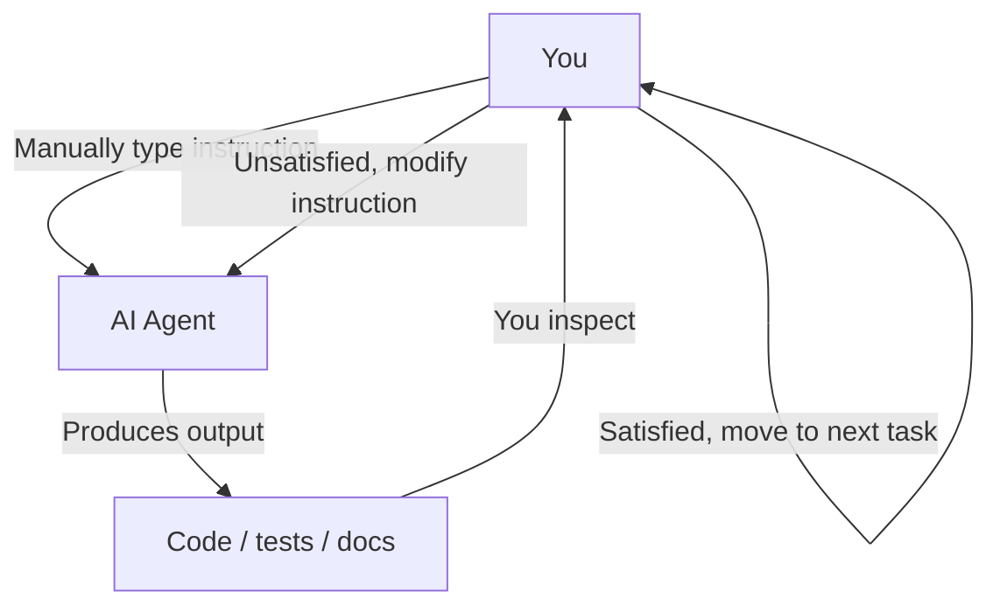
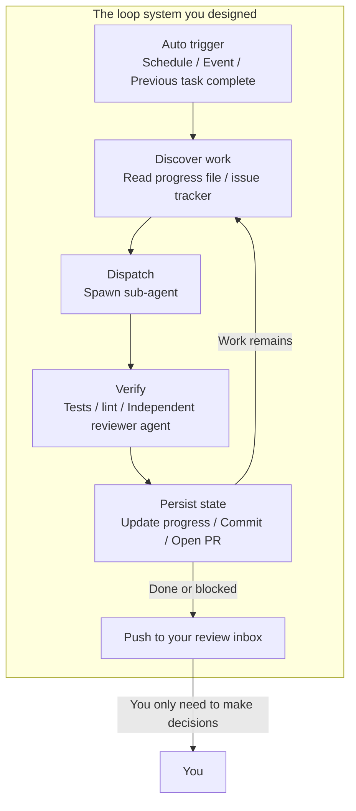
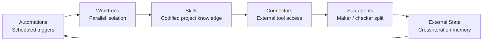
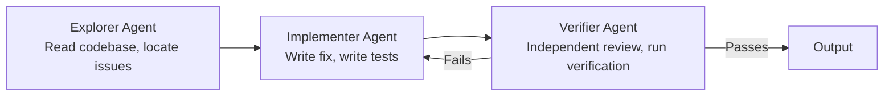
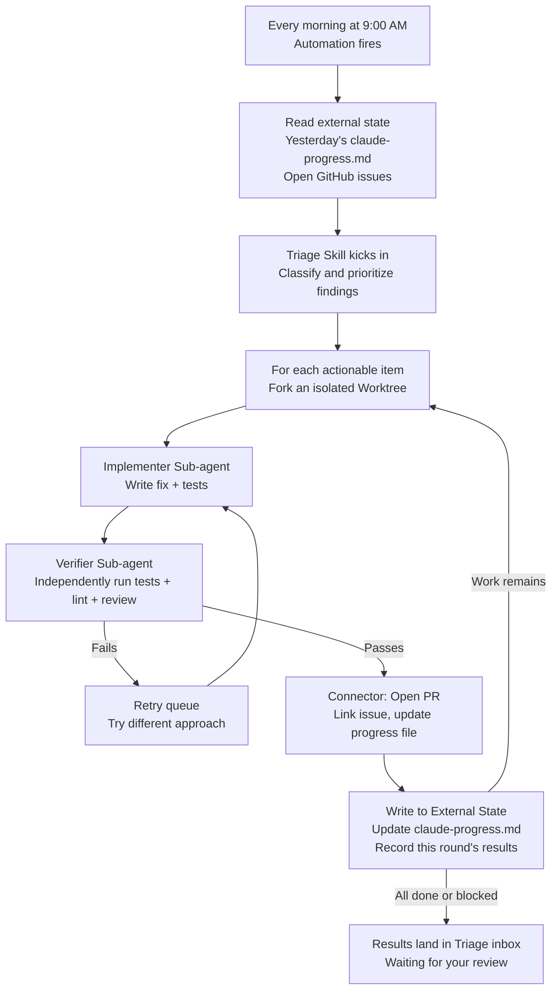
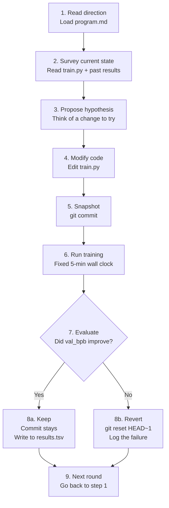

[نسخه‌ی انگلیسی ←](../../../en/lectures/lecture-13-loop-engineering/)

> مثال‌های کد: [code/](https://github.com/walkinglabs/learn-harness-engineering/blob/main/docs/en/lectures/lecture-13-loop-engineering/code/)
> پروژه‌ی تمرینی: [پروژه ۰۷. ساخت اولین حلقه خودکار شما](./../../projects/project-07-loop-engineering-first-loop/index.md)

# درس ۱۳. از پرامپت دستی تا حلقه‌های خودمختار

همه چیزی که در دوازده سخنرانی اول یاد گرفتید، بر یک فرض تکیه دارد: **شما نشسته‌اید روی صندلی، دستورات را یکی یکی تایپ می‌کنید.**

شما `AGENTS.md` را نوشتید (سخنرانی‌های ۱–۴)، مدیریت وضعیت را ساختید (سخنرانی‌های ۵–۶)، دامنه‌ی کار را با فهرست قابلیت‌ها محدود کردید (سخنرانی‌های ۷–۸)، در انتهای جلسه تحویل‌های پاک برجا گذاشتید (سخنرانی‌های ۹، ۱۲)، و رصدپذیری را درون هارنس قرار دادید (سخنرانی‌های ۱۰–۱۱). اما ماتحت همه‌ی آن، همیشه شما بودید. ایجنت هرگز تصمیم نگرفت که خودش کی شروع کند کار کنند — چون هیچ کس دکمه‌ی «شروع» را نفشاند.

این سخنرانی در مورد سپردن دکمه‌ی شروع به سیستم است. نه از دست دادن کنترل — ارتقا دادن آن به لایه‌ی بعدی.

## /goal: ساده‌ترین حلقه‌ی ممکن

بهترین ورودی به مهندسی حلقه، یک نمودار معماری پیچیده نیست — یک دستور ساده است.

در اوایل ۲۰۲۶، Claude Code و OpenAI Codex به‌طور مستقل، یک ویژگی یکسان را منتشر کردند: `/goal`. شما در ترمینال تایپ می‌کنید:

```
/goal "All tests pass, zero lint warnings, merge to main"
```

سپس لپ‌تاپ را می‌بندید و می‌روید بخوابید. هشت ساعت بعد، ایجنت تحلیل کرده، کد نوشته، آزمایش کرده، اشکالات را اصلاح کرده، و ادغام کرده — همه‌ی این کارها را خودش انجام داده. وقتی ناموفق شود تلاش دوباره می‌کند، وقتی به بن‌بست برسد رویکردها را عوض می‌کند، و وقتی کار تمام شود متوقف می‌شود — بدون آنکه شما شانه‌ی آن را لمس کنید و بگویید «دوباره تلاش کن».

تنها تفاوت بین `/goal` و یک پرامپت سنتی یک چیز است. اما آن یک چیز همه چیز را تغییر می‌دهد:

| | پرامپت سنتی | `/goal` |
|---|---|---|
| آنچه شما فراهم می‌کنید | چه کاری بعد انجام شود | وضعیت نهایی چگونه باید باشد |
| آنچه ایجنت انجام می‌دهد | یک بار اجرا | تا رسیدن به هدف حلقه بزند |
| کی تصمیم می‌گیرد کار تمام شد | شما | یک شرط توقف قابل‌تایید |
| کی می‌توانید برید | نمی‌توانید | همان لحظه که `/goal` را تایپ کردید |

`/goal` اساساً یک حلقه است. دقیقاً سه بخش دارد: **یک هدف، یک روش راستی‌آزمایی، و یک شرط توقف.** تنها این سه چیز شما را از داخل حلقه به بیرون حلقه منتقل می‌کند.

### چگونه `/goal` به‌طور طبیعی رشد کرد

`/goal` از صفر به یک، بدون هیچ پیشینه‌ای، به‌ظهور درنیامد. به‌تدریج از روال روزمره‌ی کار رشد کرد، تقریباً چهار مرحله را طی کرد:

**مرحله ۱: پرامپت دستی یکی‌یکی.** قدیم‌ترین روش کار، رفت و برگشت بود: «یک تابع بنویس»، «یک آزمایش اضافه کن»، «این منطق را اصلاح کن». ایجنت بعد از هر گام متوقف می‌شد و برای شما منتظر می‌ماند که بگویید کی بعد چه کار باید انجام شود. شما برنامه‌ریز کل خط‌لوله بودید.

**مرحله ۲: پرامپت‌های بلند با چند گام.** سپس مردم شروع کردند به نوشتن پرامپت‌های بلندتر که گام‌ها را یکی پس از دیگری چیدند: «ابتدا کد را تحلیل کن، بعد پیاده‌سازی را بنویس، سپس آزمایش‌ها را اجرا کن، و اگر ناموفق باشند، آنها را اصلاح کن». ایجنت می‌توانست چند گام را در یک بار انجام دهد، اما باز هم باید تماشا می‌کردید — زیرا ممکن بود در میانه‌ی راه منحرف شود، یا یک گام را تمام کند و نداند بعد باید چه کار کند.

**مرحله ۳: خود‌بازنگری و خود‌هدایت ایجنت.** بعد، ایجنت‌ها «درون‌بینی» را کسب کردند — بعد از هر گام، نتیجه را نگاه می‌کردند و تصمیم می‌گرفتند کی بعد چه کار کنند. شما یک هدف می‌دادید، و آن‌ها خودشان آن را شکسته‌اند و دوباره تلاش کردند. اما یک مشکل ظاهر شد: آن‌ها کی متوقف شوند؟ آیا «من تمام کردم» که خود ایجنت می‌گوید می‌تواند شمار رود؟ تجربه مارا‌به‌مرور جواب داد — نه. ایجنت‌ها خیلی راحت اعلام می‌کنند که کار تمام شد.

**مرحله ۴: قضاوت توقف مستقل — `/goal`.** گام آخر این بود که «تعیین اینکه کار تمام شده یا نه» را از دست ایجنتی که کار را انجام می‌دهد بیرون آورید، و به یک داور مستقل بسپارید. این می‌تواند یک مدل متفاوت، یک اسکریپت، یا یک دستور آزمایشی باشد — اما قانون یکی بود: فردی که کد را می‌نویسد نمی‌تواند تکالیف خودش را نمره‌دهی کند. در این نقطه، `/goal` واقعاً کار کرد: شما هدف را می‌دهید، حلقه می‌زند، یک داور مستقل تصمیم می‌گیرد کی متوقف شود، و شما می‌توانید برید.

این چهار مرحله یک نقشه‌ی راه که هر شرکتی برنامه‌ریزی کرده باشد نبود. این راهی بود که هرکسی که با ایجنت‌ها کد می‌نوشت، به‌طور مستقل، به آن رسید، هل‌داده‌شده توسط دردهای یکسان. Claude Code و Codex که `/goal` را تقریباً بیک‌زمان در اوایل ۲۰۲۶ منتشر کردند، تصادفی نبود — زمان رسیده بود.

### بیش از یک نوع حلقه وجود دارد

`/goal` ساده‌ترین حلقه برای درک است، اما تنها نوع نیست. حلقه‌ها بر اساس نحوه‌ی آغاز و توقف خود به دسته‌ها تقسیم می‌شوند:

| نوع | آغاز | شرط توقف | Claude Code | Codex | بهترین برای |
|------|---------|----------------|-------------|-------|----------|
| **حلقه مبتنی بر نوبت** | شما هر پرامپت را دستی تایپ می‌کنید | ایجنت می‌تواند فکر کند تمام شد، یا شما قطع کنید | چت معمولی | چت معمولی | کارهای کوچک، کار اکتشافی |
| **حلقه مبتنی بر هدف** | شما یک هدف می‌دهید | ارزیاب مستقل تایید می‌کند تمام شد، یا حداکثر نوبت‌ها رسید | `/goal` | `/goal` (نیاز به فعال‌سازی دستی) | کارهای پیچیده با معیار تکمیل روشن |
| **حلقه مبتنی بر زمان** | بازه‌ی زمانی برنامه‌ریزی‌شده (هر N دقیقه/ساعت) | شما دستی متوقف می‌کنید، یا بعد از تکمیل کار خارج می‌شود | `/loop` | خودکارسازی نخ | بررسی وضعیت، بررسی دوره‌ای، کار تکراری |
| **حلقه رویداد‌محور** | رویداد خارجی (PR باز شد، CI شکست، issue جدید) | بعد از رسیدگی به رویداد متوقف می‌شود، یا به حد تلاش دوباره می‌رسد | Routines (API / GitHub Webhook) | خودکارسازی مستقل + افزونه‌ها | جریان کار پاسخی، ادغام CI/CD |

این‌ها رقیب نیستند — ابزارهای متفاوتی برای کارهای مختلف هستند. نوبت‌محور برای کارهای کوچک خوب است. از `/goal` زمانی استفاده کنید که خط پایان روشن است. از `/loop` زمانی استفاده کنید که باید چیزی را نگاه‌دارید. از رویداد‌محور زمانی استفاده کنید که با سیستم‌های خارجی یکپارچگی می‌کنید.

### `/goal` و `/loop` را اشتباه نگیرید

هر دوی آنها «حلقه» در نام دارند، اما مسائل کاملاً متفاوتی را حل می‌کنند:

| | `/goal` | `/loop` |
|---|---------|---------|
| **این چه چیزی است** | یک کار بزرگ، تا تکمیل شود اجرا می‌شود | یک کار کوچک، در یک بازه‌ی زمانی تکرار می‌شود |
| **شرط توقف** | هدف رسید، یا بودجه تمام شد | شما دستی متوقف می‌کنید، یا کار خودش خارج می‌شود |
| **پروفایل زمانی** | یک اجرای بلند، می‌تواند ساعت‌ها یا روز‌ها طول بکشد | دفقه‌های کوتاه دوره‌ای، هر اجرا می‌تواند چند دقیقه باشد |
| **پیشرفت** | هر تکرار به خط پایان نزدیک‌تر می‌شود | هر اجرا مستقل است، بدون پیشرفت تجمعی |
| **تشبیه** | دویدن یک ماراتن — تیر شروع می‌زند، شما در خط پایان متوقف می‌شوید | آلارم ساعت — در یک زمان‌بندی به‌صدا در می‌آید، شما آن را خاموش می‌کنید |
| **استفاده‌ی معمول** | «سیستم پرداخت کامل را با پوشش آزمایشی پیاده کن» | «هر ۱۵ دقیقه بررسی کن CI شکست‌خورده یا نه» |

یک اشتباه رایج: چیزی که باید `/goal` باشد را داخل `/loop` فشار دادن. مثل نوشتن `/loop 10m "keep implementing the payment system"` — این اشتباه است. `/loop` دستور یکسانی را بدون پیوند، هر بار به‌طور مستقل اجرا می‌کند. شما فقط نقطه‌ی شروع یکسانی را دوباره و دوباره دریافت خواهید کرد.

**آزمایش یک‌جملگی برای اینکه کدام را استفاده کنید: آیا این چیز پایان دارد؟**
- دارای پایان → `/goal`
- بدون پایان، شما فقط باید نگاه‌دارید → `/loop`

مهندسی حلقه، موضوع این سخنرانی، در مورد هیچ دستور خاصی نیست. **درباره‌ی توانایی طراحی سیستم‌هایی است که شامل تمام این نوع‌ها هستند — تا ایجنت شما بتواند کار کند حتی وقتی شما آنجا نیستید.**

شما نباید هر بار `/goal` را تایپ کنید. اما فهم اینکه از کجا آمده و چرا این‌طور به‌نظر می‌رسد — این فهم هسته‌ی مهندسی حلقه است. حلقه‌های پیچیده‌تر فقط قسمت‌هایی مثل زمان‌بندی، توازی، انزوا، و حافظه را بر روی این سه بنیاد یکسان اضافه می‌کند: هدف، راستی‌آزمایی، شرط توقف.

## ژوئن ۲۰۲۶: سه نفر در یک هفته فتیله یکسانی را روشن کردند

در اولین هفته‌ی ژوئن ۲۰۲۶، سه نفر که زیرساخت‌های ایجنت هوش مصنوعی برای کدنویسی را می‌ساختند — بدون اینکه یادداشت‌ها را با هم مقایسه کنند — یک چیز را با الفاظ متفاوت گفتند.

**Peter Steinberger** (سازنده‌ی OpenClaw، [پست او ۸ میلیون بار دیده شد](https://x.com/steipete/status/2063697162748260627)): «شما نباید دیگر ایجنت‌های کدنویسی را پرامپت کنید. شما باید حلقه‌هایی طراحی کنید که ایجنت‌های شما را پرامپت کنند.»

**Boris Cherny** (سر Claude Code در Anthropic، [در پادکست Acquired](https://x.com/rohanpaul_ai/status/2063289804708835412)): «من دیگر Claude را پرامپت نمی‌کنم. من حلقه‌هایی دارم که اجرا می‌شوند و Claude را پرامپت می‌کنند و تصمیم می‌گیرند بعد چه کار کنند. شغل من این است که حلقه‌ها را بنویسم.»

**Addy Osmani** (سرپرست مهندسی در Google Chrome) [این مفهوم را نام‌گذاری کرد](https://addyosmani.com/blog/loop-engineering/) در ۷ ژوئن ۲۰۲۶، و یک تعریف یک‌جملگی برایش داد:

> **مهندسی حلقه جایگزین کردن خودت به‌عنوان کسی که ایجنت را پرامپت می‌کند است. تو سیستمی طراحی می‌کنی که این کار را به‌جای تو انجام دهد.**

Cherny اعداد را افشا کرد: بیش از ۳۰ روز متوالی، تمام مشارکت‌های کد در Claude Code به‌طور خودمختار توسط هوش مصنوعی انجام شده‌اند — ۲۵۹ PR ادغام‌شده، بیش از ۸۰٪ کد تولیدی نوشته‌شده توسط Claude، و نرخ موفقیت ۷۶٪ برای کارهای نرم افزاری باز انجام.

سه نفر. یک هفته. یک نتیجه‌گیری. نه برای اینکه هماهنگ شده باشند — زیرا زیرساخت به‌آرامی از یک آستانه عبور کرده بود. ایجنت‌ها قابل‌اعتماد کافی شده‌اند تا کارهای غیر‌تافه را بدون نظارت تکمیل کنند. بدول زمان‌بندی (`/loop`, `/goal`, cron) اکنون داخل ابزارها ساخته‌شده‌اند. هزینه‌ی یک اجرای تک ایجنت کاهش یافته‌است تا حدی که دوباره‌اجرای آن در یک تایمر دیگر تلف‌کننده به‌نظر نرسد. وقتی تمام قطعات موجودند، حرکتی که آن‌ها را ترکیب می‌کند برای همه‌ی افراد یکباره واضح می‌شود.

> منبع: [Addy Osmani: مهندسی حلقه](https://addyosmani.com/blog/loop-engineering/)

## داخل حلقه در برابر بیرون حلقه

بیایید دو سناریو عملی را با هم مقایسه کنیم.

**سناریو الف: شما داخل حلقه هستید (سخنرانی‌های ۱–۱۲).**



شما یک هارنس کامل دارید: `AGENTS.md` به ایجنت قوانین پروژه را می‌گوید، `feature_list.json` دامنه‌ی کار را محدود می‌کند، `init.sh` محیط سازگار را اطمینان می‌دهد، `claude-progress.md` پیشرفت را ثبت می‌کند. **اما هنوز هر گام نیاز به شروع دستی شما دارد.** یک قابلیت تمام کنید، فایل پیشرفت را بخوانید، درباره‌ی کی بعد فکر کنید، دستور را تایپ کنید. شما موتور کل گردش‌کار هستید.

**سناریو ب: شما بیرون حلقه هستید (مهندسی حلقه).**



شما دیگر دستورات تایپ نمی‌کنید. سیستمی که طراحی کردید کار را کشف می‌کند، اختصاص می‌دهد، نتایج را تأیید می‌کند، وضعیت را ثبت می‌کند، و گام‌های بعدی را تصمیم می‌گیرد. شغل شما به سه چیز شامل می‌شود: **قبل از شروع، هدف و شرط توقف را تعریف کنید، بعد از پایان، نتیجه را بررسی کنید، و وقتی سیستم منحرف شود، قوانین را تنظیم کنید.** اهرم از «نوشتن پرامپت درست» به «طراحی حلقه‌ی درست» تغییر می‌کند.

> Osmani: «سال پیش، اگر می‌خواستید یک حلقه داشته باشید، یک دسته bash می‌نوشتید و برای‌همیشه آن را نگاه‌داری می‌کردید و این از آن شما بود و فقط شما. حالا قطعات داخل محصولات می‌آیند.» شما نیاز نیست از صفر بسازید. شما باید بفهمید قطعات چگونه با هم تناسب داشته باشند.

## مفاهیم اساسی

- **مهندسی حلقه**: طراحی سیستمی که به‌طور خودکار ایجنت شما را پرامپت کند، جایگزین ورودی دستی انسان مرحله‌به‌مرحله. انسان از داخل حلقه به بیرون حلقه حرکت می‌کند، و اهرم از «نوشتن پرامپت درست» به «طراحی حلقه‌ی درست» تغییر می‌کند.
- **حالت `/goal`**: ساده‌ترین حلقه‌ی ممکن — یک هدف، روش راستی‌آزمایی، و شرط توقف را فراهم کنید؛ ایجنت تا رسیدن به آن حلقه می‌زند. پل از پرامپت دستی به حلقه‌های خودمختار.
- **تفکیک سازنده/ارزیاب**: ایجنتی که کد می‌نویسد و ایجنتی که بررسی می‌کند باید جدا باشند. یک مدل که تکالیف خودش را نمره می‌دهد، قابل‌اعتماد نیست؛ یک تایید‌کننده‌ی مستقل — گاه با استفاده از یک مدل کاملاً متفاوت — تضمین بنیادی قابلیت‌اعتماد هر حلقه است.
- **انزوای Worktree**: هر ایجنت موازی در یک git worktree مستقل کار می‌کند، برخورد‌های فایل را فیزیکی‌اً جلوگیری می‌کند. شرط مقدماتی زیرساخت برای اجرای چند ایجنت موازی.
- **وضعیت خارجی**: حافظه‌ای که خارج یک گفتگو زندگی می‌کند — فایل‌های markdown، ردیاب‌های issue، تخت‌های kanban. مدل‌ها همه چیز بین اجراها فراموش می‌کنند؛ حافظه باید روی دیسک زندگی کند.
- **چهار هزینه‌ی خاموش**: چهار هزینه‌ی پنهانی که هر چه حلقه طول‌تر اجرا شود تیز‌تر می‌شوند — بدهی راستی‌آزمایی، پوسیدگی درک، تسلیم شناختی، انفجار توکن. حلقه‌ها نه تنها خروجی را تسریع می‌کند، بلکه خطر را هم تسریع می‌کند.

## شش بدول یک حلقه

Osmani یک حلقه را به پنج بلوک‌ بنیادی تجزیه کرد، بعلاوه یک لایه‌ی حافظه که از تمام آن‌ها می‌گذرد — شش چیز در مجموع، اما لایه‌ی حافظه وضعیت خاصی دارد: این فقط یک جزء در سطح مشابه دیگری نیست؛ ستون فقرات است که همه چیز به آن وابسته است.

نمودار زیر تمام شش را به‌عنوان یک حلقه رسم می‌کند تا بتوانید کل تصویر را با یک نگاه ببینید. اما یادتان باشد: وضعیت خارجی فقط یک ایستگاه بر روی حلقه نیست — پایه‌ای است که تمام حلقه بر آن متکی است.



### ۱. خودکارسازی — ضربان

بدون خودکارسازی، یک حلقه حلقه نیست — یک اجرای یک‌بار است که شما دستی انجام دادید.

Claude Code و Codex هر دو سیستم‌های زمان‌بندی کامل دارند، اما نام‌ها و لایه‌های آنها متفاوت است. تقریباً از سبک‌تر به سنگین‌تر نقشه‌برداری:

| لایه | Claude Code | Codex | توضیحات |
|-------|-------------|-------|-------|
| نظارت درون جلسه | `/loop` | خودکارسازی نخ | وابسته به جلسه‌ی فعلی، هنگام بستن جلسه می‌میرد |
| کارهای زمان‌بندی‌شده‌ی محلی | کارهای زمان‌بندی‌شده‌ی دسکتاپ | خودکارسازی مستقل (حالت محلی) | در حالی که ماشین روشن است اجرا می‌شود، می‌تواند به فایل‌های محلی دسترسی داشته باشد |
| کارهای زمان‌بندی‌شده‌ی کلود | Routines کلود | — (بدون برنامه‌ریز ابری بومی) | هنگام خاموشی ماشین اجرا می‌شود |
| تریگرهای رویداد | Routines (API / GitHub Webhook) | خودکارسازی مستقل + افزونه‌ها | توسط رویدادهای خارجی آغاز می‌شود |
| کاملاً خود‌میزبان | GitHub Actions / cron خود‌میزبان | `codex exec` + cron | کنترل کامل |

**تب Automations در Codex** ورودی زمان‌بندی است. پروژه را انتخاب کنید، پرامپت را، بازه‌ی زمانی را، و اینکه بر روی چک‌اوت محلی یا یک worktree پس‌زمینه اجرا شود یا خیر. اجراهایی که چیزی پیدا کنند در یک صندوق Triage قرار می‌گیرند؛ اجراهایی که چیزی نپیدند خودکار بایگانی‌شده‌اند. OpenAI آن‌ها را درون‌گی برای تریاژ روزانه‌ی issue، خلاصه‌های ناکامی CI، خلاصه‌های commit، و شکار اشکالات معرفی‌شده هفته‌ی گذشته استفاده می‌کند.

خودکارسازی‌های Codex در دو طعم می‌آیند:
- **خودکارسازی نخ** — تماس‌های بیدار کردن تناوبی مرتبط با یک نخ، حفظ متن. برای دنبال‌کردن مستمر یک چیز، مثل نظارت بر یک دستور درحال‌اجرای طولانی یا بررسی وضعیت PR. معادل در Claude Code `/loop` است.
- **خودکارسازی مستقل** — هر اجرا تازه شروع می‌شود، نتایج به Triage می‌روند. برای کارهای روزانه/هفتگی مستقل مثل خلاصه‌های کار یا اسکن‌های وابستگی. معادل در Claude Code کارهای زمان‌بندی‌شده‌ی دسکتاپ است.

سیستم Claude Code به‌طور دانه‌ای بیشتر لایه‌بندی شده است:

- **`/loop`** — تکرار زمان‌بندی درون جلسه‌ی سبک. در حالی که ترمینال شما باز است کار می‌کند، هنگام بستن جلسه می‌میرد، خودکار انقضا بعد از ۷ روز. خوب برای نظارت موقت در جریان کار فعلی شما.
- **کارهای زمان‌بندی‌شده‌ی دسکتاپ** — در حالی که ماشین شما روشن است اجرا می‌شود، از بازآغاز‌های جلسه بقا می‌کند، بازه‌های دقیقه‌ای. خوب برای کار تکراری که نیاز به دسترسی به فایل‌های محلی دارد.
- **Routines کلود** — بر روی زیرساخت کلود در ابر اجرا می‌شود، ماشین شما خاموش باشد یا نه بقا می‌کند، حداقل بازه‌ی ۱ ساعت. سه نوع تریگر پشتیبانی می‌کند: زمان‌بندی‌شده، فراخوانی API، GitHub webhook. خوب برای کارهای روزانه‌ای که محیط محلی شما را نیاز ندارند.
- **GitHub Actions / cron خود‌میزبان** — کاملاً تحت کنترل شما، هرطور اجرا می‌شود که می‌خواهید. خوب برای سناریوهایی با محیط خاص یا نیازمندی‌های امنیتی.

```bash
# Claude Code: هر ۳۰ دقیقه آزمایش‌ها را اجرا کن و اشکالات ناموفق را اصلاح کن (در جلسه‌ی فعلی)
/loop 30m Run the test suite and fix any failing tests

# Claude Code: هر ۱۵ دقیقه وضعیت استقرار را بررسی کن
/loop 15m Check if the production deploy succeeded and report status
```

خودکارسازی‌ها ضربان هستند. بدون آن‌ها، حلقه یک نقشه‌ی تفریحی است که هرگز بیدار نمی‌شود.

### ۲. Worktrees — انزوا در مقیاس

به‌محض اینکه شما بیش از یک ایجنت را اجرا می‌کنید، برخورد‌های فایل حتمی‌ترین روش شکست می‌شوند. دو ایجنت نوشتن در یک فایل دقیقاً سردردی است که دو مهندس بدون مشورت یکدیگر به خط‌های یکسانی commit کنند.

`git worktree` این را حل می‌کند: هر ایجنت روی شاخه‌ی خودش در دایرکتوری‌ی خودش کار می‌کند. آن‌ها فیزیکی‌اً نمی‌توانند checkout‌های یکدیگر را لمس کنند.

Claude Code و Codex هر دو پشتیبانی worktree را می‌فرستند. وقتی از `--worktree` یا `isolation: worktree` روی یک sub-agent استفاده می‌کنید، هر کمکی یک checkout تمیز، مستقل دریافت می‌کند که خودش را تمیز می‌کند. Worktrees مشکل برخورد مکانیکی را حل می‌کند — اما یادتان باشد: **پهنای‌باند بررسی شما هنوز سقف است.** چند ایجنت موازی می‌توانید نظارت کنید تعیین می‌کند چند worktree می‌توانید واقعاً اجرا کنید.

### ۳. Skills — مجدداً بیان پروژه‌ی خودتان را متوقف کنید

Skill روشی است برای متوقف کردن تکرار بیان متن و بافتی یکسان پروژه هر جلسه. یک پوشه‌ای حاوی یک `SKILL.md` با دستورات و فراداده، بعلاوه اسکریپت‌ها، منابع، و دارایی‌های اختیاری است.

Codex و Claude Code از همان فرمت پشتیبانی می‌کنند. Skills مستقیماً با `/skill-name` فراخوانی می‌شوند (Codex همچنین `$skill-name` را پشتیبانی می‌کند)، یا به‌طور ضمنی زمانی‌که کار با توصیف skill مطابقت دارد آغاز می‌شوند.

Skills اساساً در مورد پرداخت بدهی قصدتان است. یک ایجنت هر جلسه را سرد شروع می‌کند — هر شکاف در قصدتان را با یک حدس مطمئن پر می‌کند. یک Skill این قصد نوشته‌شده‌ی بیرون است: کنوانسیون‌ها، مراحل ساخت، «ما بدین‌دلیل این کار نمی‌کنیم» — یک بار نوشته‌شده، هر اجرا خوانده‌شده.

### ۴. Connectors — حلقه‌ی شما ابزارهای واقعی را لمس می‌کند

یک حلقه که فقط می‌تواند فایل‌سیستم را ببیند، یک حلقه کوچک است. Connectors (ساخت‌شده بر پروتکل MCP) اجازه می‌دهند ایجنت ردیاب issue شما را بخواند، یک پایگاه داده را جستجو کند، به یک API بندی دسترسی داشته باشد، یک پیام در Slack بندازد.

Codex و Claude Code هر دو MCP صحبت می‌کنند، پس Connector که برای یکی نوشتید معمولاً در دیگری کار می‌کند. Connectors تفاوت بین «این تعمیر است» و یک حلقه‌ای است که PR را باز می‌کند، Linear ticket را لینک می‌کند، و پس از سبز شدن CI پیام را می‌فرستد — خودش، داخل محیط واقعی شما، نه فقط در یک ترمینال.

### ۵. Sub-agents — سازنده را از چک‌کننده دور نگه دارید

مهم‌ترین انتخاب طراحی ساختاری در یک حلقه تقسیم کسی که می‌نویسد از کسی که بررسی می‌کند است. مدلی که کد را نوشت، خیلی محتاطانه تکالیف خودش را نمره می‌دهد. یک ایجنت دوم، با دستورات متفاوت و گاه یک مدل متفاوت، آنچه را ایجنت اول خودش را متقاعد کرد، می‌پیچید.

تقسیم کلاسیک سه‌نقشی:



`/goal` کلود کد این را تحت‌الپوشش اجرا می‌کند — یک جلسه‌ی تازه، مستقل تصمیم می‌گیرد حلقه باید متوقف شود یا نه، نه جلسه‌ای که کار را انجام داد. این **تفکیک سازنده/ارزیاب** نام‌گذاری می‌شود، و این تک‌مهم‌ترین تضمین قابلیت‌اعتماد در طراحی حلقه است.

### ۶. وضعیت خارجی — حافظه‌ی حلقه

مدل‌ها همه‌چیز بین اجراها فراموش می‌کنند. حافظه باید روی دیسک زندگی کند، نه در پنجره‌ی متن.

این خیلی ساده به‌نظر می‌رسد تا اهمیت داشته باشد، اما این ترفند یکسانی است که هر ایجنت درحال‌اجرای طولانی به آن وابسته است. یک فایل markdown، یک تخت Linear — هر چیزی که خارج یک گفتگو زندگی می‌کند و آنچه انجام‌شده، آنچه درحال‌انجام است، و آنچه بعد است را نگاه‌داری می‌کند. ایجنت فراموش می‌کند. ریپازیتوری نمی‌کند.

این شش بدول ابزار طراحی حلقه‌ی شما هستند. شما نباید تمام آن‌ها را برای هر حلقه‌ای داشته باشید. اما شما باید بدانید کی کدام‌یک را استفاده کنید.

## یک حلقه کامل، تجزیه‌شده

تمام شش را به‌هم متصل کنید و بیایید ببینید یک حلقه‌ی تریاژ واقعی صبح چگونه به‌نظر می‌رسد:



این دیگر یک اجرای تک ایجنت نیست. این یک سیستم‌ی مستمر اجرا‌شده است که هر صبح بیدار می‌شود، خودش کف را جاروب می‌کند، و چیزهایی که نیاز به توجه شما دارند را جلوی شما قرار می‌دهد. نقش شما می‌شود: **محتویات صندوق را بررسی کنید، تصمیم‌گیری کنید، و وقتی الگویی را می‌بینید که سیستم نمی‌تواند رسیدگی کند، skills و قوانین را تنظیم کنید.**

Cherny از این الگو برای ادغام ۲۵۹ PR در ۳۰ روز بدون باز کردن IDE حتی یک بار استفاده کرد. مهندسان OpenAI از الگو یکسانی برای ساخت تقریباً یک میلیون خط محصول بتا استفاده کردند — بدون نوشتن یک خط کد توسط خودشان.

## تفکیک سازنده/ارزیاب: چرا نمی‌توانید مدل را اجازه دهید تکالیف خودش را نمره دهد

این سخت‌ترین درس در مهندسی حلقه است.

ایجنت هوشمندتان یک کد زیبا می‌نویسد. منطق واضح است، نظرات مفصل هستند، و هر تابع یک آزمایش دارد. شما راضی هستید.

اما اینجا سوال است: **اگر آپ از ایجنتی که این کد را نوشت، اجازه دهید تصمیم بگیرد که کار خوبی انجام داد یا نه، چه می‌گوید؟**

پاسخ باری‌زمانها توسط تجربه تأیید شده است: برایش یک نمره‌ی بالا می‌دهد. نه‌ برای اینکه بی‌صداقت است، بلکه برای اینکه نویسنده است — خودش را طی ایجاد متقاعد کرد که این راه درست بود. وقتی عقب می‌برد، اشتباه نمی‌بیند؛ فرآیند استدلالش را می‌بیند.

این مشکل Claude نیست. این مشکل GPT نیست. این یک ویژگی تمام مدل‌های تولیدی است. **یک مدل بهترین وکیل دفاع خروجی خودش است.**

رفع: هرگز یک موجودیت یکسان (مدل یکسان، پرامپت یکسان) را برای انجام کار و بررسی اجازه ندهید.

- `/goal` کلود کد از یک جلسه‌ی نظارت مستقل برای قضاوت اینکه هدف برآورده‌شده استفاده می‌کند — نه جلسه‌ای که تلاش کرد.
- سیستم sub-agent Codex به شما اجازه می‌دهد یک ایجنت تأیید‌کننده را با مدل متفاوت و تلاش استدلال متفاوت تعریف کنید.
- تمرین جامعه‌ای «تأیید مخالفانه» N شک‌آلود مستقل را برای هر یافته‌ای فراخوانی می‌کند، هر‌کدام برای رفع آن. رد اکثریت یافته را می‌کشد.

یک جملگی برای یاد داشتن: **کسی در گروه شما باید شما را باور نکند.**

## Autoresearch کارپتی: مثال نقیض حلقه

اگر می‌خواهید ببینید حلقه‌ای خوب‌طراحی‌شده و واقعاً اجرا‌شده چگونه به‌نظر می‌رسد، [autoresearch کارپتی](https://github.com/karpathy/autoresearch) مثال کتاب‌درسی است.

در مارس ۲۰۲۶، کارپتی یک پروژه‌ی ۶۳۰ خطی Python منتشر کرد. به آن یک GPU و یک جهت تحقیق بدهید، و تمام شب اجرا می‌شود — صدها آزمایش آموزش ML را تکمیل می‌کند، فقط آنهایی که واقعاً بهبود می‌دهند را نگاه‌داری می‌کند. پروژه ۶۶،۰۰۰+ ستاره را در روزهای کمی بعد از انتشار دریافت کرد.

### سه فایل، سه نقش

کل سیستم فقط سه فایل اساسی دارد، اما تقسیم کار تیز است:

| فایل | چه کسی آن را ویرایش می‌کند | این چه کار می‌کند |
|------|-------------|-------------|
| `prepare.py` | هیچ‌کس (فقط‌خواندنی) | تهیه‌ی داده، توکن‌ساز، و‌چهار‌چوب ارزیابی. زیرساخت ثابت. |
| `train.py` (~630 خط) | **ایجنت هوش مصنوعی** | تعریف مدل، بهینه‌ساز، حلقه‌ی آموزش. زمین‌بازی ایجنت — هر چیزی را تغییر دهید. |
| `program.md` | **شما** | روش‌شناسی تحقیقی نوشته‌شده در زبان طبیعی. شما فقط این را ویرایش می‌کنید. به ایجنت بگویید چگونه کاوش کند، چگونه ارزیابی کند، چه چیزی را لمس ننماید. |

این تقسیم سه‌طرفه روح طراحی است: **انسان‌ها کد را لمس نمی‌کنند، آن‌ها جهت را لمس می‌کنند؛ ایجنت‌ها جهت را لمس نمی‌کنند، آن‌ها کد را لمس می‌کنند.** شغل شما از نوشتن Python به «نوشتن فرهنگ سازمانی تحقیق» تغییر می‌کند.

### ورودی: `program.md` چگونه به‌نظر می‌رسد

`program.md` مغز حلقه است. این کد نیست — یک دستورالعمل تحقیقی نوشته‌شده در Markdown است. تقریباً شامل:

- **هدف**: بهینه کردن `val_bpb` (بیت‌های اعتبارسنجی‌شده در بایت، کمتر بهتر است)
- **محدودیت‌ها**: `prepare.py` را لمس نننماید، در بودجه‌ی VRAM بمانید، آموزش ثابت ۵ دقیقه‌ای
- **جهت‌های کاوشی**: معماری‌های متفاوت را امتحان کنید، بهینه‌سازهای متفاوت، جدول‌های یادگیری
- **قوانین ارزیابی**: آنچه ایجاد بهبود است، چگونه نتایج را ثبت کنید، بعد از شکست چه کار کنید
- **قانون آهنین**: هرگز متوقف نشوید. وقتی حلقه شروع شود، برای‌همیشه ادامه دهید

دستور شروع شما به ایجنت می‌تواند تا حد یک جملگی کوتاه باشد:

```
Have a look at program.md and let's kick off a new experiment!
```

بقیه‌ی کار بر عهده‌ی ایجنتی است که سند را می‌خواند و تصمیم‌های خود را می‌گیرد.

### حلقه‌ی نه‌مرحله‌ای Ratchet

در قلب autoresearch یک **ratchet** است — فقط جلو می‌رود، هرگز عقب نمی‌رود. هر تکرار دقیقاً نه گام را دنبال می‌کند:



تقریباً ۱۲ آزمایش در ساعت اجرا می‌کند. یک اجرای شب (۸ ساعت) تقریباً ۱۰۰ آزمایش است. کارپتی خودش آن را برای ۲ روز اجرا کرد — تقریباً ۷۰۰ آزمایش.

بودجه‌ی ۵ دقیقه‌ای دیواری ثابت یک انتخاب طراحی کلیدی است — هر چه ایجنت تغییر دهد، هر آزمایش دقیقاً زمان یکسانی می‌گیرد. این به این معنی است که تمام نتایج مستقیماً در بودجه‌ی زمانی یکسانی قابل‌مقایسه هستند — بحث ندارند از آنکه «این یکی طول‌تر اجرا شد پس بهتر است».

### نتیجه: آنچه وقتی صبح بیدار شوید می‌بینید

بعد از شب حلقه‌های داخل پا، صبح و نشست و سه چیز را پیدا می‌کنید:

**۱. تاریخچه گیت (ratchet جلو‌رونده)**

فقط commit‌های که واقعاً بهبود دادند در شاخه‌ی اصلی بمانند. همه چیزی که ناموفق بود برگردان شد. `git log` یک تحقیقی بررسی‌شده است.

**۲. results.tsv (ریکورد تمام آزمایش)**

هر آزمایش — موفق یا ناموفق — ثبت‌شده است:

```
timestamp    commit_hash    val_bpb    vram_mb    description
--------- ------------- ---------- ---------- ----------------------------
08:01:12  a1b2c3d       1.234     22100    baseline
08:06:15  d4e5f6g       1.228     22400    increased learning rate by 10%
08:11:20  (reverted)     1.241     21800    switched to GELU activation
08:16:08  h7i8j9k       1.219     23000    added weight decay 0.01
...
```

**۳. یک تحقیق ثبتی (خلاصه‌ی خود ایجنت)**

ایجنت پیام‌های commit واضحی درباره‌ی آنچه تلاش کرد، آنچه کار کرد، آنچه نکرد، و آنچه بعد تلاش کردن است می‌نویسد. شما آن‌ها را می‌خوانید — شما نباید تفاوت‌های کد را بخوانید.

### آنچه واقعاً پیدا کرد

نتایج اجرای اولیه‌ی ۲ روزه، تقریباً ۷۰۰ آزمایش کارپتی:

- بیرون تقریباً ۷۰۰ تلاش، تقریباً **۲۰ بهبود واقعی کوتاه‌شونده** پیدا شد
- کاهش زمان آموزش GPT-۲ nanochat روی ۸×H100 از **۲.۰۲ ساعت → ۱.۸۰ ساعت**، تقریباً **۱۱٪ سریع‌تر**
- یافته‌ها شامل: تنظیم نرخ یادگیری، تنظیم بهینه‌ساز، تعویض فعال‌سازی، بهینه‌سازی‌های الگوی توجه، و غیره.

آیا تمام بهبودی دسته‌‌های کشف‌کننده‌ی تاریخی بود؟ نه. بیشتر بهبودی‌های کوچک‌ی بود که کوتاه‌شدند. اما آن ۲۰ بهبود معتبر هفته‌های تحقیق دستی به یک محقق می‌ورز — ایجنت در ۴۸ ساعت انجام داد.

### جزئیات بیشتر تعریف‌کننده: حلقه در انگلیسی نوشته‌شده است، نه کد.

`program.md` یک سند Markdown است، نه اسکریپت Python. این یک روش‌شناسی تحقیقی را شرح می‌دهد — چه‌چیزی را تغییر دهیم، چه‌چیزی را تنها بگذاریم، چگونه ارزیابی کنیم، درسیل شکست‌های مختلف، و یک قانون آهنین: **هرگز برای کمک انسانی نخواهید، فقط ادامه دهید.** یک ایجنت کدنویسی این سند را می‌خواند و برای‌همیشه آن را اجرا می‌کند.

این الگو برای مهندسی حلقه است: به ایجنت یک کار ندهید. یک **روش‌شناسی** بدهید. روش‌شناسی را حلقه کنید. یک `program.md`، ۶۳۰ خط کد چسب، و باقی ایجنت اجرا‌شده است.

## چهار هزینه‌ی خاموش

وقتی یک حلقه اجرا شروع شود، مسائل را بلافاصله نخواهید دید. چهار هزینه‌ی زیر به‌آرامی انباشته می‌شوند، و تا زمانی‌که متوجه شوید، ممکن است بیش‌تر پرداخت کرده‌اید.

### ۱. بدهی راستی‌آزمایی

حلقه‌های سریع شما را وسوسه می‌کند راستی‌آزمایی را نادیده بگیریم. «به‌نظر خوب می‌رسد» با «تایید شده است» یکسان نیست. هرچه کد بیشتری یک حلقه بدون نظارت تولید کند، بدهی راستی‌آزمایی سریع‌تر انباشته می‌شود. راه‌حل: **شرط توقف باید دستی‌قابل‌بررسی، هرگز "احساس‌درست" نباشد.**

### ۲. پوسیدگی درک

هرچه سریع‌تر حلقه کد برود، درک شما از کدبیس خود از واقعیت جدا می‌شود. گروه Cherny ۸۰٪ کد ایجنت نوشته‌شده داشت — یعنی بیشتر کد گروه توسط انسان نوشته‌نشده بود. اگر شما آنچه را حلقه تولید می‌کند نخوانید و استفاده نکنید، درک شما مستمراً پوسیده می‌شود. **حلقه‌های سریع خواندن سریع را نیاز دارند.**

### ۳. تسلیم شناختی

وقتی حلقه بخوبی اجرا شود، جای راحت برای انجام نظر نیست. هرچه برگردانده شود بگیریم، بیرون‌نرند. اما دقیقاً جایی است کجا خطر شروع می‌شود — شما حلقه را برای اجتناب از تفکر استفاده می‌کنید، نه تسریع تفکر. هشدار Osmani: «دو نفر می‌توانند حلقه‌ی یکسانی ساختند و نتیجه‌ی متضادی بگیرند. یکی از آن برای رفتن سریع‌تر در کاری استفاده می‌کند که درک می‌کند؛ دیگری برای اجتناب از درک کار استفاده می‌کند. حلقه تفاوت را نمی‌داند. تو می‌دانی.»

### ۴. انفجار توکن

هر تکرار حلقه متن بیشتری انباشته می‌کند: کد نوشته‌شده، خطاهای مواجه‌شده، تصمیم‌های انجام‌شده. بدون مدیریت متن، اندازه پرامپت تقریباً درجه‌ی دوم با تعداد نوبت‌ها رشد می‌کند. Codex این را با فشرده‌سازی متن خودکار حل می‌کند — یک API اختصاصی نوبت‌های گفتگوی قدیمی‌تر را به خلاصه‌های متن رمزگذاری‌شده فشرده می‌کند، دانش ضروری را نگاه‌داری می‌کند و جزئیات زائد را دور می‌اندازد. این نگرانی مهندسی است که باید از اولین حلقه رسیدگی کنید، نه تا بعد.

## ساخت اولین حلقه‌ی خودتان

شما نباید با یک خط‌لوله Stripe-مقیاس ادغام ۱،۳۰۰ PR در هفته شروع کنید. ساده‌ترین چیز که کار می‌کند شروع کنید.

### گام ۱: یک کار تکراری را انتخاب کنید

چیزی را پیدا کنید که شما دستی دست‌کم دوبار در هفته انجام می‌دهید. مثال‌ها:
- صبح GitHub را باز کنید، issues جدید را بررسی کنید، تریاژ و جواب دهید
- قبل از هر بررسی PR lint و آزمایش‌ها را اجرا کنید
- در انتهای هر روز اسناد پیشرفت را به‌روزرسانی کنید

### گام ۲: یک هدف و شرط توقف بنویسید

کار را به چیزی که یک `/goal` می‌تواند درک کند تبدیل کنید:

```markdown
Goal: Check the 10 most recent issues in the repo.
For each issue:
  - If it already has clear labels and an assignee, skip
  - If untagged, add appropriate labels based on content
  - If fixable in under 10 minutes, create a branch and attempt a fix
Stop when: All qualifying issues have been processed, or an issue requires human decision.
```

### گام ۳: سازنده و چک‌کننده را تقسیم کنید

سازنده ایجنت یکسان را برای نوشتن و قضاوت اجازه ندهید. حلقه‌ی خود را به دو نقش تقسیم کنید:
- Implementer: issue را می‌خواند، تعمیر را می‌نویسد، آزمایش‌ها را می‌نویسد
- Verifier: به‌طور مستقل آزمایش‌ها را اجرا می‌کند، تفاوت را بررسی می‌کند، قضاوت می‌کند آیا تعمیر مسئله را واقعاً حل می‌کند

### گام ۴: حافظه اضافه کنید

از یک فایل markdown برای ثبت آنچه در هر اجرای حلقه اتفاق افتاد استفاده کنید. اجرای بعدی با خواندن این فایل شروع می‌شود — می‌داند چه انجام‌شد، چه درحال‌انجام است، چه مسدود شده است. این بدتر از هر پایگاه‌داده‌ی پیچیده است.

### گام ۵: یک تایمر قرار دهید

از `/loop` یا cron سیستم‌عامل خود برای اجازه‌دادن به حلقه برای شروع بدون شما استفاده کنید. با روزی یک بار شروع کنید. برای یک هفته نگاه‌دارید.

### نردبان بلوغ

شما نباید در یک پرش به بالا برسید. تصویب حلقه یک نردبان است:

۱. **حد ۱: Goal Runner** — شما می‌توانید `/goal` را برای دادن یک کار با شرط توقف استفاده کنید؛ ایجنت تا رسیدن به آن حلقه می‌زند.
۲. **حد ۲: کار‌تک مرتبه زمان‌بندی‌شده** — یک خودکارسازی یک کار را روی یک تایمر اجرا می‌کند (مثلاً صبح بررسی CI).
۳. **حد ۳: حلقه‌ی چند ایجنت** — تقسیم سازنده و چک‌کننده؛ هر یافته یک worktree انزوا‌شده را fork می‌کند.
۴. **حد ۴: حلقه‌ی خود‌تغذیه** — حلقه خودش کار بعدی را از وضعیت خارجی کشف می‌کند؛ خودش تصمیم می‌گیرد بعد چه کار کند.
۵. **حد ۵: مدیریت ناوگان** — چند حلقه بطور موازی اجرا می‌شود، مستقل اما یک لایه‌ی حافظه را اشتراک می‌گذار.

اکثر گروه‌ها حالی میانه‌ی حد ۲ و حد ۳ هستند. حد ۱ سریع‌ترین راه برای دیدن بازگشت است.

## نکات‌کلیدی

- **مهندسی حلقه جایگزین مهندسی هارنس نیست — یک طبقه بالاتر از آن می‌سازد.** هارنس اجرای تنها را قابل‌اعتماد می‌کند. حلقه اجراهای مستمر را خودمختار می‌کند.
- **`/goal` ساده‌ترین حلقه‌ی ممکن است:** هدف + راستی‌آزمایی + شرط توقف. این سه چیز شما را از داخل حلقه به بیرون حلقه منتقل می‌کند.
- **شش بدول (خودکارسازی / Worktrees / Skills / Connectors / Sub-agents / وضعیت خارجی) بلوک‌های ساخت حلقه‌اند.** نه همه‌ی آن‌ها هر بار، اما شما باید بدانید کی کدام‌یک را استفاده کنید.
- **سازنده و چک‌کننده باید تقسیم شوند.** یک مدل که تکالیف خودش را نمره می‌دهد، قابل‌اعتماد نیست. یک تایید‌کننده‌ی مستقل — گاه یک مدل کاملاً متفاوت — تضمین بنیادی قابلیت‌اعتماد هر حلقه است.
- **حلقه‌ها تولید را تقریباً رایگان می‌کنند و قضاوت را منابع نادر می‌کنند.** زمان‌ی که صرفه‌جویی می‌کنید برای استراحت نیست. برای قضاوت‌های بیشتری است.
- **چهار هزینه‌ی خاموش هر چه حلقه طول‌تر اجرا شود تیز‌تر می‌شود:** بدهی راستی‌آزمایی، پوسیدگی درک، تسلیم شناختی، انفجار توکن. حلقه‌ها خروجی و خطر را تسریع می‌کند.
- **ساده‌ها شروع کنید.** یک `/goal`، یک cron، یک فایل حافظه markdown. بازگشت را ببینید، سپس بالا بروید.

## خواندن بیشتر

- [Addy Osmani: مهندسی حلقه](https://addyosmani.com/blog/loop-engineering/)
- [Addy Osmani: مهندسی هارنس ایجنت](https://addyosmani.com/blog/agent-harness-engineering/)
- [Simon Willison: طراحی حلقه‌های Agentic (سپتمبر ۲۰۲۵)](https://simonw.substack.com/p/designing-agentic-loops)
- [کارپتی: autoresearch](https://github.com/karpathy/autoresearch)
- [Claude Code: جریان‌های پویا و سازماندهی](https://kenhuangus.substack.com/p/claude-code-orchestration-dynamic)
- [Loop Library (Forward Future)](https://signals.forwardfuture.ai/loop-library/) — مجموعه‌ی عمومی ۵۰ حلقه واقعی
- [The Neuron: سازندگان Claude Code درباره‌ی حلقه‌های ایجنت](https://www.theneuron.ai/explainer-articles/claude-code-creators-boris-cherny-and-cat-wu-explain-how-to-use-agent-loops/)
- سخنرانی ۱۲: [یک تحویل پاک در انتهای هر جلسه برجا گذاشتند](./../lecture-12-why-every-session-must-leave-a-clean-state/index.md) — شرط مقدماتی برای حلقه‌ها: هر جلسه وضعیت پاکی برجا می‌گذارد تا دور بعدی خودکار شروع شود
- سخنرانی ۵: [کارهای درحال‌اجرای طولانی را مستمر روی جلسات برقرار کنید](./../lecture-05-why-long-running-tasks-lose-continuity/index.md) — دانش پیش‌نیازی برای وضعیت خارجی و حافظه
- سخنرانی ۱۱: [چرا رصدپذیری باید داخل هارنس باشد](./../lecture-11-why-observability-belongs-inside-the-harness/index.md) — هرچه حلقه سریع‌تر اجرا شود، برای جلوگیری از مسائل بیشتر رصدپذیری نیاز دارید
- سخنرانی ۸: [چرا فهرست قابلیت‌ها بدول هارنس هستند](./../lecture-08-why-feature-lists-are-harness-primitives/index.md) — فهرست قابلیت‌ها منبع داده‌ی طبیعی برای یک حلقه‌ی خود‌تغذیه برای کشف کار بعدی‌اش هستند

## تمرین‌ها

۱. **یک کار تکراری را به `/goal` تبدیل کنید:** چیزی را پیدا کنید که شما دستی دست‌کم دوبار در هفته انجام می‌دهید. هدف، روش راستی‌آزمایی، و شرط توقف آن را بنویسید. یک بار با `/goal` اجرا کنید و زمان و کیفیت را با انجام دستی مقایسه کنید. این اولین قدم شما از هارنس به حلقه است.

۲. **سازنده و چک‌کننده را جدا کنید:** یک کاری را انتخاب کنید که پیش‌تر ایجنت‌ی اجرا کرده‌ اید. این بار دو پرامپت متفاوت بنویسید: یکی برای ایجنت implementer و یکی برای ایجنت verifier (مدل‌های متفاوت استفاده کنید — مثلاً Claude برای پیاده‌سازی، GPT برای تأیید، یا برعکس). verifier باید مسائل خاص را با شواهد نقل‌قولی‌شده اشاره کند. تعداد و نوع مسائل پیدا‌شده را در هر حالت ثبت کنید.

۳. **حلقه‌ی خود را حافظه بدهید:** یک فایل وضعیت markdown برای حلقه‌ی خود ایجاد کنید. در هر تکرار، بنویسید: آنچه این دور انجام‌شد، نتایج تأیید، وضعیت (موفق/ناموفق/مسدود)، و بعد چه کار کنید. سه دور اجرا کنید و تفاوت رفتاری داشتن و نداشتن فایل حافظه را مشاهده کنید.

۴. **بدهی‌های خاموش حلقه‌ی خود را بررسی کنید:** بعد از اینکه حلقه‌ی شما برای یک ساعت اجرا شده است، این چهار معیار را ارزیابی کنید:
   - راستی‌آزمایی کتنی «احساس درست» بدل از «دستی تایید‌شده» بود؟ (بدهی راستی‌آزمایی)
   - شما تا چه حد می‌توانید کد حلقه اخیری تولیدی را توضیح دهید؟ (پوسیدگی درک)
   - چند بار «بعد نگاه می‌کنم» گفتید و هرگز نگاه نکردید؟ (تسلیم شناختی)
   - اندازه متن حلقه چگونه رفتار می‌کند؟ آیا اطلاعات زائد را تکرار می‌کند؟ (انفجار توکن)
