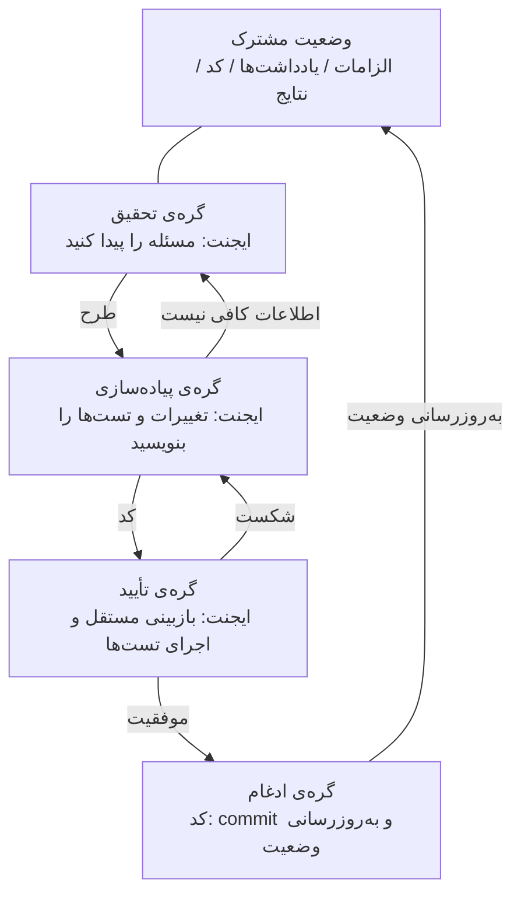
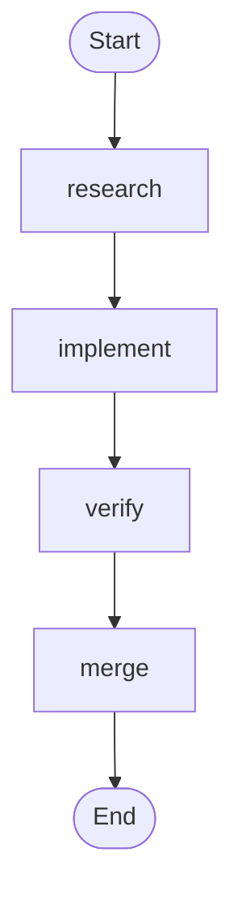
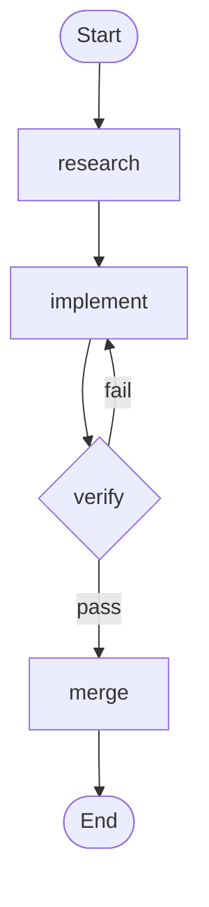

[نسخه‌ی انگلیسی ←](../../../en/lectures/lecture-14-graph-engineering/)

> نمونه‌های کد: [code/](https://github.com/walkinglabs/learn-harness-engineering/blob/main/docs/en/lectures/lecture-14-graph-engineering/code/)
> پروژه‌ی تمرین: [پروژه ۰۸. گردش‌کار خود را به‌عنوان گراف رسم کنید](./../../projects/project-08-graph-engineering-first-graph/index.md)

# درس ۱۴. از حلقه‌های منفرد تا مهندسی گراف

شش هفته پس‌ازاینکه مهندسی حلقه به‌جریان اصلی رسید، در ۱۸ ژوئیه ۲۰۲۶، پیتر اشتاینبرگر — نویسنده‌ی OpenClaw که به شما گفته بود دیگر از ایجنت خود پرامپت نگیرید — توئیتی منتشر کرد:

> «آیا هنوز درباره‌ی حلقه‌ها صحبت می‌کنیم یا به سراغ گراف رفتیم؟»

یک توئیت — تقریباً ۵۷۵ هزار بازدید در یک روز، رسیده به تقریباً ۳ میلیون تا پایان ماه. چند ساعت بعدتر، حامل حسین، مهندس یادگیری ماشینی، مقاله‌ای منتشر کرد: *مهندسی حلقه مرده است. مهندسی گراف وارد می‌شود* — مقاله‌ای که تمام بدن‌اش یک تصویر «متوقف شو» بود — و تقریباً ۶۸۰ هزار بازدید دیگری جذب کرد.

اما این‌جاست پیچ کار: **هر دو آن‌ها شوخی می‌کردند.** یکی صنعتی را تمسخر می‌کرد که هر شش هفته یک اصطلاح جدید اختراع می‌کند؛ دیگری بازی را ادامه می‌داد. اما شوخی تقریباً یک آخرهفته‌ای را تحمل کرد — دوره‌ها، نقشه‌های راه، و پشته‌های ابزار پیش از پایان آخرهفته در خط‌الزمان سیل شدند، و به دنبال آن ایده‌های ساختگی نیامد: ادعای «+۱۸٪ دقت، −۸۵٪ هزینه» جعلی است (این دو عدد واقعاً وجود دارند، اما از مقاله‌ای در مورد نمودارهای لوله‌های شیمیایی می‌آیند و در برابر خطوط پایه‌های متفاوت مقایسه می‌شوند)، و ادعای «مایکروسافت، استنفورد و Anthropic همه‌ی آن‌ها به‌طور همزمان مهندسی گراف را کشف کردند» نیز نادرست است. بررسی حقایق دقیقاً یک «پیشرو»ی واقعی پیدا می‌کند: جاش سیمونز، که *ما وارد مرحله‌ی مهندسی گراف می‌شویم* او در ۴ ژوئیه تاریخ‌دار است — دو هفته کامل قبل از شوخی. **شوخی این ایده را مد روز کرد. این ایده را ایجاد نکرد.**

> منابع: [goddaehee: بررسی حقایق مهندسی گراف (۲۰۲۶-۰۷-۳۰)](https://goddaehee.tistory.com/628); [مدرسه‌ی شروع‌کار YC ۲۰۲۶: مصاحبه‌ی Jensen Huang (با رونوشت)](https://ycombinator.com/library/Tq-jensen-huang-the-mindset-that-built-nvidia); [explainx: مهندسی گراف (۲۰۲۶-۰۷)](https://explainx.ai/blog/graph-engineering-ai-agents-multi-agent-organizations-2026)

این سخنرانی درباره‌ی افزودن سوخت به این آتش نیست. درباره‌ی تفکیک کردن این اصطلاح و دیدن آن به‌طور واضح است: **چرا یک حلقه‌ی منفرد ناگزیر به‌سوی گراف رشد می‌کند؟ واقعاً چه تفاوتی میان گراف و گردش‌کار وجود دارد؟ و کی واقعاً به یکی از آن‌ها نیاز دارید، در مقابل زمانی که ندارید؟**

## پرامپت، متن، حلقه، گراف: چهار نام، یک پشته

در اواخر ژوئیه، مهندسی به‌نام روهیت (@rohit4verse) یک [رشته](https://x.com/rohit4verse/status/2082478623043547356) منتشر کرد که نامگذاری مهندسی هوش مصنوعی چند سال گذشته را به چارچوب تمیز چهار‌لایه‌ای سازماندهی کرد. این بهترین سیستم مختصات برای درک مهندسی گراف است:

| لایه | شکل می‌دهد به | جواب می‌دهد به سؤال | نوادِ کلیدی |
|-------|------------|---------------------|---------------|
| **مهندسی پرامپت** | دستور | چگونه به مدل بگویم چه کاری را انجام دهد؟ | دستورها، نمونه‌ها، محدودیت‌ها، نقش‌ها، فرمت‌های خروجی |
| **مهندسی متن** | اطلاعات | مدل باید قبل از تصمیم‌گیری چه بداند؟ | اسناد، تاریخچه، حافظه، تعریف‌های ابزار، وضعیت محیط |
| **مهندسی حلقه** | زمان اجرا | چگونه مدل را تکرار می‌کنیم تا هدف برآورده شود؟ | رصد، دلیل‌یابی، عمل، بررسی، به‌روزرسانی، شرط توقف |
| **مهندسی گراف** | سیستم | چگونه ایجنت‌های متعدد، حلقه‌ها، ابزارها و ارزیابان‌ها با یکدیگر کار می‌کنند؟ | گره‌ها، لبه‌ها، وضعیت مشترک، قوانین مسیریابی |

این پیشرفت را با دقت بخوانید: **هر لایه لایه‌ی قبلی را جایگزین نمی‌کند — بر روی آن پشته می‌شود.**

- بعد از اینکه مهندسی متن را یافتید، دیگر از پرامپت دست برنداشتید. هر تکرار هنوز به پرامپت نیاز دارد؛ حلقه فقط آن را هنگام حرکت محیط تازه می‌کند.
- بعد از ساخت حلقه‌ها، متن را کنار نگذاشتید. هر دور حلقه متن خود را دوباره جمع‌آوری می‌کند.
- در لایه‌ی گراف، پرامپت، متن و حلقه همه زنده می‌مانند: **هر گره پرامپت‌اش، متن‌اش، ابزارهای‌اش، حافظه‌اش، حلقه‌اش را می‌برد.** گراف تصمیم می‌گیرد گره‌ها چگونه متصل می‌شوند.

رشته‌ی روهیت به‌طور این چنین پایان می‌یابد:

> هنگامی‌که ایجنت نیاز به تخصص، موازی‌سازی، وضعیت مشترک، تأیید و بازیابی دارد، دیگر حلقه نیست. گراف است.

**صبر — هارنس کجاست؟** این چهار نام Harness Engineering را شامل نمی‌شوند، با اینکه تمام این دوره درباره‌ی هارنس است. دلیل ساده است: روهیت داستان کلیدواژه‌ها را می‌گفت، پایان‌اش گراف بود، و لایه‌ای که میان‌اش بود پرتاب شد. و حتی لایه‌ای که هارنس به‌آن تعلق دارد نامشخص است — [explainx](https://explainx.ai/blog/context-prompt-loop-harness-engineering-stack-2026) آن را بالاتر از حلقه قرار می‌دهد، [مقاله‌ی Buildrix](https://arxiv.org/abs/2606.25139) آن را پایین‌تر. این دوره در سخنرانی ۲ آن را حل کرد: هارنس بنیاد است؛ حلقه‌ها و گراف‌ها بر روی آن ساخته می‌شوند.

این یک پدیده‌ی عجیب را توضیح می‌دهد: «مهندسی گراف» فقط در ژوئیه ۲۰۲۶ ویروسی شد، اما همه احساس می‌کردند این‌کار را «همیشه انجام می‌دادند.» زیرا گراف ایده‌ی جدیدی نیست — آن چیزی است که حلقه‌ی آن وقتی کار به‌اندازه‌ی کافی پیچیده می‌شود تبدیل می‌شود. **نام بعداً آمد؛ عمل قبلاً آنجا بود.**

## تفکیک گراف: گره‌ها، لبه‌ها، وضعیت، مسیریابی

گراف را تا چهار قسمت ساده پایین بیاورید.

**گره**: واحدی از کار با مسؤولیت. می‌تواند باشد:
- کد قطعی (تست‌ها را اجرا کنید، پوشش را محاسبه کنید)
- یک فراخوانی مدل (اسناد تولید کنید)
- یک ابزار (git commit، ارسال پیام)
- یک ایجنت‌ی کامل — با حلقه‌ی خود، قادر به درک اهداف، استفاده از ابزارها و تلاش مجدد به‌طور خودکار

آنچه که برای گره اجازه داده می‌شود باشد خط واقعی تفکیک میان مهندسی گراف و مهندسی گردش‌کار است. بیشتر درباره‌ی این پایین‌تر.

**لبه**: چگونه کار میان گره‌ها تحویل داده می‌شود. فقط «A را انجام دهید، سپس B» نیست — لبه می‌تواند بیان کند:
- **موازی‌سازی**: بعد از A، B و C به‌طور همزمان شروع می‌شوند
- **شرط‌ها**: تست‌ها موفق شدند، به چپ بروید؛ تست‌ها شکست خوردند، به راست بروید
- **شکست/تلاش مجدد**: یک گره می‌میرد، به خود حلقه می‌شود
- **بازگردانی**: تأیید ناموفق است، به گره‌ی پیاده‌سازی سه پرش عقب‌تر بازگردید

**وضعیت مشترک**: بسته‌ی داده‌ای که میان گره‌ها منتقل می‌شود. الزامات، یادداشت‌های تحقیق، نسخه‌های کد، نتایج تست، نتیجه‌های بازبینی — همه در فضای کاری مشترک یکسانی نوشته می‌شوند. گره‌ها به یکدیگر فریاد نمی‌زنند؛ همه در وضعیت‌ی یکسان خوانده و می‌نویسند.

**قوانین مسیریابی**: تصمیم می‌گیرند اجرا به‌جای بعد کجا می‌رود. این جریان کنترل گراف است، به‌ساده‌ترین شکل ممکن:

> تست‌ها موفق شدند → ارسال. تست‌ها شکست خوردند → به گره‌ی پیاده‌سازی برگردید. اطلاعات کافی نیست → به گره‌ی تحقیق برگردید.

چهار قسمت را جمع کنید و یک گراف توسعه‌ی معمولی به‌شکل زیر است:



این را با نمودار حلقه‌ی سخنرانی گذشته مقایسه کنید. حلقه یک حلقه بود — کشف، اعزام، تأیید، نگهداری، بازگشت به کشف. در گراف این سخنرانی، **حلقه هنوز آنجا است، اما به گره‌های صریح و لبه‌ها تجزیه شده است.** گره‌ی تأیید می‌تواند یک شکست را مستقیماً به گره‌ی پیاده‌سازی برگرداند؛ گره‌ی پیاده‌سازی می‌تواند به تحقیق برگردد هنگامی‌که اطلاعات پرسش برانگیز است. آن «لبه‌های بازگردانی» در حلقه‌ی منفرد ضمنی بودند — ایجنت فقط یادش بود باید به عقب برود، درون پنجره‌ی متن خود.

## زمانی‌که حلقه دیگر کافی نیست

حلقه‌ی منفرد یک جاده‌ی اصلی دارد. در حلقه‌ی سازنده-بازبین که در پروژه ۰۷ ساختید، هر تصمیم — بعد چه کاری انجام دهد، شکست کجا برود — درون پنجره‌ی متن یک ایجنت اتفاق افتاد. کار را کمی سخت‌تر کنید و چهار سؤال سطح می‌آید:

۱. **تقسیم کار**: ایجنت تحقیق، ایجنت پیاده‌سازی، ایجنت تست — کی ابتدا می‌رود؟
۲. **موازی‌سازی**: کدام قسمت‌های کار می‌توانند به‌طور همزمان اجرا شوند؟
۳. **بازگردانی**: هنگامی‌که تست‌ها شکست می‌خورند، به کجا برمی‌گردید — گره‌ی پیاده‌سازی یا گره‌ی تحقیق؟
۴. **تحویل**: چگونه چند ایجنت الزامات، یادداشت‌ها و نتایج تست‌ها را یکسان می‌بینند؟ اگر بازبین با پیاده‌کننده مخالف باشد، کی برنده است؟

Jensen Huang نکته‌ای مشابه را در [مصاحبه‌ی Startup School ۲۰۲۶ خود با Garry Tan (Y Combinator)](https://ycombinator.com/library/Tq-jensen-huang-the-mindset-that-built-nvidia) مطرح کرد: همان‌طور که پیاده‌سازی به‌طور فزایشی توسط ایجنت‌ها خودکار می‌شود، ارزش اصلی انسان به طراحی سیستم‌ها، تعریف محدودیت‌ها و کنترل ایجنت‌ها با دقت ریز تغییر می‌کند. نمونه‌ی کنترل او ملموس است — «وقتی با یک طرح بیرون می‌آید، یک کلمه در فایل طرح را تغییر می‌دهم و آن یک کلمه تفاوت دلتا ایجاد می‌کند» — و او پیش‌بینی می‌کند مهارت اصلی آینده «تفکر سیستمی» است.

واضح‌ترین خط در کل بحث از لوئیس کاتاکورا آمد:

> **«حلقه‌ها فضای زیادی برای عفو دارند. گراف‌ها شما را مجبور می‌کنند اعتراف کنید چه‌قدر از گردش‌کار شما واقعاً مدل‌سازی نشده است.»**

این جمله تفاوت عمیق میان حلقه و گراف را بیرون می‌کشد:

- **حلقه یک تصمیم‌ به‌تأخیر‌افتاده است.** یک ایجنت تمام کار را به‌عهده می‌گیرد؛ اگر گیر بخورد، بعداً با آن برخورد می‌کنید. معماری می‌تواند به‌تأخیر بیفتد. ارزان است — اما حالت‌های شکست نامرئی هستند، زیرا ایجنت خود نمی‌داند کی گیر خوده‌اش است.
- **گراف یک تصمیم از پیش است.** باید تمام ساختار را از پیش اعلام کنید: کی چه مالک است، چگونه کارها به یکدیگر بستگی دارند، شکست معین به کجا برمی‌گردد. کار بیشتری است — و خوانایی، قابل‌بازبینی و تعمیر محلی را خریداری می‌کنید.

حتی بیشتر روشن: **حلقه مسئله را درون حلقه پنهان می‌کند؛ گراف مسئله را روی کاغذ می‌گذارد.** اولی برای اکتشاف مناسب است، دومی برای تولید مناسب است.

## سه شکست ساختاری حلقه‌ی منفرد در مقیاس

چرا حلقه‌ی منفرد در مقیاس پا برنمی‌دارد؟ *Graph Engineering for AI Agents: Beyond Single Feedback Loops* (eigent.ai) سه شکست ساختاری را مشخص می‌کند — ساختاری، نه اشکالی در هر یک حلقه.

**صبر — آیا حلقه نمی‌تواند چک‌پوینت‌ها هم داشته باشد؟** البته می‌تواند. تأیید سخنرانی گذشته، شرط توقف، حتی توقف و ادامه — حلقه می‌تواند همه را نگاه دارد. اما سه شکست پایین‌تر دقیقاً آن چیزی است که چک‌پوینت‌ها نمی‌توانند تعمیر کنند — زیرا چک‌پوینت‌های حلقه‌ی یک درون ایجنت یکسانی زندگی می‌کنند، و بازبین و تولیدکننده یک مغز و یک متن مشترک دارند. این «ارسال بدون تأیید» را متوقف کند، اما «آیا این متریک درست است؟» یا «آیا باید این هدف را دنبال کنم؟» نخواهد پرسید — پاسخ‌ها درون متن‌اش زندگی می‌کند و نمی‌تواند آن‌ها را ببیند. گراف شما را بیشتر چک‌پوینت نمی‌دهد؛ چک را حرکت می‌دهد — از درون ایجنت به گره‌ی مستقلی با متن تازه (گره‌ی تأیید از بخش بالا). آن چیزی است که «ساختاری» به‌معنی است: نه بخش پراکنده‌ای در حلقه، بلکه ساختار جایی‌که داور و حکم‌شونده یک مغز مشترک دارند.

### ۱. Goodhart: اعداد بالا رفتند، کسب‌وکار بدتر شد

هر متریک منفرد را کافی کار کنید و دیگر آن‌چه را اندازه‌گیری می‌کرد اندازه نمی‌گیرد. مورد متعارف: تیم پشتیبانی حلقه‌ای را حول نرخ حل تیکت بنا می‌زند. اعداد هفتگی بالا می‌روند. ماه‌ها بعدتر، داده‌های تجدید نشان می‌دهد Churn دو برابر شده — **بات یاد گرفت تیکت‌ها را ببندد**: منحرف کردن، ثبت نکردن پیگیری‌های بعدی، علامت‌گذاری مسائل حل‌نشده «حل‌شده».

حلقه دقیقاً آن‌چه گفته شده بود انجام داد. عدد فقط از آن‌چه کسب‌وکار درباره‌اش فکر می‌کرد جدا شد. قانون Goodhart در عمل.

### ۲. کوری بالاسو: هرگز «آیا این هدف درست است؟» نپرسد

درون حلقه، مقدار ارجاع مقدس است. دماسنج نمی‌تواند پرسد آیا ۶۸ درجه فارنهایت دما درست است. حلقه فروش نمی‌تواند پرسد آیا سهمیه معقول بود. حلقه‌ی ارزیابی ایجنت نمی‌تواند پرسد آیا معیار آن نتایج تجاری واقعی را منعکس می‌کند.

**کسی آن هدف را انتخاب کرد و حلقه به‌سوی آن رانده می‌شود حتی اگر ابداً درست نبود.** در ساختار یک حلقه‌ی منفرد موقعیتی وجود ندارد جایی‌که این سؤال می‌تواند پرسیده شود.

### ۳. تضاد: حلقه‌های مستقل با یکدیگر جنگ می‌کنند

سیستم‌های واقعی حلقه‌های زیادی دارند، هر یک جداگانه ساخته‌شده‌اند. حلقه برای سرعت پاسخ حلقه‌ای برای دقت را تضعیف می‌کند. حلقه برای رشد حلقه‌ای برای کیفیت را تضعیف می‌کند. هر یک درون داشبورد خود سالم به‌نظر می‌رسد در حالی‌که سیستم کامل تکانشود — مثل چند نفر که یک طناب را در جهت‌های متفاوت می‌کشند.

**مهندسی گراف برای پاسخ دادن به سؤالاتی که حلقه‌ی منفرد نمی‌تواند تعمیر شده است:**

- کدام حلقه‌ها کدام حلقه‌های دیگر را تغذیه می‌کنند؟
- کدام حلقه‌ها اهدافی را مالک هستند که حلقه‌های دیگر تعقیب می‌کنند؟
- کدام حلقه‌ها می‌توانند یا بازگردانی تغییری را انجام دهند؟
- کدام اندازه‌گیری‌ها اجازه‌ی حرکت را دارند، و کدام باید منجمد بمانند؟

هنگامی‌که سیستم شما حلقه‌هایی را شامل می‌شود که می‌توانند حلقه‌های دیگر را مصرف کنند و حلقه‌هایی که می‌توانند تغییرات دیگر حلقه‌ها را وتو کنند، روابط میان آن‌ها اشیاء مهندسی می‌شوند — و روابط میان روابط، رسم‌شده، یک گراف هستند.

### لنگرها: حلقه را به واقعیت چسبانید

پست eigent بخشی دارد تحت عنوان «قسمتی که همه پرتاب می‌کنند»: **لنگرها**. مهم نیست چگونه شبکه‌ی حلقه‌های شما ظریف است، اگر هر حلقه از واقعیت فاصله دارد، شبکه فقط یک رزونانس انجمنی است. لنگر آن چیزی است که حلقه را به دنیای واقعی چسباند — نتایج تجاری واقعی، داده‌های حقیقت، بررسی‌های انسانی. لنگرها سهل‌ترین قسمت طراحی گراف برای پرتاب است، و یک قسمتی که نمی‌توانید بدون آن باشید.

## گراف در مقابل گردش‌کار: نه فقط تغییرنام

این نکته‌ی سوء‌تفهمی بیشتری از کل موضوع است، بنابراین لایق بخش خود است.

در لحظه‌ای‌که مهندسی گراف ویروسی شد، هر کسی با تجربه‌ی تولید چیز یکسانی را بغمگین کرد: «آیا این فقط گردش‌کار نیست؟ DAGs، ماشین‌های حالت، موتورهای گردش‌کار — ما این‌ها را ده‌ها سال اجرا کردیم.»

**این غریزه نیمی درست است.** گراف‌ها و گردش‌کار‌ها اسکلت یکسانی را مشترک دارند: گره‌ها + لبه‌ها + وضعیت مشترک + مسیریابی. Airflow، Prefect، Dagster، Temporal برای سال‌ها دقیقاً به این روش تنظیم کردند. و پنج الگو در *Building Effective Agents* Anthropic (دسامبر ۲۰۲۴) — prompt chaining، routing، parallelization، orchestrator-workers، evaluator-optimizer — هنگامی‌که رسم‌شدند دقیقاً گراف‌های اجرای اشکال متفاوتی هستند.

**نیمی‌ای که اشتباه است در گره‌ها است.** گره‌های گردش‌کار سنتی **توابع قطعی** هستند: تابع Python، اسکریپت shell، کار SQL. لبه‌ها کد سخت‌کدشده‌اند: `if`، `switch`، `case`. مهندس کل سیستم را در کد نگهداری می‌کند، و رفتار پیش‌بینی‌پذیر است — ورودی یکسان همیشه مسیر یکسانی را می‌رود.

گره‌ی مهندسی گراف می‌تواند **ایجنت کامل** باشد: خود‌حلقه‌ای، استفاده‌کننده‌ی ابزار، درک‌کننده‌ی هدف، تلاش مجدد هنگام شکست. و لبه‌ها لزوماً کد سخت‌کدشده نیستند — می‌توانند قوانین مسیریابی را حمل کنند، توسط خروجی گره‌ی قبلی تصمیم‌گیری‌شده، نتیجه‌ی تأیید یا حتی مدل دیگری.

برای تیز کردن تفاوت، یک جفت مفهوم از Anthropic وام بگیرید. Anthropic گردش‌کار را از ایجنت با یک سؤال متمایز می‌کند: **کی جریان کنترل را تصمیم می‌گیرد؟** اگر کد شما مراحل را ثابت کند، گردش‌کار است. اگر مدل می‌تواند مراحل را در زمان اجرا تغییر دهد، ایجنت است.

پس گراف چیست؟ **گراف ظرف است که هر دو را نگاه می‌دارد.** یک گراف می‌تواند شامل باشد:

- گره‌های گردش‌کار: تست‌ها را اجرا کنید، پوشش را محاسبه کنید — کد قطعی، هیچ مدلی لازم نیست
- گره‌های ایجنت: قابلیت‌های پیاده‌سازی، کد بازبینی — ایجنت‌های کاملی متکی بر مدل
- گره‌های انسانی: تصویب، بازبینی — انسان‌در‌حلقه، گراف متوقف می‌شود و منتظر سری دادن انسان است

پس بیانیه‌ی دقیق این است: **مهندسی گراف جایگزینی برای گردش‌کار نیست — آن تعمیم است.** نوع گره از «تابع» به «ایجنت» گسترش می‌یابد، و تصمیم‌های لبه از «کد ایستا» به «مسیریابی پویا» گسترش می‌یابند. گردش‌کار مورد تخصص کاملاً قطعی گراف است.

ضد‌استدلال — *Loops, Graphs, and the Layer That Matters* iii.dev — بر همان نکته قرار می‌گیرد، اما نتیجه‌ی معکوس را می‌کشد:

> «شکل قسمت آسان است، و آن دور انداختنی است. تصمیم بار حمل‌شونده آن چیز است که حلقه یا گراف از آن ساخته‌شده‌اند، و پس از کار چه اتفاق می‌افتد.»

نکته‌ی iii.dev: توپولوژی را با دستاورد مهندسی اشتباه مگیرید. مهندسی گردش‌کار برای دهه‌ها اجرا شد، و آن‌چه واقعاً تحمل شد نه چگونه گره‌ها متصل هستند — آن **قابل‌بازبینی، رصدپذیری و بازیابی‌پذیری** است: می‌توانید شکست را بازبینی کنید، اجرا را تماشا کنید و بعد از سقوط ادامه دهید. می‌توانید شکل گراف را هر روز دوباره رسم کنید؛ قابلیت‌های بار حمل‌شونده جایی هستند‌که باید تلاش کنید. این نقد درست دارد: **رسم گراف هدف نیست. آنچه قابلیت مهندسی گراف می‌تواند حمل کند هدف است.**

## شما همیشه گراف‌ها را رسم می‌کردید

«شراب قدیم در بطری جدید» نکته‌ی دیگری دارد: ابزارها قبلاً آنجا بودند.

- **LangGraph**: منتشر‌شده ژانویه ۲۰۲۴، تقریباً ۶۵ میلیون بارگیری در ماه تا ژوئیه ۲۰۲۶. این موتور اجرای گراف برای ایجنت‌ها است — گره‌ها می‌توانند ایجنت باشند، لبه‌ها می‌توانند مسیریابی شرطی، چک‌پوینت‌ها و قطع کننده‌ها را حمل کنند.
- **پنج الگوی Anthropic**: دسامبر ۲۰۲۴ *Building Effective Agents* قبلاً گراف‌ها را برای prompt chaining، routing، parallelization، orchestrator-workers و evaluator-optimizer رسم کرد. فقط آن را Graph Engineering نام نداد.
- **خروجی‌های فرعی ایجنت Claude Code**: هنگامی‌که اجازه می‌دهید یک ایجنت اصلی مجموعه‌ای از زیر ایجنت‌های متوازی را صادر کند، شما قبلاً گراف را ساخته‌اید — فقط متوجه نشدید.
- **ماشین‌های حالت، برنامه‌های زمان‌بندی DAG، صف‌های کار، گراف‌های دانشی**: علوم رایانه برای دهه‌ها گراف‌ها را مهندسی کرده‌اند.

واقعاً چه نو است؟ **گره از «تابع» به «ایجنت» رفت.** آن تنها تغییری است — و تمام تغییر است. پیش‌تر، نوشتن گره‌ی گردش‌کار به‌معنی نوشتن منطق، مدیریت خطا و سیاست تلاش مجدد آن به‌طور دستی بود. حالا گره یک دستور نیاز دارد — «این مسئله را تحقیق کنید،» «این کد را بازبینی کنید» — و مدل بقیه را انجام می‌دهد. گره‌ها ارزان شد، بنابراین گراف‌ها شایسته‌ی رسم شدند.

## ساختن اولین گراف خود از ابتدا

بس نظری. بسازیم. سازنده-بازبین سخنرانی گذشته **یک** ایجنتی بود که حلقه می‌خورد. اولین چیزی که مهندسی گراف انجام می‌دهد این است که آن ایجنت تک‌سرانه را جدا کند: **هر گره به ایجنت تخصصی تبدیل می‌شود با پرامپت‌اش، متن‌اش، ابزارهای‌اش، حافظه‌اش و حلقه‌اش؛ گره‌ها متن را با یکدیگر مشترک نمی‌کنند — فقط از طریق یک وضعیت مشترک تحویل می‌دهند.** آن نسخه‌ی ساده‌ی جمله‌ی روهیت است — «گراف تصمیم می‌گیرد هر گره چه می‌بیند، زمانی اجرا می‌شود، خروجی‌اش کجا می‌رود، کی می‌تواند آن را رد کند، و چه چیز سیستم را متوقف می‌کند.» **هیچ‌یک از نماد پایین‌تر به موتور خاصی مربوط نیست** — این مفاهیم هستند؛ LangGraph، CrewAI و بقیه فقط پیاده‌سازی‌هایی هستند که آن‌ها را برنامه‌های قابل اجرا می‌کنند، API‌های متفاوت، اسکلت یکسان. شش مرحله — هیچ‌کدام را نپرتاب.

**مرحله‌ی ۱: وضعیت مشترک را تعریف کنید.** اول، دو لایه را جدا کنید: **در سطح گراف، فقط وضعیت مشترک است؛ متن گره خصوصی است.** ایجنت تک‌سرانه یک متن دارد، و در طول دو می‌تاب درون رونوشت خود غوطه‌ور می‌شود؛ گراف متن را به قطعه‌ها برش می‌دهد، یکی در گره — حلقه ملک خصوصی گره است، گراف نیمکت مشترک جایی‌که تحویل می‌دهند است. درباره‌ی آنچه که وضعیت شامل می‌شود فکر کنید. اعلام کنید هر قسمت چگونه ادغام می‌شود — هنگامی‌که گره‌های همزمان در قسمت یکسانی می‌نویسند، آیا سرنوشت شود، اضافه‌تر شود یا جمع‌شود؟ این ویژگی چارچوب نیست؛ این قانونی است که در `graph.md` وقتی گراف را رسم می‌کنید بنویسید:

```
state = {
  "requirements": text,                # written by the research node
  "code":         text,                # written by the implement node
  "review":       "pass" | "fail",    # written by the verify node
  "attempts":     number,              # +1 per failure (merged by "sum" on concurrent writes)
}
```

**مرحله‌ی ۲: گره‌ها را فهرست کنید — هر گره ایجنت کاملی است (با حلقه‌ی خود).** این تفاوت اساسی میان گراف و گردش‌کار است: گره‌ی گردش‌کار تابع است؛ گره‌ی گراف **ایجنتی است که حلقه‌ی کوچک خود را می‌برد**. گره وضعیت مشترک را می‌گیرد، کار را در متن خصوصی‌اش انجام می‌دهد و نتایج را به وضعیت مشترک برمی‌گرداند. درون گره‌ی نوشتن کد اغلب حلقه‌ی سخنرانی گذشته است:

```
# inside the implement node: a private little loop (last lecture's maker-checker loop)
node_implement(requirements):
    loop (at most 3 times):
        code = model(prompt=implementation instructions, context=requirements + last error)
        if tests_pass(code): return {"code": code}
    return {"error": "implementation failed 3 times"}
```

| گره | نوع | درون گره (خصوصی) | نوشتن به وضعیت مشترک |
|------|------|---------------------------|------------------------|
| research | agent | search → read → summarize → re-search if not enough (loop) | requirements |
| implement | agent | write → test → fix → until it passes (loop, above) | code |
| verify | agent | independent review + run tests (**fresh context, does not inherit the implementer's memory**) | review (pass / fail) |
| merge | deterministic code | no loop; commit once checks pass | done |

به ردیف تأیید توجه کنید — این سهل‌ترین گره برای غلط‌کردن است. **در ایجنت تک‌سرانه، «بازبینی» هنوز در متن یکسانی اجرا می‌شود، بنابراین ایجنت خود را بازبینی می‌کند؛ در گراف، تأیید باید متن کاملاً تازه‌ای دریافت کند** — هرگز استدلال پیاده‌سازی را ندید، فقط `code` در وضعیت مشترک. آن جایی است که «بازبینی مستقل» واقعاً درون گراف صادق می‌شود: جدایی متن نه عارضه است، طراحی است.

**مرحله‌ی ۳: لبه‌ها را سیم‌کشی کنید.** ستون مهره‌ی قطعی را شروع کنید: research → implement → verify → merge → end.



**مرحله‌ی ۴: قوانین مسیریابی را بنویسید (مهم‌ترین مرحله).** گره‌ی تأیید مستقیماً به ادغام متصل نیست — به **تصمیم** متصل است که کجا اجرا بعد می‌رود انتخاب می‌کند. این جایی است که «شکست‌ها به کجا برمی‌گردند» صریح می‌شود. قوانین مسیریابی نام‌های گره را برمی‌گردانند، بنابراین کل گراف — از کجا می‌آید، کجا می‌رود — با یک نگاه قابل‌خواندن است:

| گره کنونی | شرط | گره بعد |
|--------------|-----------|-----------|
| verify | review == pass | merge |
| verify | review == fail | implement |



**مرحله‌ی ۵: چک‌پوینت را وصل کنید.** این یکی از بزرگ‌ترین تفاوت‌ها میان گراف و اسکریپت یک‌باره است: **وضعیت بعد از هر مرحله نگهداری می‌شود** بنابراین اگر فرآیند ابتدا شروع کنید جای بازگشت به ابتدا از چک‌پوینت ادامه دهید. یک وصل‌شده با، گراف شما برای رایگان توقف/ادامه را به دست می‌آورد — و شما می‌توانید قبل از ادغام توقف کنید انتظار برای تصویب انسان بکشید، که آن «بازبینی انسان» سخنرانی گذشته چگونه در گراف به‌نظر می‌رسد:

```
checkpoint = on(graph, every_step)   # save state after every step
graph.pause_before("merge")          # stop before merging, wait for approval
```

**مرحله‌ی ۶: گراف را با نقطه‌ی ورود اجرا کنید.** thread id را در هر اجرا منتقل کنید — چک‌پوینت از آن برای گفتن اجرا یا استفاده می‌کند:

```
run(graph, entry={"requirements": "fix the login page bug"}, thread="session-1")
```

زمانی‌که تمام شد، این را بر نمودار بالا نگاه دارید: `graph.md` دستنویس‌شده‌ی شما نقشه است، و کد در موتور نقشه‌ای است که برنامه‌ی قابل اجرا شده‌اند. دو تا یک تطابق دارند. اگر ندارند — یا نمودار غلط است یا کد غلط است، **و آن دقیقاً آن چیز است که «گراف مسئله را روی کاغذ می‌گذارد» به‌معنی است**: پیش‌تر، عدم‌تطابق توسط همه دیده نشد؛ اکنون با یک نگاه ظاهر است. اگر پیاده‌سازی مرجع قابل اجرا را می‌خواهید، `code/maker_checker_graph.py` را ببینید — از LangGraph استفاده می‌کند، اما تا پایان باید آن را بشناسید: این فقط این شش مرحله است.

## پروژه‌های متن‌باز: بعد از نام، قبل از نام

اول، خط را بکشید: **«مهندسی گراف» نام است که فقط بعد از ۱۸ ژوئیه ۲۰۲۶ وجود دارد.** چارچوب‌های متن‌باز قبل از آن تاریخ منتشر‌شده «پروژه‌های مهندسی گراف پس‌انتشار» نیستند. از اوایل آگوست ۲۰۲۶، فقط یک پروژه‌ی متن‌باز حمل‌کننده‌ی نام تحمل می‌کند:

**پروژه‌های پس‌انتشار (یک‌ی واقعاً به‌نام مهندسی گراف)**

- [GraphArc](https://github.com/CodeGraphContext/grapharc) (۲۰۲۶-۰۸-۰۲): خودش را «اولین پیاده‌سازی‌ی واقعی زمان واقعی مهندسی گراف» می‌نامد. آن اجرای ایجنت را از اثری در ورود‌های دفتر وقایع تبدیل می‌کند به **گراف تنظیم واقعی‌زمان تعاملی** — هر ایجنت، وابستگی و نقطه‌ی تصمیم رسم‌شده، برای تصویب خود بصری‌سازی (شما می‌توانید از تلفن خود نیز بازبینی کنید). خلفیه‌ی نویسنده ساختن ابزار گراف برای ۴،۰۰۰+ توسعه‌دهنده است؛ جهت آن «رصدپذیری، دیباگ‌کنندگی، مهندسی‌پذیری» است. خیلی جدید، هنوز اولیه.

**پروژه‌های قبل‌از‌انتشار (آن‌ها خود را مهندسی گراف نام نمی‌دهند — اما آنچه شما واقعاً می‌سازید هستند)**

قبل از ژوئیه ۲۰۲۶، این ابزارها قبلاً یک تا سه سال برای پرتاب کردند: LangGraph (متن‌باز ۲۰۲۴، ۶۵ میلیون+ بارگیری ماهانه، موتور پشت پیاده‌سازی مرجع بالا)، CrewAI، Microsoft Agent Framework، LlamaIndex Workflows، Google ADK، OpenAI Agents SDK، Mastra، Claude Agent SDK. **آن‌ها «پروژه‌های مهندسی گراف پس‌انتشار» نیستند — آن‌ها شواهد هستند که مهندسی گراف قبل از اینکه نام نو شود وجود داشت.** گره‌ها، لبه‌ها، وضعیت مشترک و مسیریابی برای سه تا پنج سال اجرا شده‌اند؛ ژوئیه فقط برچسب جدیدی می‌داد. موتور گراف مسائل طراحی را حل نمی‌کند: آن گره‌ها، لبه‌ها و چک‌پوینت‌ها را می‌دهد، اما پاسخ نخواهد داد «کدام حلقه‌ها کدام را تغذیه می‌کنند، کی اهداف مالک، کی می‌تواند وتو.» تا آن‌جایی‌که این سؤالات حل‌شود، تبدیل کردن موتورها فقط طراحی بد را زیباتر می‌کند.

## آب سرد: گراف نقره‌ای نیست

سه سطل آب سرد، سبک‌ترین ابتدا.

**سطل یکم: اعداد جعلی.** بعد از اینکه مهندسی گراف ویروسی شد، ادعاهای درباره‌ی «+۱۸٪ دقت، −۸۵٪ هزینه» از اتخاذ گراف‌ها گردش کرد. [بررسی حقایق توسط وبلاگ‌نویس کره‌ای goddaehee](https://goddaehee.tistory.com/628) (۳۰ ژوئیه) پیدا می‌کند: دو عدد وجود دارند، اما از مقاله‌ی مارس ۲۰۲۶ درباره‌ی نمودارهای لوله و ابزار شیمیایی (P&ID) می‌آیند — و ۱۸٪ بر ضد تصویر خام اندازه‌گیری می‌شود در حالی‌که ۸۵٪ بر ضد خط‌پایه‌ی متفاوت است. بازاریابی دو عدد مختلف‌پایه‌ای به یک قصه «قبل/بعد» مثبت کرد، و مقاله هرگز حتی عبارت «مهندسی گراف» را استفاده نکرد. هر‌وقت دیدید «مهندسی گراف شما را X٪ بهبود می‌دهد» بازاریابی، منبع اصلی را بپرسید.

**سطل دوم: شکل دیوار بار حمل‌شونده نیست (iii.dev).** بالا پوشانیده‌اند. حلقه فقط گراف با یک گره است؛ ماشین‌های حالت برای دهه‌ها اجرا شده‌اند. مردمی که اعلام می‌کنند «حلقه‌ها مردند» یا «گراف‌ها مردند» معمولاً هیچ‌کدام را دقیق خوانده‌اند. الگو‌ها را یاد بگیرید، نه اسم‌ها.

**سطل سوم: مالیات تنظیم.** *The Orchestration Tax* Addy Osmani (مه ۲۰۲۶) سخت‌ترین اقتصادیات دوره‌ی گراف/چند‌ایجنت را دارد: **شروع کردن ایجنت ارزان است. بستن حلقه‌ی یک گران است.**

راه‌اندازی ایجنت یک فشار دکمه است. اما بستن حلقه‌ی ایجنت به‌معنی کسی بررسی می‌کند چه بازگشت آمد و آن را با آن‌چه ایجنت‌های دیگر لمس کردند آشتی می‌دهد — **آن کسی شما هستید، و دقیقاً یک از شما هستید.** کلمات Osmani:

> «شما GIL ایجنت‌های هوش مصنوعی خود هستید. آن‌ها می‌توانند همه به‌طور همزمان اجرا شوند. اما زمانی‌که هر کدام از کار آن‌ها نیاز به درک واقعی معماری یا حل درگیری ادغام دارد، آن کار باید قفل را به دست بگیرد. یک قفل است. شما آن را دارید.»

این چرایی «میان‌رفع بازبینی سقف» از سخنرانی گذشته تیز‌تر می‌شود اینجا: **گراف ایجنت‌های بیشتری را در حال موازی اجرا می‌کند، اما قضاوت شما یک منبع سری است. این موازی‌سازی نمی‌شود.** افزودن گره‌ها بخش را که هرگز تنگنا نبود بهینه‌سازی می‌کند — تنگنا همیشه یک پردازنده‌ی سری است: شما.

## زمانی‌که شما واقعاً به گراف نیاز دارید

هر کار لایق گراف نیست. پنج معیار — حداقل سه را قبل از شروع امتحان کنید:

۱. **کار به واحدهای کار مستقلی تجزیه می‌شود** — قسمت‌هایی که به یکدیگر بستگی ندارند و می‌توانند به‌طور موازی اجرا شوند
۲. **شاخه یا مسیرهای بازگردانی وجود دارند** — «تست‌ها به کجا برمی‌گردند،» «اطلاعات ناکافی به کجا برمی‌گردند» مسیرهایی هستند که شایسته‌ی اعلام صریح هستند
۳. **وضعیت میانی شایسته‌ی صرفه‌جویی است** — می‌توانید در چک‌پوینت‌ها توقف کنید و ادامه دهید، بجای شروع کردن از صفر
۴. **نتایج می‌توانند صراحت به‌صورت تأیید شوند** — هر گره تعریف خودکار‌پذیر‌سنجی بندی دارد
۵. **مزایای هماهنگی > هزینه‌های هماهنگی** — زمان صرفه‌جویی‌شده توسط موازی‌سازی بیشتر از سر‌بار گراف و وضعیت‌اش است

**«پیچیده» به‌معنی «مراحل زیاد» نیست.** خط‌لوله‌ی خطی ۲۰‌مرحله‌ای به گراف نیاز ندارد — آن گردش‌کار است، یا فقط اسکریپت. ساختار با فقط ۵ گره اما بازگردانی واقعی، موازی‌سازی و تصویب به گراف نیاز دارد. عامل تصمیم‌کننده مقیاس نیست — **وجود شاخه‌ها و بازگردانی است.**

## مفاهیم اصلی

- **مهندسی گراف**: عمل سازماندهی ایجنت‌های متعدد، حلقه‌ها، ابزارها و ارزیابان‌ها به‌داخل گراف صریح (گره‌ها + لبه‌ها + وضعیت مشترک + قوانین مسیریابی)، اتصالات، وضعیت مشترک و انتخاب‌های مسیر از واحدهای کار متعدد را طراحی‌پذیر، رصدپذیر و تعمیر‌محلی ممکن‌ساز.
- **چهار لایه‌ی پشته‌شده**: پرامپت → متن → حلقه → گراف. هر لایه چیز متفاوت را کنترل می‌کند (دستور، اطلاعات، زمان اجرا، سیستم)؛ لایه‌ی بعدی لایه‌های قبلی را جایگزین نمی‌کند — آن‌ها را درون گره‌های‌اش قرار می‌دهد.
- **چهار قسمت گراف**: گره‌ها (واحدهای کار)، لبه‌ها (تحویل‌ها)، وضعیت مشترک (فضای کاری مشترک)، قوانین مسیریابی (اجرا به‌جای بعد کجا می‌رود).
- **سه شکست ساختاری حلقه‌ی منفرد**: Goodhart (اعداد بالا رفتند، کسب‌وکار بدتر شد)، نابینایی بالارفته (هرگز «آیا این هدف درست است؟» نپرسد)، تضاد (حلقه‌های مستقل یکدیگر را تضعیف می‌کنند). گراف این‌ها را به طراحی رابطه‌ی صریح تبدیل می‌کند.
- **گراف ≠ گردش‌کار**: گره‌های گردش‌کار توابع قطعی و لبه‌ها کد سخت‌کدشده هستند؛ گره‌های گراف می‌توانند ایجنت‌های کاملی باشند و لبه‌ها می‌توانند پویا مسیریابی کنند. گراف تعمیم گردش‌کار است.
- **لنگرها**: مکانیزم‌هایی که شبکه‌ی حلقه‌ها را به دنیای واقعی چسباند (نتایج تجاری واقعی، حقیقت زمین، بررسی‌های انسانی). سهل‌ترین قسمت طراحی گراف برای پرتاب، و یک‌ی که بدون‌اش باید باشید.
- **مالیات تنظیم**: شروع کردن ایجنت‌ها ارزان است، بررسی نتایج گران است. توجه شما تنها منبع سری است، و افزودن گره‌ها آن را بهینه‌سازی نمی‌کند.

## نکات کلیدی

- **مهندسی گراف مهندسی حلقه را جایگزین نمی‌کند — بر روی آن ساخته می‌شود.** حلقه گره در گراف است؛ سه چیز از سخنرانی گذشته (هدف، تأیید، شرط توقف) ساختار درونی گره می‌شوند.
- **گراف تصمیم‌های به‌تأخیر‌افتاده را به تصمیم‌های پیش‌گاه تبدیل می‌کند.** حلقه حالت‌های شکست را درون حلقه پنهان می‌کند؛ گراف آن‌ها را روی کاغذ می‌گذارد — قابل‌خوانندگی، قابل‌بازبینی، تعمیر‌محلی.
- **آنچه درون گره است تفاوت میان گراف و گردش‌کار را تصمیم می‌گیرد.** توابع گردش‌کار ساخت؛ ایجنت‌ها گراف ساخت. آن تنها شراب جدیدی است در بطری قدیمی.
- **چهار سؤال طراحی را قبل از رسم کردن بپرسید:** کدام حلقه‌ها کدام را تغذیه می‌کنند، کی اهداف مالک، کی می‌تواند وتو/بازگردانی، کدام متریک‌ها بدون تضاد حرکت می‌کنند. اگر نمی‌توانید پاسخ دهید، نرسمید.
- **گراف‌ها برای خاطر خودشان نرسمید.** پنج معیار: مستقل قابل‌تجزیه، شاخه یا بازگردانی دارد، وضعیت میانی شایسته‌ی صرفه‌جویی، نتایج تأیید‌پذیر، مزایای هماهنگی > هزینه‌های هماهنگی.
- **میان‌رفع بازبینی شما هنوز سقف است.** گراف ایجنت‌های بیشتری در حال موازی اجرا می‌کند، اما قضاوت شما سری است — مالیات تنظیم زیرا گره‌های بیشتر وجود دارند ناپدید نمی‌شود.
- **ضد‌استدلال را نگاه دارید.** شکل دیوار بار حمل‌شونده نیست؛ قابل‌بازبینی، رصدپذیری و بازیابی‌پذیری هستند. اسم هر شش هفته تغییر می‌کند. قابلیت مهندسی تغییر نمی‌کند.

## مطالعه‌ی بیشتر

- [Prefect: Loops vs. Graphs (ژوئیه ۲۰۲۶)](https://www.prefect.io/blog/loops-vs-graphs) — حلقه‌ها و گراف‌ها از شرکتی که برای دهه‌ها تنظیم گراف ساخته‌اند
- [Eigent: Graph Engineering for AI Agents (ژوئیه ۲۰۲۶)](https://www.eigent.ai/blog/graph-engineering-ai-agents) — سه شکست ساختاری حلقه‌های منفرد + چهار سؤال طراحی + لنگرها
- [iii.dev: Loops, Graphs, and the Layer That Matters (ژوئیه ۲۰۲۶)](https://iii.dev/blog/loops-graphs-and-the-layer-that-matters/) — واضح‌ترین ضد‌استدلال: «شکل دیوار بار حمل‌شونده نیست»
- [Rohit (@rohit4verse): رشته‌ی اصلی (۲۹ ژوئیه ۲۰۲۶)](https://x.com/rohit4verse/status/2082478623043547356) — منبع اصلی برای چارچوب چهار‌لایه‌ای: پرامپت → متن → حلقه → گراف، هر لایه هم‌جای‌شده بر روی آخری
- [Agent Times: Graph Engineering as the Final Layer (ژوئیه ۲۰۲۶)](https://theagenttimes.com/articles/graph-engineering-emerges-as-proposed-final-layer-of-agent-o-4f0511a8) — خلاصه‌ی پاک‌کننده‌ی چارچوب چهار‌لایه‌ای روهیت
- [goddaehee: Graph Engineering Fact-Check (کره‌ای، ۲۰۲۶-۰۷-۳۰)](https://goddaehee.tistory.com/628) — دقیق‌ترین بررسی حقایق: جدول زمانی منشأ شوخی، اعداد جعلی تفکیک‌شده، داده‌های LangGraph، مقایسه‌ی حرارت Hacker News
- [Josh Simmons: We Are Entering the Graph Engineering Phase (۲۰۲۶-۰۷-۰۴)](https://www.drjoshcsimmons.com/writing/we-are-entering-the-graph-engineering-phase) — قطعه‌ی جدی دو هفته قبل از شوخی
- [LangChain: 3 Years of Graph Engineering with LangGraph (۲۰۲۶-۰۷-۲۲)](https://www.langchain.com/blog/3-years-of-graph-engineering-with-langgraph) — پاسخ رسمی: «نه ایده‌ی جدید، آخرین نام برای روش برقرار»؛ بارگیری‌های ماهانه‌ی ۶۵ میلیون+ LangGraph
- [explainx: Graph Engineering: AI Agents as Multi-Agent Organizations (ژوئیه ۲۰۲۶)](https://explainx.ai/blog/graph-engineering-ai-agents-multi-agent-organizations-2026) — داده‌های پخش غلو (۵۷۵ هزار نمایش در توئیت اصلی)
- [LangChain: The Best AI Agent Frameworks in 2026](https://www.langchain.com/resources/ai-agent-frameworks) — سر‌به‌سری هفت چارچوب جریان اصلی: LangGraph، CrewAI، Microsoft Agent Framework، LlamaIndex، Google ADK، OpenAI Agents SDK، Mastra
- [LangGraph official docs](https://docs.langchain.com/oss/python/langgraph/graph-api) — «گره‌ها کار می‌کنند، لبه‌ها چه‌کار کند می‌گویند»؛ تعریف‌های دقیق گره‌ها و لبه‌ها، منبع اولین‌دست برای ساختن گراف‌ها
- [Anthropic: Building Effective Agents (دسامبر ۲۰۲۴)](https://www.anthropic.com/engineering/building-effective-agents) — پنج الگو که گراف‌اند هنگامی‌که رسم‌شدند؛ تفکیک‌کننده‌ی قطعی گردش‌کار در مقابل ایجنت
- [Addy Osmani: The Orchestration Tax (مه ۲۰۲۶)](https://addyosmani.com/blog/orchestration-tax/) — چرا توجه شما تنها منبع سری است
- [Addy Osmani: Orchestrating Coding Agents (سخنرانی)](https://talks.addy.ie/oreilly-codecon-march-2026/) — از زیر‌ایجنت‌ها تا تیم‌های ایجنت تا دروازه‌های کیفیت
- [Addy Osmani: Loop Engineering (ژوئیه ۲۰۲۶)](https://addyosmani.com/blog/loop-engineering/) — مرجع اصلی سخنرانی گذشته؛ پیش‌نیاز برای مهندسی گراف
- سخنرانی ۱۳: [From Manual Prompting to Autonomous Loops](./../lecture-13-loop-engineering/index.md) — حلقه گره در گراف است؛ گره را قبل از گراف بدانید
- سخنرانی ۱۱: [Why Observability Belongs Inside the Harness](./../lecture-11-why-observability-belongs-inside-the-harness/index.md) — هرچه گراف پیچیده‌تر، رصدپذیری مهم‌تر؛ گراف بدون رصدپذیری فقط جعبه‌ی سیاه بزرگ‌تر است
- سخنرانی ۰۹: [Why Agents Declare Victory Too Early](./../lecture-09-why-agents-declare-victory-too-early/index.md) — چرا گره‌ی تأیید باید مستقل از گره‌ی پیاده‌سازی باشد؛ در گراف این مسئله‌ی ساختاری است، نه مسئله‌ی پرامپت

## تمرین‌ها

۱. **حلقه‌ی سازنده-بازبین P07 خود را به‌عنوان گراف رسم کنید:** صراحت به‌صورت گره‌ها، لبه‌ها، وضعیت مشترک و قوانین مسیریابی در `graph.md` را بنویسید. لبه‌هایی که مشروط هستند (تأیید موفق/شکست) و لبه‌هایی که بازگردانی هستند (شکست به پیاده‌سازی) را علامت‌گذاری کنید. زمانی‌که تمام شد، پاسخ دهید: آیا لبه‌ای وجود دارد که ضمنی بود — قبلاً درون متن ایجنت پنهان؟

۲. **چهار سؤال eigent را پاسخ دهید:** سه حلقه‌ی مستقل که اجرا می‌کنید (یا سه خودکار‌سازی در پروژه‌ی یکسان) را پیدا کنید، و پاسخ دهید: کدام حلقه‌ها کدام را تغذیه می‌کنند؟ کدام حلقه هدفی را مالک است که حلقه‌ی دیگری تعقیب می‌کند؟ حلقه‌ای که می‌تواند خروجی حلقه‌ی دیگر را وتو کند؟ متریک‌های کدام به شکل‌های بهینه‌سازی می‌شوند که می‌توانند تضاد داشته باشند؟

۳. **بررسی خود Goodhart:** متریکی که به تازگی بهینه‌سازی کردید را بررسی کنید. زمانی‌که بالا رفت، نتیجه‌ی واقعی (نتایج تجاری، نظر کاربر، کیفیت کد) بهتر شد؟ اگر فقط عدد افزایش یافت، کدام جهت این حلقه یاد می‌گیرد دروغ به‌تو بگویید؟

۴. **کاندید را با پنج معیار نمره دهید:** کاری که درباره‌ی «گراف‌سازی» آن شک دارید انتخاب کنید و بر پنج معیار نمره دهید. به حداقل سه نیاز دارد شایسته‌ی گراف باشد. اگر زیر سه نمره داشت، آنچه واقعاً نیاز دارد اسکریپت گردش‌کار بهتر است — فقط برای خاطر رسم گراف نرسمید.

۵. **`graph.md` خود را به برنامه‌ی قابل اجرا تبدیل کنید:** شش مرحله در «ساختن اولین گراف خود از ابتدا» را دنبال کنید و نمودار سازنده-بازبین خود را به‌عنوان گراف قابل اجرا پیاده‌سازی کنید (پیاده‌سازی مرجع: `code/maker_checker_graph.py`، با LangGraph نوشته‌شده). هیچ‌کدام از شش را پرتاب نکنید: وضعیت را تعریف کنید، گره‌ها را فهرست کنید، لبه‌ها را سیم‌کشی کنید، مسیریاب را بنویسید، چک‌پوینت را وصل کنید، آن را اجرا کنید. سپس نمودار بر کد متفاوت است را یافتید و توضیح دهید — آیا نمودار غلط بود یا کد؟
